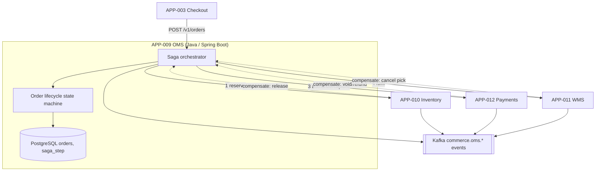
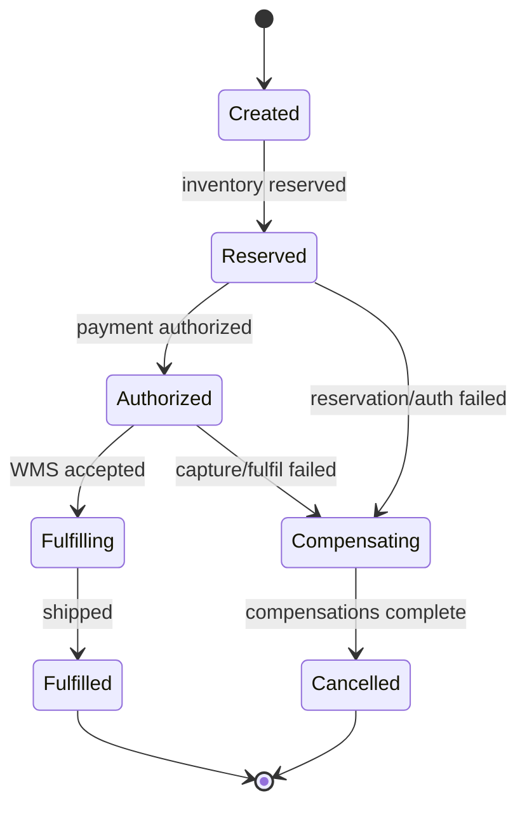

# AD-0009 — Order Management Saga

| Field | Value |
|---|---|
| Doc id | AD-0009 |
| Title | Order Management Saga |
| Owner team | TEAM-006 |
| Apps | APP-009 |
| Status | Accepted |
| Related | KN-209, APP-010, APP-011, APP-012, APP-003, INC-2026-012, ADR-0045, ADR-0033 |

## Purpose

This document describes the **Order Management System (APP-009, OMS)** and specifically its
**saga orchestration** across inventory, warehouse, and payments. An order at MCG is a
long-running, multi-service business transaction; there is no distributed 2PC, so OMS runs a
**saga** with explicit **compensating transactions** to keep the system eventually consistent.

The OMS owns the **order lifecycle state machine** — the single authoritative record of where an
order is and what has been committed. It coordinates side effects in other bounded contexts
(inventory reservation, fulfillment, payment capture) without owning their data.

The document exists because order correctness under partial failure is the hardest property in
the commerce platform, and INC-2026-012 (multi-warehouse oversell) showed that reservation and
compensation semantics must be specified precisely rather than assumed.

## Context

APP-009 is owned by **TEAM-006**, built in **Java on Spring Boot** with **PostgreSQL** for the
order store and saga log. It is **Tier 0**.

- **Dependencies (canon):** APP-010 Inventory (ATP + reservations), APP-011 WMS (fulfillment),
  APP-012 Payments (auth/capture), and **Kafka** as the event backbone.
- **Upstream caller (canon):** APP-003 Checkout places the order; OMS never calls back into
  checkout. Dependency direction is fixed: Checkout → OMS → {Inventory, WMS, Payments}.
- **Downstream:** OMS emits order-lifecycle events consumed by notifications (APP-023), the
  customer portal (APP-021 via APP-009), and analytics (APP-020).

Business drivers: never charge a customer for an order that can't be fulfilled, never oversell,
and always converge to a consistent terminal state (fulfilled or fully compensated).

## Architecture

The saga is orchestration-based: OMS is the single orchestrator that issues commands and reacts
to events, advancing a persisted state machine. Each forward step has a defined compensation.





Steps are coordinated over **Kafka** asynchronously (event-driven, §8), but the orchestrator
holds authoritative state in Postgres so recovery after a crash resumes exactly where it left off.

## Key decisions

1. **Orchestration saga, not choreography.** A single orchestrator (OMS) makes the lifecycle
   auditable and the compensation logic explicit, avoiding emergent cross-service coupling.
2. **No distributed transactions.** Each step commits locally; global consistency is achieved by
   compensating transactions, not 2PC — the only workable model across independent bounded contexts.
3. **Every forward step has a compensation (ADR-0045).** Reserve↔release, authorize↔void,
   capture↔refund, fulfil↔cancel-pick. Compensations are idempotent so retries are safe.
4. **Persisted saga log = source of truth.** `saga_step` rows record intent, outcome, and
   compensation state; the orchestrator is stateless and recoverable from the log.
5. **Reserve before charge.** Inventory is reserved (APP-010) before payment is authorized so a
   customer is never charged for stock that isn't held — directly guards against INC-2026-012.
6. **Idempotent commands with keys (ADR-0045).** Each command to Inventory/Payments/WMS carries a
   saga-scoped idempotency key; duplicate delivery from Kafka is a no-op.
7. **Timeouts drive compensation.** A step that doesn't confirm within its budget transitions the
   saga to `Compensating` rather than hanging, bounding the time an order can be "in flight."
8. **Expand-contract for order schema (ADR-0033).** New lifecycle states/fields are additive with
   dual-read so long-lived in-flight orders survive deploys.

## Data & APIs

Synchronous entry + async coordination:

```
POST /v1/orders                 # place order (from APP-003), returns orderId + Created
GET  /v1/orders/{orderId}        # lifecycle + saga step status
POST /v1/orders/{orderId}/cancel # customer/agent-initiated compensation
```

| Store / topic | Purpose |
|---|---|
| PostgreSQL `orders` | authoritative order + terminal state |
| PostgreSQL `saga_step` | per-step intent, outcome, compensation state |
| Kafka `commerce.oms.order-placed.v1` | emitted on Created |
| Kafka `commerce.oms.order-fulfilled.v1` | emitted on Fulfilled |
| Kafka `commerce.oms.order-cancelled.v1` | emitted on Cancelled (compensated) |
| Kafka `commerce.inventory.reserved.v1` | consumed from APP-010 |
| Kafka `commerce.payments.authorized.v1` | consumed from APP-012 |

Idempotency key: `saga:{orderId}:{stepName}`. Error envelope:

```json
{ "error": { "code": "SAGA_COMPENSATING", "orderId": "ORD-88", "failedStep": "AUTHORIZE", "traceId": "..." } }
```

## Failure modes & resilience

- **Multi-warehouse oversell (INC-2026-012).** Two orders reserved the same multi-warehouse SKU
  because reservation wasn't atomic across warehouses. OMS's guard: reserve-before-charge plus a
  single authoritative reservation from APP-010; if reservation is not confirmed, the saga never
  advances to authorize. (Atomic ATP reservation is owned by APP-010 / AD-0010.)
- **Payment authorized but fulfillment fails.** Saga enters `Compensating`; payment is
  voided/refunded and inventory released. Terminal state `Cancelled`, customer not charged.
- **Orchestrator crash mid-saga.** On restart the orchestrator replays from `saga_step`; each
  command is idempotent so re-issuing is safe.
- **Kafka lag / duplicate delivery.** Idempotency keys make duplicates no-ops; consumer offsets
  ensure at-least-once processing without double side effects.
- **Downstream timeout.** Step budget expiry → `Compensating`; no order hangs indefinitely.

Timeouts: reserve 2 s, authorize 3 s, fulfil-accept 5 s; retries with backoff before compensating.
Circuit breakers around Payments and WMS shed load rather than pile up in-flight sagas.

## Observability

Golden-signal SLOs (Tier 0):

| Signal | Target |
|---|---|
| Order-placement latency p95 | ≤ 400 ms to Created |
| Saga completion p95 | ≤ 30 s to terminal state |
| Error rate (unrecoverable) | < 0.05% |
| Compensation rate | < 1% of orders (alert above) |
| Stuck-saga count | 0 beyond budget |

Metrics: `oms.saga.duration`, `oms.saga.compensation.rate`, `oms.step.timeout.count`,
`oms.orders.by_state`. Traces span checkout → OMS → each downstream step. Alerts: compensation
rate spike (a fulfillment or ATP regression — the INC-2026-012 detector), stuck-saga age, and
order-placement latency breach. Dashboards visualize the state-machine funnel and per-step failure.

## Cross-references

- **Sibling ADs:** KN-209 (this doc), AD-0010 (Inventory ATP — reservation semantics),
  AD-0011 (Payments), AD-0003 (Checkout).
- **Apps:** APP-009 (OMS), APP-010 (Inventory), APP-011 (WMS), APP-012 (Payments), APP-003 (Checkout).
- **Teams:** TEAM-006 (owner), TEAM-012, TEAM-013, TEAM-009, TEAM-004.
- **Incidents:** INC-2026-012 (ATP oversell multi-warehouse SKUs).
- **ADRs:** ADR-0045 (idempotent execution & rollback plans), ADR-0033 (expand-contract).
- **Release:** REL-2026-006.
