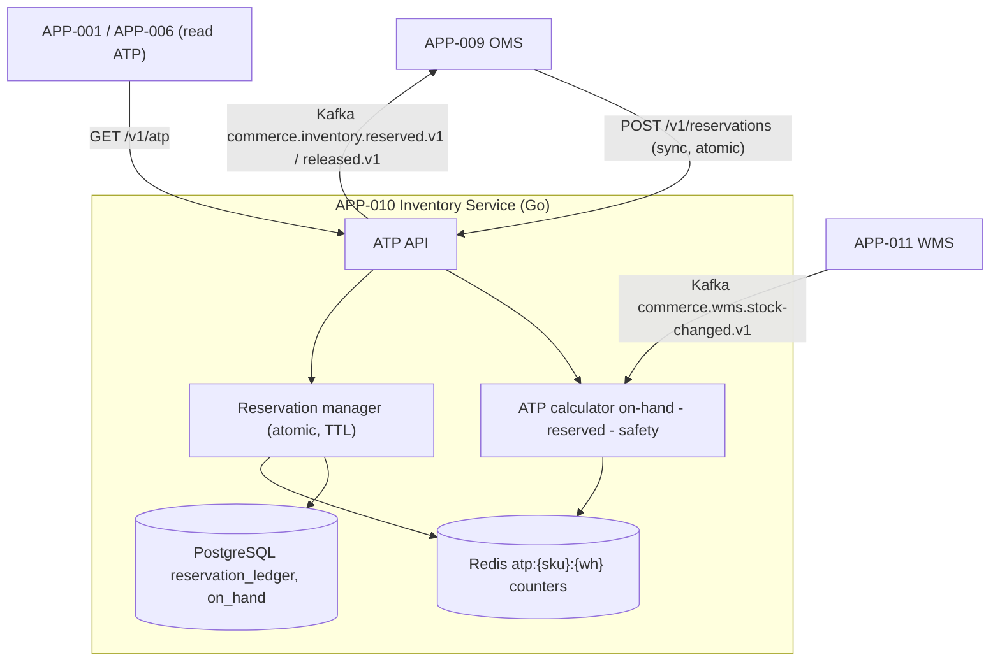

# AD-0010 — Inventory Available-to-Promise (ATP)

| Field | Value |
|---|---|
| Doc id | AD-0010 |
| Title | Inventory Available-to-Promise (ATP) |
| Owner team | TEAM-012 |
| Apps | APP-010 |
| Status | Accepted |
| Related | KN-210, APP-011, APP-009, INC-2026-012, ADR-0045, ADR-0033 |

## Purpose

This document describes the **Inventory Service (APP-010)** and its **Available-to-Promise (ATP)**
model: how MCG computes, in real time, how many units of a SKU can be promised to a customer
across multiple warehouses, and how it prevents overselling under concurrent demand.

ATP is not the same as on-hand stock. ATP = on-hand − reserved − safety, evaluated per warehouse
and aggregated to a network view. The service owns **reservation semantics**: turning a "promise"
into a short-lived hold that the order saga (APP-009) can convert into a committed allocation.

The document exists because INC-2026-012 (oversell on multi-warehouse SKUs) proved that a naive
per-warehouse view plus non-atomic reservation lets two orders promise the same last unit. The
fix is precise, atomic ATP reservation, specified here.

## Context

APP-010 is owned by **TEAM-012**, built in **Go** with **PostgreSQL** as the durable ledger and
**Redis** for hot ATP counters. It is **Tier 0**.

- **Dependencies (canon):** APP-011 WMS (authoritative on-hand and warehouse events) and **Kafka**.
- **Upstream caller (canon):** APP-009 OMS reserves against ATP during the order saga. Dependency
  direction is fixed: OMS → Inventory. Inventory never calls OMS.
- **Regions/tier:** warehouses map to regions (NA/LATAM/EU/APAC); ATP is computed per warehouse
  and rolled up so a customer in EU sees network availability weighted to fulfillable locations.

Business drivers: accurate real-time availability on the storefront, zero oversell at checkout,
and fast reservation so the order saga isn't blocked.

## Architecture

ATP counters live in Redis for read speed; the durable reservation ledger lives in Postgres.
On-hand changes arrive asynchronously from WMS over Kafka; reservations are synchronous, atomic,
and short-lived.



Reads (`/v1/atp`) are served from Redis counters. Reservation writes go through an atomic
compare-and-decrement across the candidate warehouses, persisted to the Postgres ledger, so two
concurrent requests can never both win the last unit.

## Key decisions

1. **ATP = on-hand − reserved − safety, per warehouse.** Availability is computed at warehouse
   granularity and aggregated; the network number is derived, never stored as an independent truth.
2. **Atomic multi-warehouse reservation (the INC-2026-012 fix).** A reservation that spans
   candidate warehouses executes as a single atomic decrement (Redis Lua script backed by the
   Postgres ledger). No interleaving can double-promise a unit. This is the core correctness
   property of the service.
3. **Reservations are short-lived holds with TTL.** A reservation expires if the saga doesn't
   confirm, automatically returning units to ATP — no leaked stock from abandoned checkouts.
4. **Postgres ledger is authoritative; Redis is a cache.** Every reservation is journaled; Redis
   counters are rebuildable from the ledger + WMS on-hand, so a Redis loss is recoverable.
5. **On-hand is event-sourced from WMS (event-driven, §8).** APP-011 owns physical stock; APP-010
   consumes `stock-changed` events and never writes on-hand itself, preserving bounded contexts (§8).
6. **Idempotent reservation with keys (ADR-0045).** Reserve/confirm/release carry a saga-scoped
   idempotency key so OMS retries are safe and never double-reserve.
7. **Oversell prevention is fail-closed.** If ATP can't be computed atomically (e.g. Redis + ledger
   disagree), the reservation is rejected rather than guessed — better a rare false "out of stock"
   than an oversell.
8. **Expand-contract for ledger schema (ADR-0033).** New reservation dimensions (e.g. channel,
   promise-by date) ship additively with dual-read.

## Data & APIs

Synchronous REST (JSON):

```
GET  /v1/atp?skuId=SKU-1&region=EU              # network + per-warehouse ATP
POST /v1/reservations                            # {orderId, lines:[{skuId, qty}], region}
POST /v1/reservations/{id}/confirm               # convert hold -> allocation (from OMS saga)
POST /v1/reservations/{id}/release               # compensation / TTL expiry
```

| Store / topic | Purpose |
|---|---|
| Redis `atp:{sku}:{wh}` | hot ATP counter per SKU/warehouse |
| Redis `resv:{id}` | live reservation hold with TTL |
| PostgreSQL `reservation_ledger` | authoritative reservation journal |
| PostgreSQL `on_hand` | materialized on-hand from WMS events |
| Kafka `commerce.wms.stock-changed.v1` | consumed from APP-011 |
| Kafka `commerce.inventory.reserved.v1` / `released.v1` | emitted to OMS |

Idempotency key: `resv:{orderId}:{skuId}`. Error envelope:

```json
{ "error": { "code": "ATP_INSUFFICIENT", "skuId": "SKU-1", "requested": 2, "available": 1, "traceId": "..." } }
```

## Failure modes & resilience

- **Multi-warehouse oversell (INC-2026-012).** Root cause: reservation decremented warehouses
  non-atomically, so two orders each saw the last unit as available. Fix: atomic
  compare-and-decrement across candidate warehouses (Decision 2) with the Postgres ledger as the
  tiebreak. Regression test asserts no two confirmed reservations exceed on-hand for any SKU/wh.
- **Redis counter loss.** Counters are rebuilt from `reservation_ledger` + `on_hand`; during
  rebuild the service serves conservative (lower-bound) ATP and fails reservations closed.
- **WMS event lag.** On-hand drifts slightly stale; safety stock absorbs the gap and ATP trends
  conservative. Alert on `wms.event.lag`; no oversell because reserved is always current.
- **Reservation leak.** TTL expiry auto-releases; a sweeper reconciles Redis holds against the
  ledger to catch any orphaned hold.
- **Ledger unavailable.** Reservations fail closed (no new holds) while reads continue from Redis;
  the order saga (APP-009) sees `ATP_INSUFFICIENT` and does not advance to payment.

Timeouts: reservation call budget 300 ms with one retry; circuit breaker sheds reservation load
before the ledger saturates.

## Observability

Golden-signal SLOs (Tier 0):

| Signal | Target |
|---|---|
| ATP read latency p95 | ≤ 20 ms |
| Reservation latency p95 | ≤ 60 ms |
| Reservation latency p99 | ≤ 150 ms |
| Oversell events | 0 (hard invariant) |
| Reservation-leak rate | < 0.1% |
| WMS event lag | < 30 s p95 |

Metrics: `inv.atp.read.latency`, `inv.reservation.latency`, `inv.oversell.count` (must be 0),
`inv.reservation.leak.count`, `inv.wms.event.lag`. Traces: OMS → APP-010 → {Redis, Postgres}.
Alerts: any `oversell.count > 0` pages immediately (the INC-2026-012 tripwire), reservation-leak
spike, WMS lag breach, and ledger-vs-Redis divergence. Dashboards split by warehouse and region.

## Cross-references

- **Sibling ADs:** KN-210 (this doc), AD-0009 (OMS saga — reservation consumer), AD-0011 (Payments).
- **Apps:** APP-010 (Inventory), APP-011 (WMS), APP-009 (OMS).
- **Teams:** TEAM-012 (owner), TEAM-013 (WMS), TEAM-006 (OMS).
- **Incidents:** INC-2026-012 (ATP oversell multi-warehouse SKUs).
- **ADRs:** ADR-0045 (idempotent execution & rollback plans), ADR-0033 (expand-contract).
- **Release:** REL-2026-006.
