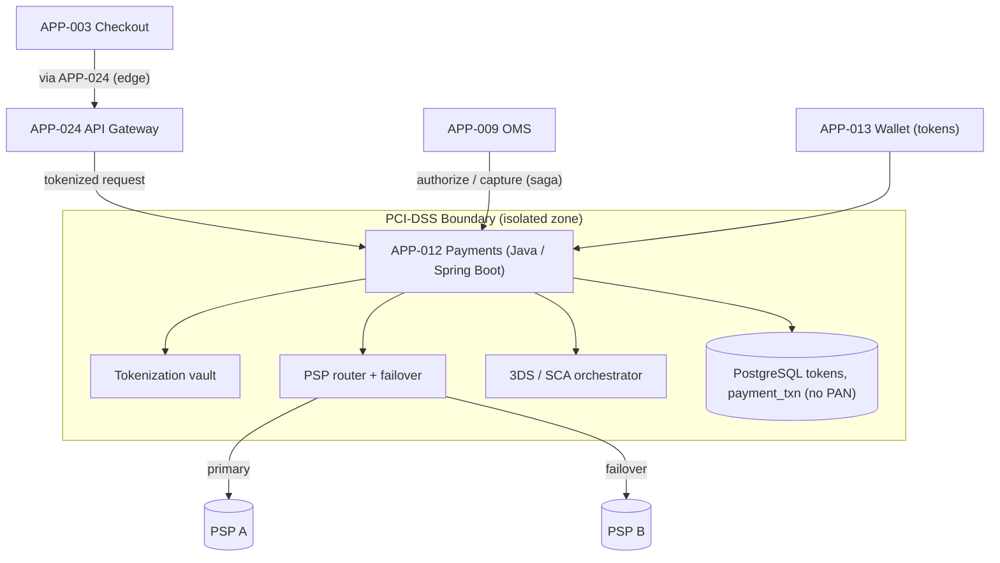
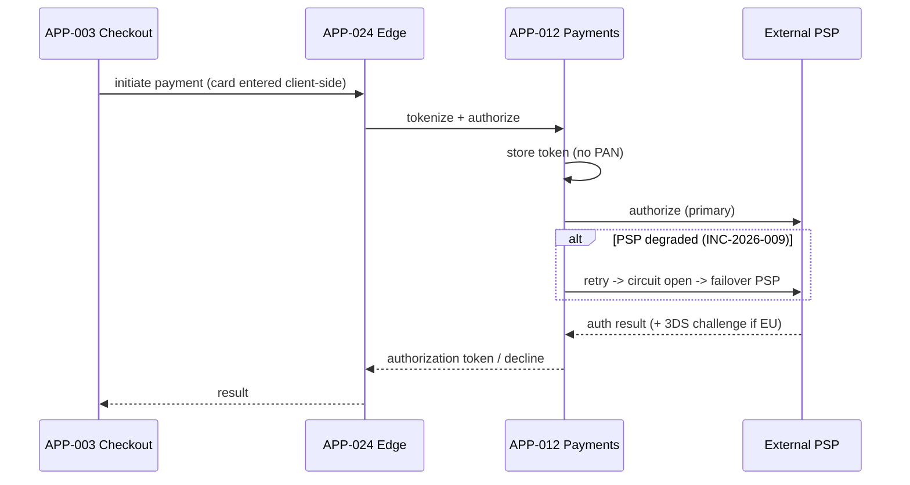

# AD-0011 — Payments & PCI Boundary

| Field | Value |
|---|---|
| Doc id | AD-0011 |
| Title | Payments & PCI Boundary |
| Owner team | TEAM-009 |
| Apps | APP-012 |
| Status | Accepted |
| Related | KN-211, APP-013, APP-024, APP-003, APP-009, INC-2026-009, ADR-0043, ADR-0045 |

## Purpose

This document describes the **Payments Service (APP-012)** and the **PCI-DSS boundary** it
enforces. Payments is the only MCG service permitted to touch cardholder data, and it does so
inside a tightly scoped, isolated boundary so that the rest of the commerce platform stays out
of PCI scope entirely.

The service handles tokenization, authorization and capture, 3-D Secure (3DS), and integration
with external Payment Service Providers (PSPs) with failover. **Security-by-design (§8)** is the
organizing principle: cardholder data never leaves the boundary in the clear, and every other
service works with tokens only.

The document exists to make the PCI boundary, the tokenization flow, and PSP failover explicit,
and to record how INC-2026-009 (primary PSP degraded auth latency) is handled without customer
impact or PCI-scope creep.

## Context

APP-012 is owned by **TEAM-009**, built in **Java on Spring Boot** with **PostgreSQL** (holding
tokens and payment state — never raw PANs). It is **Tier 0** and **sensitivity: pci** per ADR-0043.

- **Dependencies (canon):** APP-013 Wallet (stored tokenized instruments), external PSPs, and
  **APP-024 API Gateway** for edge ingress.
- **Caller (canon):** APP-003 Checkout initiates payment **via APP-024** — checkout never calls
  Payments directly outside the gateway, and Payments never calls checkout. APP-009 OMS drives
  auth/capture within the order saga.
- **Regions/tier:** PSP routing is region-aware (NA/LATAM/EU/APAC); EU flows enforce 3DS/SCA.

Business drivers: authorize reliably even when a PSP degrades, keep PCI audit scope minimal, and
never store or log a raw card number anywhere in MCG.

## Architecture

The PCI boundary is a network- and data-isolated zone. Cardholder data enters only via a
tokenization endpoint and is exchanged with PSPs; everything internal uses tokens.





Auth/capture are synchronous; payment-lifecycle events (`authorized`, `captured`, `refunded`) are
published on Kafka for OMS and analytics (event-driven, §8).

## Key decisions

1. **Cardholder data is confined to the PCI boundary (security-by-design, §8; ADR-0043).** Only
   APP-012 sees a PAN, and only transiently during tokenization. Every other MCG service handles
   tokens, keeping them out of PCI scope.
2. **Tokenize immediately, store never.** The vault exchanges a PAN for a token at entry; the raw
   PAN is never persisted and never logged. `payment_txn` and `tokens` hold no cardholder data.
3. **PSP failover with circuit breakers (INC-2026-009 fix).** When the primary PSP's auth latency
   degrades, a circuit breaker opens and the router fails over to a secondary PSP, preserving the
   auth success rate. Routing is region-aware.
4. **3DS/SCA orchestrated at the boundary.** EU flows enforce Strong Customer Authentication; the
   3DS challenge is orchestrated inside APP-012 so callers never handle authentication secrets.
5. **Idempotent auth/capture (ADR-0045).** Every auth and capture carries an idempotency key so a
   retry from the OMS saga can never double-authorize or double-charge.
6. **Auth then capture, driven by the saga.** Authorization holds funds; capture is triggered by
   OMS only after fulfillment commits, matching the reserve-before-charge invariant in AD-0009.
7. **Sensitivity travels with data (ADR-0043).** Tokens and txn records are tagged `pci`;
   pipelines to APP-020 receive only de-scoped, tokenized fields.
8. **Least-privilege network isolation.** The boundary has its own subnet, keys, and audit log;
   ingress is only via APP-024 and the OMS saga path — no ad-hoc access.

## Data & APIs

Synchronous REST (JSON), reached only through APP-024:

```
POST /v1/payments/tokenize        # PAN in (client-side collected) -> token out
POST /v1/payments/authorize       # {orderId, token, amount, currency, region} -> authId
POST /v1/payments/{authId}/capture
POST /v1/payments/{authId}/void
POST /v1/payments/{txnId}/refund
```

| Store / topic | Purpose |
|---|---|
| PostgreSQL `tokens` | token ↔ instrument mapping (no PAN) |
| PostgreSQL `payment_txn` | auth/capture/refund state |
| Kafka `commerce.payments.authorized.v1` | emitted to OMS |
| Kafka `commerce.payments.captured.v1` | emitted to OMS / analytics |

Idempotency key: `pay:{orderId}:{operation}`. Error envelope (never leaks PAN or PSP internals):

```json
{ "error": { "code": "AUTH_DECLINED", "reason": "issuer_declined", "psp": "B", "traceId": "..." } }
```

## Failure modes & resilience

- **Primary PSP degraded (INC-2026-009).** Auth latency on the primary PSP rose sharply. Handling:
  per-PSP circuit breaker opens on latency/error threshold, router fails over to PSP B, and
  in-flight auths retry idempotently. Customer sees normal auth times; no double charges.
- **PSP total outage.** Failover PSP absorbs traffic; if both are down, authorize fails closed and
  checkout surfaces a retryable decline rather than completing an order it can't pay for.
- **3DS challenge timeout.** Auth is abandoned cleanly (no funds held); customer is re-prompted.
- **Vault/DB unavailable.** Fail closed — no tokenization, no auth. Payments never guesses. OMS
  saga does not advance and no capture occurs.
- **Duplicate delivery / retry storm.** Idempotency keys make repeated auth/capture no-ops.

Timeouts: PSP auth 4 s with backoff, circuit breaker at sustained p95 breach; capture 3 s.
Load-shedding protects the boundary during PSP incidents so degradation stays graceful.

## Observability

Golden-signal SLOs (Tier 0, PCI-scoped dashboards with restricted access):

| Signal | Target |
|---|---|
| Authorize latency p95 | ≤ 900 ms |
| Authorize latency p99 | ≤ 2.5 s |
| Auth success rate | > 99% (excl. genuine declines) |
| PSP failover time | < 5 s from breaker open |
| PAN-in-logs incidents | 0 (hard invariant) |

Metrics: `pay.authorize.latency` by PSP, `pay.auth.success_rate`, `pay.psp.circuit_state`,
`pay.failover.count`. Traces span edge → APP-012 → PSP (PSP payloads redacted). Alerts: PSP
latency/error breach (the INC-2026-009 detector), circuit-open events, auth-success-rate drop,
and any DLP hit for cardholder data in logs. Audit logging is immutable and PCI-retained.

## Cross-references

- **Sibling ADs:** KN-211 (this doc), AD-0012 (API Gateway / Edge), AD-0009 (OMS saga),
  AD-0003 (Checkout).
- **Apps:** APP-012 (Payments), APP-013 (Wallet), APP-024 (API Gateway), APP-003 (Checkout),
  APP-009 (OMS).
- **Teams:** TEAM-009 (owner), TEAM-040 (Security Eng), TEAM-030 (Edge), TEAM-006 (OMS).
- **Incidents:** INC-2026-009 (primary PSP degraded auth latency).
- **ADRs:** ADR-0043 (sensitivity travels with data / PCI), ADR-0045 (idempotent execution & rollback).
- **Release:** REL-2026-005.
