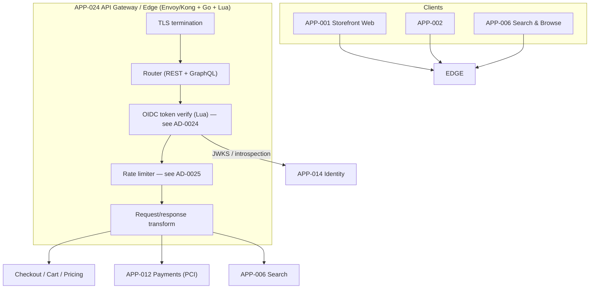
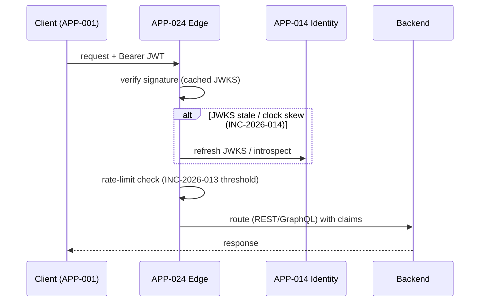

# AD-0012 — API Gateway & Edge

| Field | Value |
|---|---|
| Doc id | AD-0012 |
| Title | API Gateway & Edge |
| Owner team | TEAM-030 |
| Apps | APP-024 |
| Status | Accepted |
| Related | KN-212, KN-224, KN-225, APP-014, APP-001, APP-002, APP-006, INC-2026-013, INC-2026-014, ADR-0026, ADR-0045 |

## Purpose

This document describes the **API Gateway & Edge (APP-024)**: MCG's single ingress plane for
external client traffic. It terminates TLS, routes to backend bounded contexts, verifies OIDC
tokens, enforces rate limits, and presents a unified GraphQL/REST edge to the storefront and
other client apps.

The gateway is where cross-cutting concerns live so backend services don't reimplement them:
authentication, rate limiting, request shaping, and observability at the edge. It is a control
point, not a business service — it owns **no** domain data.

The document exists because two edge incidents (INC-2026-013 rate-limit too aggressive,
INC-2026-014 edge OIDC rejected valid tokens) showed how sensitive Tier-0 availability is to
edge policy. The deep policy specs live in sibling docs — **rate limiting in AD-0025 (KN-225)**
and **edge authentication in AD-0024 (KN-224)** — and this doc references them in detail.

## Context

APP-024 is owned by **TEAM-030 Core Platform**, built on **Envoy/Kong** with **Go** control-plane
services and **Lua** filters for request-time logic. It is **Tier 0** — if the edge is down, the
storefront is down.

- **Dependency (canon):** APP-014 Identity (Go, OIDC/OAuth2, PostgreSQL) provides the JWKS and
  token introspection used for edge token verification. Dependency direction is fixed:
  APP-024 → APP-014. Identity never calls the gateway.
- **Clients / downstreams (canon):** the edge fronts APP-001 Storefront Web, APP-002, and
  APP-006 Search & Browse, and routes to backend services (checkout, cart, pricing, payments)
  behind it. Payments (APP-012) is reachable only through this edge.
- **Regions/tier:** the edge is deployed per region (NA/LATAM/EU/APAC) on AWS/Kubernetes for
  locality and blast-radius isolation.

Business drivers: a single, consistent, secure entry point; open-standards protocols (§8, ADR-0026)
so clients aren't locked to proprietary edge APIs; and edge policy that protects backends without
false-rejecting legitimate traffic.

## Architecture

Requests hit the regional edge, pass through the filter chain (TLS → routing → OIDC verify →
rate limit → transform), and are routed to REST or GraphQL backends.





Verification and rate limiting are synchronous, in the request path. Edge access logs and metrics
stream asynchronously to observability (TEAM-032).

## Key decisions

1. **Single edge control point (API-first, §8).** All external traffic ingresses through APP-024,
   so authentication, rate limiting, and routing are enforced once, consistently.
2. **Edge OIDC verification, Identity is authority (§8; ADR-0026).** The edge verifies JWT
   signatures against APP-014's JWKS locally for speed and introspects when needed. Open standards
   (OIDC/OAuth2) keep clients portable. Deep spec: **AD-0024 (KN-224)**.
3. **JWKS caching with safe refresh (INC-2026-014 fix).** Valid tokens were rejected when a rotated
   signing key wasn't in the edge's cached JWKS and on clock skew. Fix: proactive JWKS refresh on
   `kid` miss, a grace window for key rotation, and bounded clock-skew tolerance — detailed in AD-0024.
4. **Rate limiting as a first-class, tunable policy (INC-2026-013 fix).** Limits were set too
   aggressively and shed legitimate traffic. The corrected model (per-client/per-route tiers,
   burst allowance, and gradual rollout of threshold changes) is specified in **AD-0025 (KN-225)**;
   the edge enforces it.
5. **GraphQL + REST at the edge.** A GraphQL edge serves rich client apps (APP-001/APP-002/APP-006)
   while REST is preserved for service-to-service and simple clients; both share the same authN and
   rate-limit filters.
6. **Fail-open vs fail-closed by concern.** Authentication fails **closed** (no valid token → no
   backend). Rate limiting degrades gracefully with burst allowance to avoid false rejection
   (the INC-2026-013 lesson).
7. **Per-region deployment for blast-radius isolation (cloud-native, §8).** An edge incident in one
   region does not cascade globally.
8. **Idempotency + rollback for policy changes (ADR-0045).** Rate-limit and authN policy changes
   ship as versioned config with a rollback plan and canary rollout — no flag-day edge changes.

## Data & APIs

The edge owns no domain data; it exposes management and health surfaces and shapes client traffic:

```
# Client-facing (examples routed by the edge)
POST /graphql                      # unified GraphQL edge for APP-001/APP-002/APP-006
GET  /v1/catalog/... , /v1/cart/... , /v1/search/...   # REST routes to backends

# Edge control-plane (internal, TEAM-030)
GET  /admin/routes                 # active route table
GET  /admin/ratelimits             # effective limits (policy owned by AD-0025)
GET  /healthz , /readyz
```

| Store / config | Purpose |
|---|---|
| JWKS cache (in-memory) | APP-014 signing keys for JWT verify (see AD-0024) |
| Rate-limit counters (Redis) | per-client/route token buckets (see AD-0025) |
| Route config (declarative) | Envoy/Kong route + filter chain |

Error envelopes are standardized so clients can distinguish policy from backend failure:

```json
{ "error": { "code": "RATE_LIMITED", "retryAfterMs": 800, "traceId": "..." } }
{ "error": { "code": "TOKEN_INVALID", "reason": "kid_not_found", "traceId": "..." } }
```

## Failure modes & resilience

- **Rate-limit too aggressive (INC-2026-013).** Thresholds shed legitimate storefront traffic under
  normal load. Handling: burst allowance, per-route tiers, and canary rollout of threshold changes
  — full policy in **AD-0025**. Alert compares reject rate against baseline.
- **Edge OIDC rejected valid tokens (INC-2026-014).** Root cause: cached JWKS missed a rotated key
  and clock skew tripped `nbf`/`exp`. Handling: refresh JWKS on `kid` miss, key-rotation grace
  window, bounded skew tolerance — full spec in **AD-0024**. Fails closed only for genuinely
  invalid tokens.
- **Identity (APP-014) unavailable.** Edge serves from cached JWKS for local verification; token
  introspection degrades to signature-only within the cache validity window rather than rejecting all.
- **Backend timeout / unhealthy.** Circuit breaker per route sheds to that backend; other routes
  unaffected (blast-radius isolation).
- **Edge saturation.** Load-shedding at the edge protects backends; excess returns `RATE_LIMITED`
  with `Retry-After` instead of collapsing.

Timeouts: JWKS fetch 500 ms (cached), per-route upstream budgets, circuit breakers per backend.

## Observability

Golden-signal SLOs (Tier 0 edge):

| Signal | Target |
|---|---|
| Edge added latency p50 | ≤ 3 ms |
| Edge added latency p95 | ≤ 12 ms |
| Edge added latency p99 | ≤ 30 ms |
| 5xx rate at edge | < 0.05% |
| False token rejections | ~0 (INC-2026-014 guard) |
| Legit-traffic reject rate | < 0.1% (INC-2026-013 guard) |

Metrics: `edge.latency`, `edge.ratelimit.rejects` vs baseline, `edge.authn.rejects` by reason
(`kid_not_found`, `expired`), `edge.jwks.refresh.count`, `edge.upstream.circuit_state`. Traces
originate at the edge (trace-id injected) and span to backends. Alerts: reject-rate baseline
deviation (INC-2026-013), `kid_not_found` spike (INC-2026-014), per-route 5xx, and edge saturation.
Dashboards split by region and route.

## Cross-references

- **Sibling ADs:** KN-212 (this doc), **AD-0024 / KN-224** (edge authentication — authoritative),
  **AD-0025 / KN-225** (rate limiting — authoritative), AD-0011 (Payments edge path).
- **Apps:** APP-024 (Gateway), APP-014 (Identity), APP-001/APP-002/APP-006 (clients), APP-012 (Payments).
- **Teams:** TEAM-030 (owner, Core Platform), TEAM-014 (Identity), TEAM-032 (Observability/SRE),
  TEAM-040 (Security Eng).
- **Incidents:** INC-2026-013 (rate-limit threshold too aggressive), INC-2026-014 (edge OIDC
  rejected valid tokens).
- **ADRs:** ADR-0026 (open standards), ADR-0045 (idempotent execution & rollback plans).
- **Release:** REL-2026-007.
