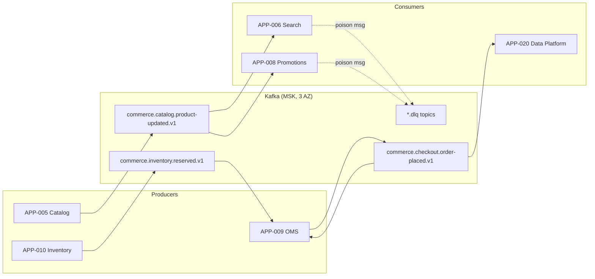

# AD-0013 — Event Backbone (Apache Kafka)

| Field | Value |
|---|---|
| Doc id | AD-0013 |
| Title | Event Backbone (Apache Kafka) |
| Owner team | TEAM-030 |
| Apps | Platform / cross-cutting |
| Status | Accepted |
| Related | KN-213, KN-214, APP-005, APP-006, APP-008, APP-009, APP-010, INC-2026-003, INC-2026-011, INC-2026-021, ADR-0026, ADR-0033, ADR-0045 |

## Purpose

This document defines the shared event backbone for Meridian Commerce Group (MCG): a
multi-tenant Apache Kafka platform operated by Core Platform (TEAM-030) that carries all
asynchronous, domain-event traffic between commerce services. It is the physical substrate
for MCG's event-driven architecture principle.

The backbone exists to decouple bounded contexts. Producers publish facts about their own
domain (an order was placed, inventory was reserved, a price changed) without knowing which
services consume them. This lets teams evolve independently, absorb load spikes, and rebuild
read models by replaying history — none of which is possible over synchronous RPC alone.

It also standardises *how* events look on the wire. Every message is a CloudEvents envelope
with a registered payload schema (see AD-0014), so consumers can rely on stable framing and
compatible evolution rather than bespoke, per-team JSON blobs.

## Context

Kafka sits behind almost every Tier 0 flow. The Product Catalog (APP-005) emits change events
that Search & Browse (APP-006) consumes to keep its OpenSearch index current; a lag in this
pipeline caused stale prices in INC-2026-003. The Promotions Engine (APP-008) consumes pricing
and catalog events to invalidate its Redis promo cache — the failure to do so drove
INC-2026-011. Order Management (APP-009) and Inventory Service (APP-010) exchange order and
reservation events to keep available-to-promise consistent.

The platform runs on AWS MSK across three availability zones per region (NA, LATAM, EU, APAC),
with region-local clusters and no cross-region topic mirroring for transactional domains.
APP-020 (Data Platform, TEAM-060) is the largest downstream consumer, sinking events into the
lakehouse; its outage stalled catalog ingestion in INC-2026-021, which is why sink lag must
never back-pressure online producers.

## Architecture

Producers write synchronously to a partitioned topic; the broker replicates the record across
the in-sync replica set before acknowledging. Consumers pull in groups, each partition owned by
exactly one group member, committing offsets after successful processing.



Every payload is wrapped in a CloudEvents 1.0 envelope. `type` mirrors the topic's logical
event name, `source` identifies the producing app, `subject` carries the aggregate id
(e.g. the order id), and `datacontenttype` plus a schema-registry `dataschema` reference pin
the body's shape.

```json
{
  "specversion": "1.0",
  "id": "0f9c8f0a-3b1e-4a2d-9f7c-2b6a1e5d4c33",
  "source": "app-009-oms",
  "type": "commerce.checkout.order-placed.v1",
  "subject": "order/ORD-8871234",
  "time": "2026-07-12T14:22:05Z",
  "datacontenttype": "application/json",
  "dataschema": "sr://commerce.checkout.order-placed/v1",
  "traceparent": "00-4bf92f3577b34da6a3ce929d0e0e4736-00f067aa0ba902b7-01",
  "data": { "orderId": "ORD-8871234", "cartId": "CRT-55021", "totalMinor": 12999, "currency": "USD" }
}
```

## Key decisions

1. **Topic naming is `<domain>.<context>.<event>.<version>`** (event-driven, open standards).
   Example: `commerce.checkout.order-placed.v1`. The version suffix lets a breaking schema
   change coexist as a new topic during expand-contract migration (ADR-0033), rather than
   mutating consumers in place.
2. **CloudEvents 1.0 as the mandatory envelope** (open standards, ADR-0026). A single framing
   standard means tracing, DLQ tooling, and audit sinks work uniformly across every team.
3. **Partition by aggregate key** — order id for checkout topics, SKU for catalog/inventory.
   This guarantees per-aggregate ordering, which OMS and Inventory rely on to apply state
   transitions correctly, while spreading load across partitions.
4. **At-least-once delivery is the default; consumers must be idempotent** (ADR-0045). We do
   not run Kafka exactly-once (EOS) across service boundaries because it couples producer and
   consumer transactions and inflates latency; idempotency keys are cheaper and more portable.
5. **Exactly-once is used only intra-service** where a consume-transform-produce loop stays on
   one cluster (e.g. Promotions cache-invalidation stream), via transactional producers.
6. **Every consumer group has a paired `.dlq` topic** with the original envelope plus failure
   metadata. Poison messages are parked, not retried infinitely, so one bad record cannot
   stall a partition (a lesson from INC-2026-003 reindex lag).
7. **Region-local clusters, no transactional mirroring** (cloud-native). Cross-region event
   sharing is limited to analytical sinks into APP-020, decoupled from the online path.
8. **Schema compatibility is enforced at publish time** by the registry (AD-0014); producers
   cannot emit a payload that would break existing consumers.

## Data & APIs

Kafka is not exposed over HTTP to services; producers/consumers use native clients. Key topics:

| Topic | Producer | Key consumers | Partition key |
|---|---|---|---|
| `commerce.catalog.product-updated.v1` | APP-005 | APP-006, APP-008, APP-020 | SKU |
| `commerce.pricing.price-changed.v1` | APP-007 | APP-008, APP-006 | SKU |
| `commerce.checkout.order-placed.v1` | APP-009 | APP-020, APP-010 | orderId |
| `commerce.inventory.reserved.v1` | APP-010 | APP-009 | SKU |
| `commerce.inventory.oversold.v1` | APP-010 | APP-009, APP-023 | SKU |
| `commerce.promotions.applied.v1` | APP-008 | APP-020 | orderId |

- **Idempotency:** consumers dedupe on CloudEvents `id` (kept in a Redis/Postgres seen-set with
  TTL) so at-least-once redelivery is safe.
- **Retention:** transactional topics 7 days; catalog/pricing change-log topics 30 days
  (compacted where a latest-state view is useful, e.g. `product-updated` compacted by SKU).
- **Error envelope on DLQ:** original event embedded under `data.original`, plus
  `data.error.reason`, `data.error.consumerGroup`, `data.error.attempts`.

## Failure modes & resilience

- **Broker/AZ loss:** replication factor 3, `min.insync.replicas=2`, `acks=all` — a single AZ
  failure is transparent; producers block only if two replicas are unavailable.
- **Consumer lag / slow sink:** monitored per group; a slow analytical sink (INC-2026-021 class)
  must never back-pressure producers, so online producers and the APP-020 sink are separate
  consumer groups on the same topic.
- **Stale downstream cache (INC-2026-011):** promo/search caches are driven by change topics;
  invalidation consumers alert if lag exceeds the freshness SLO so staleness is caught early.
- **Poison message:** after N=5 retries with backoff, the record is routed to `.dlq` and the
  partition advances; on-call triages the DLQ rather than the pipeline stalling.
- **Producer unavailable:** producers use a local outbox (transactional write to Postgres, then
  relay to Kafka) so an order is never lost if the broker is briefly unreachable.
- **Rebalance storms:** static group membership and generous `session.timeout` reduce needless
  partition reassignment during rolling deploys.

## Observability

- **Golden signals:** end-to-end event latency (produce→consume) p95 < 2s, p99 < 5s for
  Tier 0 change topics; consumer group lag (records and time); under-replicated partition count
  (target 0); broker request p99.
- **Metrics:** per-topic produce/consume rate, DLQ arrival rate, idempotent-dedupe hit rate,
  rebalance frequency, offset commit failures.
- **Traces:** the CloudEvents `traceparent` propagates the OpenTelemetry context across the
  async hop, so a single trace spans HTTP → Kafka → consumer (see AD-0017).
- **Alerts:** consumer lag over freshness SLO; DLQ arrival rate > 0 sustained; ISR shrink;
  any producer outbox backlog growth.
- **Dashboards:** per-domain topic health and a cross-cutting "event freshness" board watched
  during peak-readiness windows.

## Cross-references

- AD-0014 API Contracts & Schema Registry (payload schemas, evolution)
- AD-0017 Observability & SLOs (trace propagation, lag SLOs)
- KN-213, KN-214 (sibling platform notes)
- APP-005, APP-006, APP-007, APP-008, APP-009, APP-010, APP-020, APP-023
- TEAM-030 (owner), TEAM-032 (SRE), TEAM-060 (Data Platform)
- INC-2026-003, INC-2026-011, INC-2026-021
- ADR-0026 (open standards), ADR-0033 (expand-contract), ADR-0045 (idempotency & rollback)
