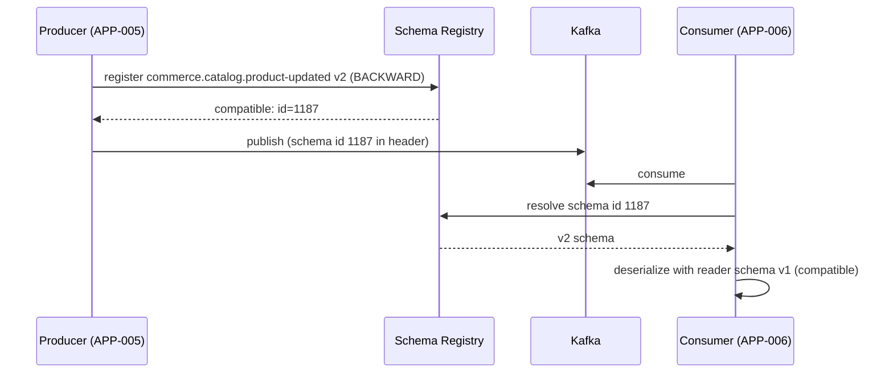

# AD-0014 — API Contracts & Schema Registry

| Field | Value |
|---|---|
| Doc id | AD-0014 |
| Title | API Contracts & Schema Registry |
| Owner team | TEAM-030 |
| Apps | Platform / cross-cutting |
| Status | Accepted |
| Related | KN-213, KN-215, APP-005, APP-009, APP-024, TEAM-050, INC-2026-019, ADR-0026, ADR-0033 |

## Purpose

This document defines how MCG designs, publishes, and evolves the contracts between its
services — synchronous APIs (REST, gRPC, GraphQL) and asynchronous event payloads (Kafka,
see AD-0013). It is the practical expression of the **API-first** and **open standards**
principles (ADR-0026).

MCG has dozens of services owned by independent teams. Without a single source of truth for
interfaces, integration devolves into tribal knowledge and breaking changes ship by accident.
This document establishes that the contract is the product: it is written first, reviewed,
versioned, and machine-checked before any implementation is trusted against it.

Two mechanisms enforce this: a central contract repository (`mcg-contracts`) for
request/response API specs, and a schema registry that gates every Kafka payload. Together they
make interface compatibility a build-time and publish-time guarantee rather than a runtime
surprise.

## Context

Every focal app is both a contract consumer and producer. The API Gateway (APP-024) routes to
services strictly by their published OpenAPI specs. Checkout (APP-003) calls Payments (APP-012),
Cart (APP-004), and Pricing (APP-007) over their contracts; the p99 regression in INC-2026-019
traced to a synchronous promo call whose contract lacked a tight timeout budget — a contract
quality issue as much as a code issue.

Contracts live in `mcg-contracts`, a mono-repo of interface definitions independent of any
service's source tree, so a consumer can depend on a producer's contract without depending on
its code. QE (TEAM-050) owns the consumer-driven contract (CDC) test harness that runs in CI
(see AD-0018). The schema registry is a Core Platform (TEAM-030) service co-located with each
regional Kafka cluster.

## Architecture

The contract flow is: author spec → PR review in `mcg-contracts` → generate client/server stubs
→ implement → CDC tests verify both sides → registry gates runtime payloads.

```mermaid
flowchart TD
  Dev["Producer team"] -->|1. write spec| Repo["mcg-contracts repo\n(OpenAPI / proto / GraphQL SDL)"]
  Repo -->|2. codegen| Stubs["Client + server stubs"]
  Repo -->|3. publish schemas| SR["Schema Registry\n(per region)"]
  Consumer["Consumer team"] -->|4. contract test (Pact)| CDC["CDC harness (TEAM-050)"]
  CDC -->|verify against| Repo
  Prod["Kafka producer"] -->|5. serialize + validate| SR
  SR -->|compat check| Prod
  Cons["Kafka consumer"] -->|fetch schema by id| SR
```



## Key decisions

1. **API-first: the contract is authored before code** (API-first). No service is deployed
   whose runtime behaviour has not been validated against its published contract.
2. **Protocol chosen by interaction shape** (open standards): REST+OpenAPI 3.1 for
   resource/CRUD and public-facing edge APIs; gRPC+protobuf for high-throughput internal
   service-to-service calls; GraphQL SDL only at BFF aggregation layers (APP-001, APP-021).
3. **`mcg-contracts` is the single source of truth**, decoupled from service repos, so a
   consumer depends on an interface, not an implementation (DDD/bounded-context isolation).
4. **Schema registry gates all Kafka payloads** (event-driven). A producer cannot publish a
   payload whose schema is incompatible with the registered subject; incompatibility fails the
   publish, not the consumer.
5. **BACKWARD compatibility by default** for event schemas: new consumers can read old data.
   Public REST APIs additionally require FULL compatibility within a major version.
6. **Expand-contract for all breaking changes** (ADR-0033): add the new field/topic/version,
   migrate producers, migrate consumers, then remove the old — never a flag-day cutover.
7. **Consumer-driven contract tests are mandatory in CI** (TEAM-050). Each consumer publishes
   the interactions it relies on; the producer's pipeline fails if it would break any consumer.
8. **Timeout and error contract is part of the spec.** Every synchronous operation declares a
   latency budget and error envelope, closing the INC-2026-019 gap where an unbounded
   downstream call regressed checkout p99.
9. **Versioning is explicit and in-band**: REST via URI major (`/v1/`), events via topic suffix
   (`.v1`), gRPC via package version.

## Data & APIs

Contract artefact types and where they live:

| Artefact | Format | Location | Compatibility rule |
|---|---|---|---|
| Edge / public API | OpenAPI 3.1 | `mcg-contracts/openapi/` | FULL within major |
| Internal RPC | protobuf 3 | `mcg-contracts/proto/` | BACKWARD |
| BFF aggregation | GraphQL SDL | `mcg-contracts/graphql/` | additive only |
| Kafka payloads | JSON Schema / Avro | Schema Registry subjects | BACKWARD |

Example REST fragment (catalog):

```
GET /v1/products/{sku}            -> 200 Product | 404 error-envelope
GET /v1/products?ids=SKU1,SKU2    -> 200 ProductList
```

Error envelope (shared across all REST services):

```json
{ "error": { "code": "PRODUCT_NOT_FOUND", "message": "…", "traceId": "…", "retryable": false } }
```

- **Registry subjects** follow the topic name, e.g. subject `commerce.checkout.order-placed-value`.
- **Idempotency:** mutating REST endpoints accept an `Idempotency-Key` header; the contract
  declares it required for POSTs that create orders/payments.
- **Schema id** travels in the Kafka record header so consumers resolve the exact writer schema.

## Failure modes & resilience

- **Registry unavailable at publish:** producers cache resolved schema ids locally; a brief
  registry outage does not stop publishing already-registered schemas, only new registrations.
- **Consumer sees unknown schema id:** consumer fetches on demand and caches; if truly unknown,
  the record is DLQ'd (AD-0013) rather than crashing the consumer.
- **Accidental breaking change:** blocked twice — CDC tests in CI and the registry compatibility
  gate at publish. A change that passes neither cannot reach production.
- **Contract drift (impl diverges from spec):** contract tests run against the deployed service
  in staging; drift fails the pipeline before promotion.
- **Over-tight or missing timeout contract:** required latency-budget field in specs prevents the
  INC-2026-019 pattern of an unbounded synchronous dependency.

## Observability

- **Golden signals (registry as a Tier 0 dependency):** registry lookup p99 < 20ms (cache hit
  near zero), availability 99.95%, error rate < 0.01%.
- **Metrics:** schema registration rate, compatibility-check rejections (a leading indicator of
  breaking changes attempted), schema cache hit ratio, CDC test pass rate per service pair.
- **Traces:** contract validation failures annotate the request trace with the offending field.
- **Alerts:** spike in compatibility rejections; any consumer deserialization failure rate > 0;
  CDC verification breakage on a producer pipeline.
- **Dashboards:** contract coverage (share of endpoints/topics with published specs and passing
  CDC tests), tracked as a platform health KPI.

## Cross-references

- AD-0013 Event Backbone (schema registry usage on Kafka)
- AD-0018 CI/CD Golden Paths (where CDC tests and codegen run)
- KN-213, KN-215 (sibling platform notes)
- APP-005, APP-009, APP-024 (representative producers/consumers), APP-001, APP-021 (BFF GraphQL)
- TEAM-030 (owner), TEAM-050 (QE / CDC harness)
- INC-2026-019 (unbounded sync dependency)
- ADR-0026 (open standards), ADR-0033 (expand-contract schema evolution)
