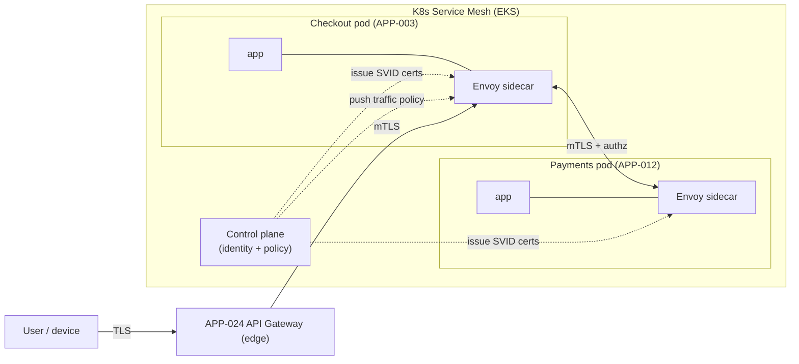
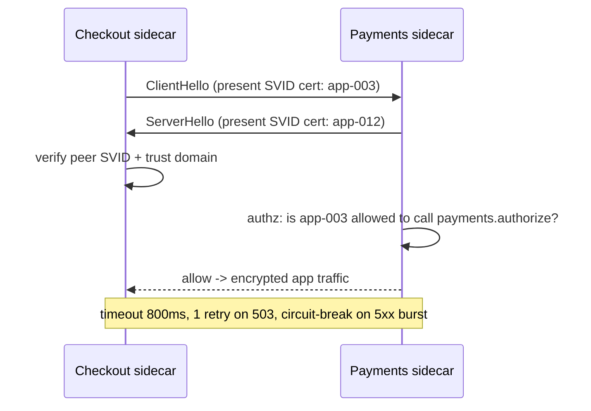

# AD-0015 — Service Mesh & mTLS

| Field | Value |
|---|---|
| Doc id | AD-0015 |
| Title | Service Mesh & mTLS |
| Owner team | TEAM-030 |
| Apps | Platform / cross-cutting |
| Status | Accepted |
| Related | KN-216, KN-217, APP-024, APP-012, APP-014, TEAM-040, INC-2026-013, INC-2026-014, ADR-0026 |

## Purpose

This document defines MCG's Kubernetes service mesh: the data-plane sidecars and control plane
that provide mutual TLS, workload identity, and traffic policy for all in-cluster
service-to-service communication. It realises the **security-by-design** and **cloud-native**
principles by making encrypted, authenticated, authorised connectivity the platform default
rather than something each service implements itself.

The mesh removes cross-cutting networking concerns from application code. Timeouts, retries,
circuit breaking, mTLS, and identity are enforced by the sidecar proxy uniformly, so a Go
service (APP-010) and a Java service (APP-009) get identical, correct behaviour without each
team hand-rolling it.

Crucially, the mesh governs east-west (service-to-service) traffic. North-south (client→edge)
traffic is terminated at the API Gateway (APP-024), which then hands off into the mesh. The two
layers are complementary: the gateway authenticates *users*; the mesh authenticates *workloads*.

## Context

Every Tier 0 call between MCG services rides the mesh: Checkout (APP-003) → Payments (APP-012),
Cart (APP-004) → Pricing (APP-007), OMS (APP-009) → Inventory (APP-010). Because Payments and
Identity (APP-014) handle sensitive data, workload-level authentication is non-negotiable — a
compromised service must not be able to impersonate another.

Mesh policy also carries operational lessons. INC-2026-013 (over-aggressive rate-limit
threshold) and INC-2026-014 (edge OIDC rejecting valid tokens) both involved policy enforced at
the edge/mesh boundary; getting retry, timeout, and identity policy right at this layer is
directly tied to Tier 0 availability. The mesh runs on EKS across all regions; legacy Azure POS
sits outside it and integrates only via the gateway.

## Architecture

Each pod runs an Envoy sidecar. Application traffic is transparently redirected through the
sidecar, which negotiates mTLS with the peer's sidecar, checks authorization policy, and applies
traffic policy (timeouts, retries, outlier ejection). The control plane distributes identity
certificates and policy.





## Key decisions

1. **mTLS is mandatory (STRICT mode) for all east-west traffic** (security-by-design). Plaintext
   in-cluster traffic is rejected; there is no opt-out for service-to-service calls.
2. **Workload identity via SPIFFE-style SVIDs.** Each workload receives a short-lived X.509
   identity (e.g. `spiffe://mcg/ns/checkout/sa/app-003`) auto-rotated by the control plane, so
   identity is cryptographic, not IP- or network-based.
3. **Least-privilege authorization by identity, not network location** (security-by-design).
   `AuthorizationPolicy` explicitly lists who may call what — Payments only accepts calls from
   Checkout and OMS, denying all others by default.
4. **Traffic resilience policy lives in the mesh, not the app.** Timeouts, retries (idempotent
   methods only), and outlier ejection are declared as mesh config, giving polyglot services
   (Go/Java/Kotlin/Python) uniform behaviour.
5. **Retries are bounded and safe.** Only idempotent operations retry; retry budgets cap
   amplification so a slow dependency cannot trigger a retry storm (avoiding an INC-2026-013-style
   self-inflicted overload).
6. **Edge and mesh are separate trust boundaries** (open standards, ADR-0026). APP-024
   terminates user auth (OIDC/OAuth2 via APP-014); the mesh authenticates workloads. A valid
   user token never substitutes for workload identity.
7. **Certificate rotation is automatic and short-lived** (< 24h SVID TTL), shrinking the blast
   radius of any key compromise; no long-lived service credentials exist.
8. **Fail-closed on authz, fail-fast on transport.** An undefined authz rule denies; a peer that
   cannot present a valid SVID gets no connection.

## Data & APIs

The mesh exposes no product API; it is configured declaratively. Representative policy:

```yaml
# AuthorizationPolicy: only Checkout & OMS may authorize payments
selector: app=payments               # APP-012
rules:
  - from: [ spiffe://mcg/ns/checkout/sa/app-003,
            spiffe://mcg/ns/oms/sa/app-009 ]
    to:   [ POST /v1/payments/authorize ]
  - default: DENY
```

```yaml
# DestinationRule: resilience toward Payments
host: payments.mcg.svc
timeout: 800ms
retries: { attempts: 1, retryOn: "5xx,reset", perTryTimeout: 400ms }
outlierDetection: { consecutive5xx: 5, ejectionTime: 30s }
```

| Concern | Mesh mechanism | Default |
|---|---|---|
| Encryption | mTLS (STRICT) | on, no opt-out |
| Identity | SPIFFE SVID (X.509) | TTL < 24h |
| Authz | AuthorizationPolicy | default DENY |
| Timeout | DestinationRule | per-tier budget |
| Retry | retryOn idempotent | attempts ≤ 2 |

## Failure modes & resilience

- **Sidecar crash:** pod readiness gates on sidecar health; traffic is not routed to a pod whose
  proxy is down, so half-open pods are removed from rotation.
- **Control-plane outage:** the data plane keeps last-known-good config and certs; existing mTLS
  connections and policy continue. Only new policy/cert issuance pauses — the mesh degrades
  gracefully, it does not black-hole traffic.
- **Cert expiry during outage:** SVID TTLs are short but rotation begins well before expiry;
  alerting fires if the control plane cannot rotate, giving operators lead time.
- **Retry amplification:** retry budgets and outlier ejection prevent a struggling service (e.g.
  the INC-2026-009 degraded PSP path via Payments) from being hammered into full failure.
- **Authz misconfiguration:** default-DENY means a missing rule fails safe; policy changes are
  reviewed by Security Eng (TEAM-040) and rolled out progressively (AD-0016).
- **Edge/mesh boundary confusion:** because user-auth (INC-2026-014 class) is handled only at the
  gateway, mesh authz is unaffected by token-validation issues at the edge.

## Observability

- **Golden signals (mesh as Tier 0 substrate):** sidecar-added p99 latency < 3ms; mTLS handshake
  success rate > 99.99%; authz deny rate tracked (spikes = misconfig or attack).
- **Metrics:** per-service-pair request rate/errors/latency (emitted by sidecars), circuit-breaker
  open events, outlier ejections, cert rotation success, connection pool saturation.
- **Traces:** sidecars propagate and emit spans, so every hop appears in the OpenTelemetry trace
  (AD-0017) with peer identity attached.
- **Alerts:** rising authz denies, mTLS handshake failures, cert rotation failure, sustained
  circuit-breaker-open on a Tier 0 dependency.
- **Dashboards:** service-dependency topology (who-calls-whom), auto-derived from mesh telemetry
  and used during peak-readiness review.

## Cross-references

- AD-0016 Feature Flags & Progressive Delivery (progressive policy rollout)
- AD-0017 Observability & SLOs (sidecar telemetry, trace propagation)
- KN-216, KN-217 (sibling platform notes)
- APP-024 (edge), APP-012 (Payments), APP-014 (Identity), APP-003, APP-009, APP-010
- TEAM-030 (owner), TEAM-040 (Security Eng), TEAM-032 (SRE)
- INC-2026-013 (rate-limit), INC-2026-014 (edge OIDC), INC-2026-009 (PSP degradation)
- ADR-0026 (open standards)
