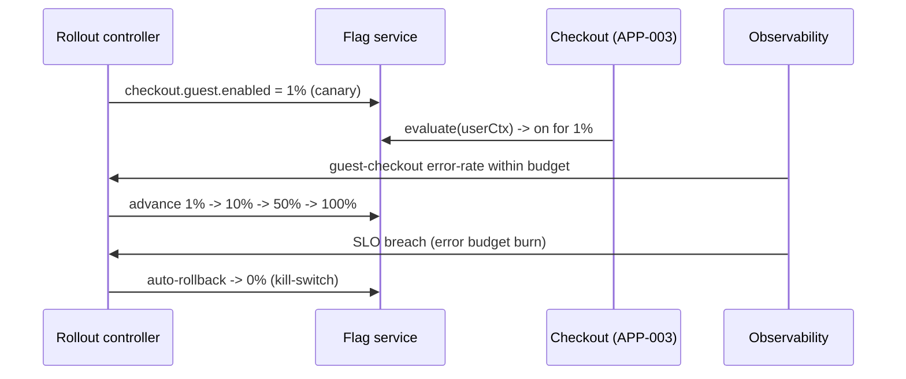

# AD-0016 — Feature Flags & Progressive Delivery

| Field | Value |
|---|---|
| Doc id | AD-0016 |
| Title | Feature Flags & Progressive Delivery |
| Owner team | TEAM-030 |
| Apps | Platform / cross-cutting |
| Status | Accepted |
| Related | KN-217, KN-218, APP-003, APP-024, CHK-1421, INC-2026-002, INC-2026-016, INC-2026-019, ADR-0031, ADR-0045 |

## Purpose

This document defines `mcg-feature-flags`, MCG's platform service for runtime feature control and
progressive delivery. It decouples *deploy* from *release*: code reaches production dark, then is
exposed to traffic gradually under measurement, with automated rollback if service-level
objectives degrade. This directly supports the trunk-based delivery model (ADR-0031) and the
requirement for idempotent, reversible change (ADR-0045).

Feature flags exist because MCG ships to trunk continuously across many Tier 0 services. Shipping
and releasing in one step makes every deploy a high-blast-radius event. Flags let a change be
merged, deployed, and validated in production behind a guard, then rolled out on a schedule the
platform can halt or reverse in seconds.

Progressive delivery adds the automation: canary → small percentage → larger percentage → full,
with SLO guardrails at each step and kill-switches for instant disable. The guest-checkout work
(CHK-1421) is the canonical consumer of this capability.

## Context

The service is used by every focal app but matters most on Tier 0 user-facing paths. Guest
checkout (CHK-1421) in the Checkout Service (APP-003) rolled out behind flag
`checkout.guest.enabled`; the orphaned-loyalty defect (INC-2026-002) was contained because the
flag scoped exposure and enabled fast rollback. The storefront latency incident (INC-2026-016)
and the checkout p99 regression (INC-2026-019) both underline why new behaviour must ride a
guardrailed rollout rather than a flag-day switch.

Flag evaluation happens at the edge (APP-024) for routing/experiment decisions and inside each
service for behavioural flags. `mcg-feature-flags` is owned by Core Platform (TEAM-030) and its
SLO signals come from Observability (AD-0017).

## Architecture

Services fetch flag definitions and stream updates from the flag service; evaluation is local
(in-process SDK) against a context, so the hot path never blocks on a network call. A rollout
controller advances percentages and watches SLOs, tripping rollback automatically on breach.

```mermaid
flowchart TD
  UI["mcg-feature-flags console\n(TEAM-030 + release owners)"] --> FS["mcg-feature-flags service"]
  FS -->|stream flag config| SDK1["SDK in APP-003 Checkout"]
  FS -->|stream flag config| SDK2["SDK in APP-024 Edge"]
  RC["Rollout controller"] -->|advance %| FS
  SLO["SLO signals (AD-0017)"] -->|breach| RC
  RC -->|auto rollback / kill-switch| FS
  SDK1 -->|evaluate(ctx)| Dec["variation: on/off/%"]
```



## Key decisions

1. **Deploy ≠ release** (ADR-0031, trunk-based). Merged code ships dark behind a flag; exposure is
   a separate, controlled, reversible action — enabling continuous integration without exposing
   half-finished work.
2. **Local, in-process evaluation.** SDKs cache flag config and evaluate against a supplied
   context; the request hot path never makes a synchronous call to the flag service (avoids an
   INC-2026-019-style added-latency dependency).
3. **Standard rollout ladder: canary → percentage → full.** Every user-facing change advances
   1% → 10% → 50% → 100%, holding at each rung long enough for SLO signal to accumulate.
4. **Automated rollback on SLO breach** (ADR-0045, reversibility). The rollout controller consumes
   error-budget-burn signals (AD-0017) and reverts to the last safe percentage without human
   action; humans are notified, not required.
5. **Kill-switches for every risky capability.** A single flag flip disables a feature globally in
   seconds — the primary containment lever used for INC-2026-002 guest-checkout defects.
6. **Targeting by context, not by build.** Flags evaluate on region, tier, cohort, or entity id,
   so a feature can be limited to NA or to internal users before broad exposure.
7. **Flags are governed and expire.** Each flag has an owner and a removal date; stale flags are
   tracked as tech debt to prevent an unmanageable flag sprawl.
8. **Rollout state is idempotent and auditable.** Setting a flag to a percentage is idempotent;
   every change is logged with actor, reason, and linked release (REL-2026-###) for audit.

## Data & APIs

Management and evaluation surfaces:

```
POST /v1/flags/{key}/rollout      { "strategy": "percentage", "value": 10, "region": "NA" }
POST /v1/flags/{key}/kill         { "reason": "INC-2026-002" }
GET  /v1/flags/{key}              -> definition + current rollout state
```

Evaluation (SDK, local):

```
variation = flags.evaluate("checkout.guest.enabled",
                           ctx={ userId, region:"NA", tier:0, cohort:"guest" })
```

| Flag (example) | Owner app | Strategy | Guardrail |
|---|---|---|---|
| `checkout.guest.enabled` | APP-003 | percentage | checkout success SLO |
| `edge.ratelimit.v2` | APP-024 | canary | 429 rate, p99 |
| `promo.sync-call.disable` | APP-008 | kill-switch | checkout p99 (INC-2026-019) |

- **Config store:** flag definitions in Postgres; live config streamed to SDKs and cached in
  memory with a short refresh, so evaluation survives a brief flag-service outage.
- **Idempotency:** rollout `POST`s carry an `Idempotency-Key`; re-applying the same percentage is
  a no-op.
- **Audit event:** each change emits `platform.flags.rollout-changed.v1` on Kafka (AD-0013).

## Failure modes & resilience

- **Flag service unavailable:** SDKs serve last-known-good cached config; evaluation continues.
  New rollout changes pause, but running traffic is unaffected — fail-static, not fail-closed.
- **Bad rollout:** SLO guardrail trips automated rollback to the prior safe percentage; if signal
  is ambiguous, the controller halts advancement rather than proceeding.
- **Defect exposed by a flag (INC-2026-002):** kill-switch disables globally in seconds; blast
  radius is bounded to the exposed percentage at time of detection.
- **Latency risk:** because evaluation is local, a slow flag service cannot add hot-path latency
  (contrast INC-2026-019's synchronous-dependency pattern).
- **Flag sprawl / stale guards:** expiry dates and ownership reviews prevent dead flags from
  silently changing behaviour.
- **Split-brain config across regions:** rollouts are region-scoped and converge from the same
  definition store; region is an explicit targeting dimension, not an accident.

## Observability

- **Golden signals for the flag service (Tier 1 control plane):** evaluation is local so hot-path
  impact is ~0ms; config-stream freshness p95 < 5s; management API availability 99.9%.
- **Metrics:** rollout percentage per flag over time, rollback events, kill-switch activations,
  SDK config staleness, per-variation exposure counts.
- **Per-feature SLO tie-in:** each guarded rollout is bound to a specific SLO (e.g. checkout
  success rate) whose error-budget burn drives auto-rollback (AD-0017).
- **Traces:** the evaluated variation is attached as a span attribute so a trace shows which flag
  state produced an outcome.
- **Alerts:** any automated rollback; kill-switch fired; config staleness beyond threshold.
- **Dashboards:** active rollouts and their guardrail health, watched during release windows and
  peak-readiness.

## Cross-references

- AD-0017 Observability & SLOs (guardrail signals, error budgets)
- AD-0018 CI/CD Golden Paths (progressive delivery stage)
- AD-0015 Service Mesh & mTLS (progressive rollout of mesh policy)
- KN-217, KN-218 (sibling platform notes)
- APP-003 (Checkout / guest checkout), APP-024 (edge), APP-008 (promotions)
- TEAM-030 (owner), TEAM-032 (SRE)
- CHK-1421 (guest checkout), INC-2026-002, INC-2026-016, INC-2026-019
- ADR-0031 (trunk-based), ADR-0045 (idempotency & rollback)
