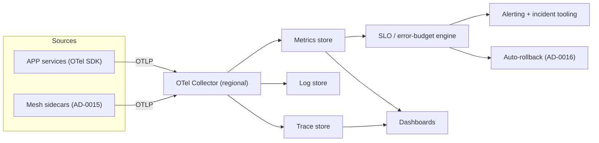
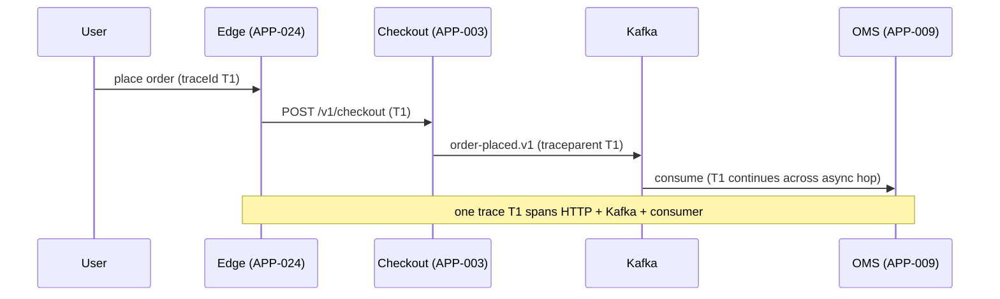

# AD-0017 — Observability & SLOs

| Field | Value |
|---|---|
| Doc id | AD-0017 |
| Title | Observability & SLOs |
| Owner team | TEAM-032 |
| Apps | Platform / cross-cutting |
| Status | Accepted |
| Related | KN-218, KN-219, APP-001, APP-003, APP-012, APP-024, INC-2026-016, INC-2026-019, REL-2026-009, ADR-0045 |

## Purpose

This document defines MCG's observability platform and its SLO/error-budget policy. It realises
the **observability/SLOs** principle: every service emits standardised telemetry, every Tier 0/1
service has explicit objectives, and error budgets convert those objectives into decisions about
whether to ship or to stabilise.

Observability is not "collect everything." It is the disciplined instrumentation of the golden
signals — latency, traffic, errors, saturation — plus distributed traces that stitch a single
user action across many services and the async Kafka hop (AD-0013). The goal is that when
something breaks, an engineer can move from symptom to cause in minutes, not hours.

SLOs give that data meaning. A per-tier objective and an error budget tell teams, objectively,
when reliability work must take priority over features, and they arm the automated rollback that
progressive delivery (AD-0016) depends on.

## Context

Every focal app instruments to this standard, but the sharpest consumers are Tier 0 user paths:
Storefront (APP-001), Checkout (APP-003), Payments (APP-012), and the edge (APP-024). The
storefront latency incident (INC-2026-016) and the checkout p99 regression from a synchronous
promo call (INC-2026-019) are exactly the failures this platform is built to detect fast — both
surfaced first as SLO burn on latency signals. Peak-readiness for high-traffic sales events (the
context around REL-2026-009) leans entirely on these dashboards and error budgets.

The platform is owned by Observability/SRE (TEAM-032). Telemetry is emitted via OpenTelemetry
from every service and mesh sidecar (AD-0015), collected regionally, and fed to metrics, logs,
tracing, and alerting backends with a unified incident-tooling workflow.

## Architecture

Services and sidecars export OTLP to a regional collector, which fans telemetry out to the
metrics store, log store, and trace store. SLO evaluation runs continuously against the metrics
store and drives alerting and rollback.





## Key decisions

1. **OpenTelemetry is the single instrumentation standard** (open standards, observability). All
   services emit OTLP metrics, logs, and traces; no bespoke agents. This makes polyglot services
   (Java/Go/Kotlin/Python/Node) observable identically.
2. **Golden signals are mandatory for every service** (observability). Latency, traffic, errors,
   and saturation are the minimum instrumentation bar enforced in the CI golden path (AD-0018).
3. **SLOs are defined per tier, on user-facing symptoms.** Objectives measure what the user
   experiences (request success, latency), not internal proxy metrics.
4. **Error budgets govern the ship/stabilise decision** (ADR-0045-adjacent reversibility). When a
   service burns its budget, feature rollout pauses and reliability work takes priority — the
   policy is explicit, not a judgement call.
5. **Trace context propagates across the async boundary** (event-driven). The W3C `traceparent`
   rides the CloudEvents envelope (AD-0013) so a Kafka hop does not break the trace — essential to
   diagnosing INC-2026-019-style cross-service regressions.
6. **Multi-window, multi-burn-rate alerting.** Fast-burn (page now) and slow-burn (ticket) alerts
   on the same SLO cut false pages while still catching slow degradations like INC-2026-016.
7. **Structured logs, sampled traces, exemplar-linked metrics.** Logs are JSON with the trace id;
   metrics carry trace exemplars so a spiking latency chart links straight to a slow trace.
8. **Peak-readiness is a first-class dashboard set.** Load-test results and live golden signals
   share a board used to gate high-traffic releases (REL-2026-009 window).

## Data & APIs

Telemetry is emitted, not served, but SRE tooling exposes SLO status:

```
GET /v1/slo/{service}         -> objective, current SLI, budget remaining, burn rate
GET /v1/slo/{service}/budget  -> 28-day error budget consumption
```

Per-tier SLO targets (rolling 28-day, availability = successful requests):

| Tier | Availability | Latency p95 | Latency p99 | Error budget |
|---|---|---|---|---|
| Tier 0 (APP-001, 003, 012, 024) | 99.95% | ≤ 300ms | ≤ 800ms | 0.05% |
| Tier 1 (APP-008, 021) | 99.9% | ≤ 500ms | ≤ 1200ms | 0.1% |
| Tier 2 (batch/analytics) | 99.5% | best-effort | — | 0.5% |

- **Golden-signal metric names** are standardised, e.g. `http.server.request.duration`,
  `rpc.client.duration`, `messaging.kafka.consumer.lag`, `saturation.cpu`, `errors.rate`.
- **Trace attributes:** `mcg.app.id`, `mcg.tier`, `mcg.flag.variation` (from AD-0016), peer SVID
  identity (from AD-0015).
- **Log envelope:** `{ ts, level, msg, traceId, spanId, app, region }` — JSON, correlatable.

## Failure modes & resilience

- **Collector overload during peak:** collectors autoscale and tail-sample traces; metrics
  (unsampled) remain authoritative for SLOs even if trace sampling drops.
- **Telemetry pipeline outage:** SLO evaluation degrades to last-known-good; a hard gap triggers a
  "flying blind" alert so operators know signal — not the service — is missing.
- **Alert fatigue / false pages:** multi-burn-rate policy suppresses noise; symptom-based SLOs
  avoid paging on internal metrics that don't affect users.
- **Missed slow regression (INC-2026-016 class):** slow-burn alerts catch gradual latency creep
  under load that a single-threshold alert would miss.
- **Cross-service regression (INC-2026-019):** propagated trace context localises the added
  latency to the offending downstream call in one trace, not by correlation guesswork.
- **Cardinality blowup:** label budgets and drop rules protect the metrics store from a
  misbehaving service exploding time-series cardinality.

## Observability

(As the observability platform itself, its self-monitoring is explicit.)

- **Meta-SLOs:** telemetry ingestion availability 99.9%; metrics query p99 < 2s; alert delivery
  latency p95 < 30s.
- **Metrics:** ingestion rate and drop rate, trace sampling ratio, active SLO burn alerts,
  dashboard query latency, time-series cardinality per service.
- **Alerts:** ingestion gaps ("flying blind"), alert-delivery failures, SLO engine lag.
- **Dashboards:** the golden-signal board per Tier 0 service, an error-budget overview across all
  services, and the peak-readiness board combining load-test and live signals.

## Cross-references

- AD-0013 Event Backbone (trace context over CloudEvents)
- AD-0015 Service Mesh & mTLS (sidecar telemetry)
- AD-0016 Feature Flags & Progressive Delivery (error-budget-driven rollback)
- AD-0018 CI/CD Golden Paths (instrumentation enforced in pipeline)
- KN-218, KN-219 (sibling platform notes)
- APP-001, APP-003, APP-012, APP-024 (Tier 0 consumers)
- TEAM-032 (owner / SRE), TEAM-030 (Core Platform)
- INC-2026-016 (storefront latency), INC-2026-019 (checkout p99), REL-2026-009 (peak window)
- ADR-0045 (reversibility / rollback)
