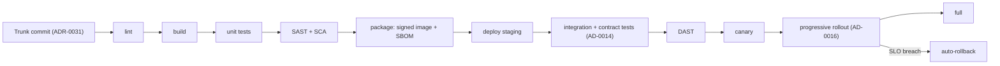
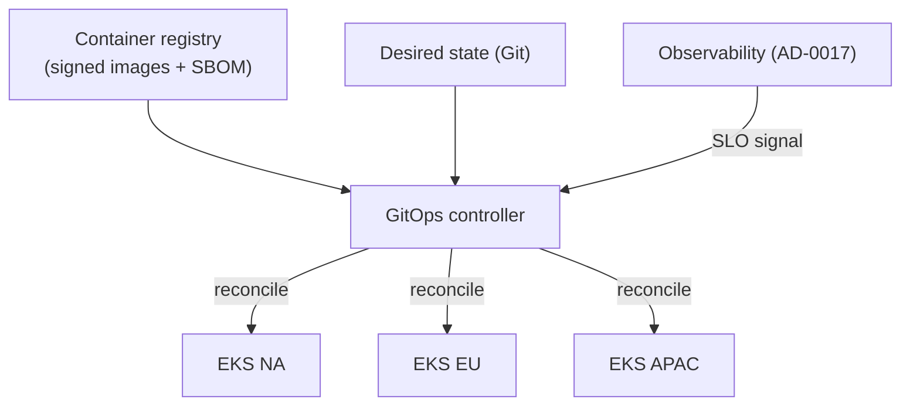

# AD-0018 — CI/CD Golden Paths

| Field | Value |
|---|---|
| Doc id | AD-0018 |
| Title | CI/CD Golden Paths |
| Owner team | TEAM-031 |
| Apps | Platform / cross-cutting |
| Status | Accepted |
| Related | KN-219, KN-220, APP-003, APP-012, APP-024, TEAM-040, TEAM-050, INC-2026-002, ADR-0031, ADR-0045 |

## Purpose

This document defines MCG's CI/CD "golden paths": opinionated, paved-road delivery pipelines that
DevEx (TEAM-031) provides so product teams ship safely by default. A golden path encodes the
organisation's non-negotiables — tests, security scanning, signed artefacts, supply-chain
provenance, progressive delivery — as reusable pipeline stages a team adopts rather than rebuilds.

The golden path exists to make the secure, reliable way the easy way. Teams get a per-language
template that already lints, tests, scans, packages, and deploys correctly; they focus on
application logic, not on assembling a pipeline from scratch. This is how the trunk-based delivery
model (ADR-0031) scales across dozens of Tier 0 services without each team reinventing safety.

It is the connective tissue between several platform docs: contracts and CDC tests (AD-0014),
progressive delivery and flags (AD-0016), observability instrumentation gates (AD-0017), and
mesh/security policy (AD-0015).

## Context

Every focal app deploys through a golden path. Checkout (APP-003) and Payments (APP-012) use the
JVM and PCI paths; the edge (APP-024) uses the Go path. The guest-checkout defect (INC-2026-002)
reinforced why contract tests and progressive rollout must be pipeline stages, not optional: the
fast, scoped rollback that contained it was only possible because the change shipped through the
canary/progressive stage wired to flags (AD-0016).

Security Eng (TEAM-040) owns the SAST/SCA/DAST gates and image signing policy; QE (TEAM-050) owns
the contract and integration test gates. Pipelines target EKS across all regions via GitOps.
Payments and other cardholder-data services run the hardened **PCI** variant with stricter gates.

## Architecture

The pipeline is a fixed sequence of gates. Everything up to "deploy staging" runs on every trunk
commit; promotion to production proceeds through canary and progressive delivery under SLO
guardrails. GitOps reconciles the declared desired state into each cluster.





## Key decisions

1. **Golden paths are the default; deviations require exception.** DevEx maintains per-language
   templates so the secure path is the low-effort path (paved road over guardrails-only).
2. **Trunk-based, deploy-dark, release-progressively** (ADR-0031). Every commit is releasable and
   flows through the same pipeline; exposure is controlled by flags (AD-0016), not by branch.
3. **Security gates are non-optional stages** (security-by-design): SAST and SCA before packaging,
   DAST against staging before canary. A failing gate blocks promotion; TEAM-040 owns the rules.
4. **Every artefact is a signed image with an SBOM** (open standards / supply chain). Clusters
   admit only signed images with attached provenance; unsigned or unscanned images are rejected at
   admission.
5. **Contract and integration tests gate promotion** (API-first, AD-0014). Consumer-driven
   contract tests (TEAM-050) fail the producer's pipeline if a change would break a consumer.
6. **Progressive delivery with automated, SLO-driven rollback** (ADR-0045). Canary → percentage →
   full, reverting automatically on error-budget breach (AD-0017) — the mechanism that contained
   INC-2026-002.
7. **GitOps is the deployment mechanism** (cloud-native). Desired state lives in Git and is
   reconciled into EKS; the cluster is never mutated imperatively, so deploys are auditable and
   reproducible.
8. **Per-language pipelines share one contract** (jvm, go, python, node, pci). Each tunes build
   tooling but every path emits the same signed-image + SBOM artefact and passes the same gate
   sequence, so guarantees are uniform regardless of stack.
9. **The PCI path adds hardened gates** for cardholder-data services (APP-012): stricter SCA
   thresholds, mandatory secret scanning, segregation-of-duties approval before production.

## Data & APIs

The golden path is invoked declaratively per service:

```yaml
# .mcg/pipeline.yaml
service: mcg-checkout-service      # APP-003
path: jvm                          # jvm | go | python | node | pci
gates:
  sast: required
  sca:  { max-severity: high }
  contract-tests: required         # TEAM-050 / AD-0014
rollout:
  strategy: progressive            # AD-0016
  slo: checkout.success            # guardrail from AD-0017
```

| Stage | Owner | Blocks promotion? | Artefact/output |
|---|---|---|---|
| lint / build / unit | team | yes | build report |
| SAST / SCA | TEAM-040 | yes | scan report |
| package | TEAM-031 | yes | signed image + SBOM |
| integration / contract | TEAM-050 | yes | CDC + integ results |
| DAST | TEAM-040 | yes (pre-canary) | dynamic scan |
| canary → progressive | TEAM-031 | auto-rollback | rollout status |

- **Provenance:** each image carries a signature and an SBOM; admission control verifies both.
- **Idempotency:** GitOps reconciliation is idempotent — re-applying desired state is a no-op
  (ADR-0045), and rollback is "revert the Git state."
- **Pipeline events** are emitted to Kafka (`platform.cicd.deploy-completed.v1`, AD-0013) for
  audit and to correlate deploys with SLO changes.

## Failure modes & resilience

- **Failing security gate:** promotion blocked; the artefact never reaches staging/production —
  fail-closed on SAST/SCA/DAST.
- **Broken contract (INC-2026-002 class):** CDC test failure stops the producer pipeline before
  deploy; if a defect still reaches production, progressive rollout + flags bound the blast radius
  and enable fast rollback.
- **Bad canary:** SLO guardrail (AD-0017) trips automated rollback to the last healthy version; no
  human action required to stop the bleed.
- **GitOps drift:** the controller continuously reconciles, so manual cluster changes are reverted
  to the declared state, preventing configuration drift.
- **Registry/admission outage:** unsigned images cannot be admitted; a registry outage delays
  deploys but never allows an unverified artefact through.
- **Flaky tests:** quarantine lane isolates known-flaky tests from blocking trunk while they are
  fixed, protecting delivery velocity without dropping the gate.

## Observability

- **Golden signals for delivery (DevEx as a platform service):** pipeline success rate,
  lead-time-to-production p50/p95, deploy frequency, change-failure rate, MTTR.
- **Metrics:** per-stage duration and failure rate (which gate blocks most often), rollback rate,
  canary abort rate, signed-image admission rejections.
- **Traces/logs:** each pipeline run is correlatable; `platform.cicd.deploy-completed.v1` events
  let dashboards overlay deploys onto service SLO charts (AD-0017) to spot deploy-induced
  regressions.
- **Alerts:** trunk red (main branch failing), spike in change-failure rate, repeated canary
  aborts on a service.
- **Dashboards:** DORA-style delivery board per team plus a supply-chain board (signing/SBOM
  coverage), reviewed with peak-readiness gating before high-traffic releases.

## Cross-references

- AD-0014 API Contracts & Schema Registry (contract/CDC gate)
- AD-0015 Service Mesh & mTLS (deployed policy)
- AD-0016 Feature Flags & Progressive Delivery (canary/progressive stage)
- AD-0017 Observability & SLOs (SLO guardrail, deploy correlation)
- AD-0013 Event Backbone (pipeline audit events)
- KN-219, KN-220 (sibling platform notes)
- APP-003, APP-012 (PCI path), APP-024
- TEAM-031 (owner / DevEx), TEAM-040 (Security Eng), TEAM-050 (QE)
- INC-2026-002 (guest checkout defect containment)
- ADR-0031 (trunk-based), ADR-0045 (idempotency & rollback)
