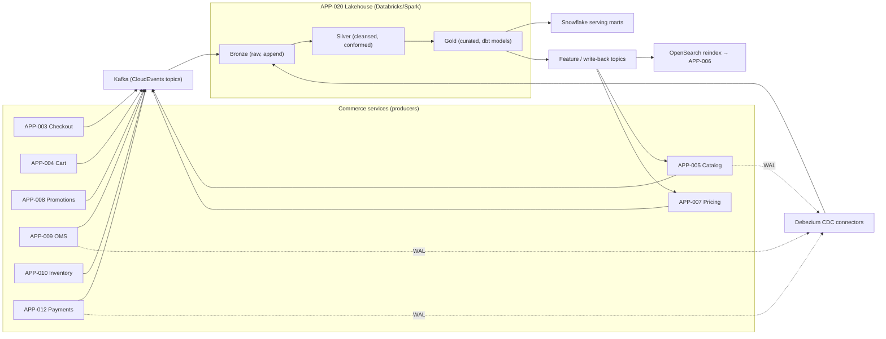

# AD-0019 — Data Platform Integration

| Field | Value |
|---|---|
| Doc id | AD-0019 |
| Title | Data Platform Integration |
| Owner team | TEAM-060 |
| Apps | APP-020 |
| Status | Accepted |
| Related | KN-205, KN-214, APP-005, APP-006, APP-007, APP-020, INC-2026-021, INC-2026-003, ADR-0043, ADR-0033 |

## Purpose

This document describes how Meridian Commerce Group (MCG) integrates its operational
commerce services with the central analytical and feature-serving estate operated by the
Data Platform team (TEAM-060, APP-020). It defines the ingestion contract, the lakehouse
storage layers, and the outbound feature/derived-data paths that flow back into online
commerce services.

APP-020 is a Databricks/Spark lakehouse with a medallion (bronze/silver/gold) layout, a set
of Snowflake serving marts for BI and finance, and dbt for modelling and tests. It is *not*
in the synchronous request path of Tier 0 commerce; it consumes change-data-capture (CDC)
and domain events asynchronously and publishes derived data back on its own cadence.

The document exists to make the async coupling between operational services and analytics
explicit, so that neither side accidentally creates a hidden synchronous dependency. This is
a direct lesson from INC-2026-019 (a synchronous promo call on the checkout path) applied to
the analytics boundary: no Tier 0 service may block on APP-020.

## Context

APP-020 sits downstream of every commerce bounded context. It ingests CDC from operational
Postgres stores and domain events from Kafka produced by APP-003 (checkout), APP-004 (cart),
APP-005 (catalog), APP-007 (pricing), APP-008 (promotions), APP-009 (OMS), APP-010
(inventory), and APP-012 (payments). Ingestion is exclusively pull/subscribe; producers never
call the platform.

On the outbound side, APP-020 computes derived data that a small number of online services
consume through their own stores — never by querying the lakehouse directly:

- **APP-005 Product Catalog** receives enrichment attributes (categorisation, normalized
  brand, computed quality scores) that land back in its Postgres via a curated Kafka topic.
- **APP-007 Pricing Service** receives cost/margin and elasticity inputs used by pricing rules.
- **APP-006 Search & Browse** receives ranking features (popularity, conversion, embeddings)
  that are indexed into OpenSearch as part of the reindex pipeline.

Business drivers: unified analytics, ML feature freshness for AI-ready ranking/pricing, and a
governed audit trail. Constraints: data residency per AD-0020 (regional lakehouse zones),
Tier 0 producers must not be impacted by platform load, and sensitivity classification must
travel with the data per ADR-0043. INC-2026-021 (catalog ingestion stalled on a data-platform
outage) is the canonical reminder that catalog write-back must degrade gracefully.

## Architecture

Ingestion is event/CDC-driven; serving marts and feature write-back are batch/stream hybrids.

Two ingestion planes coexist. Domain events (business facts such as `order-placed`) arrive on
Kafka as CloudEvents and are the preferred contract. CDC via Debezium captures row-level
change from operational Postgres for entities where an event stream is incomplete (e.g.
full catalog attribute history). Both land in Bronze with source, offset, and ingestion
timestamp preserved for replay. Silver applies schema-on-read validation and conforms keys
across contexts; Gold holds business-grade dbt models with tests and freshness expectations.

## Key decisions

1. **Async-only coupling to APP-020** (event-driven, §8). No Tier 0 service issues a synchronous
   call to the lakehouse. Trade-off: derived data is eventually consistent (minutes to hours),
   accepted in exchange for full isolation of commerce from analytics load — the isolation that
   INC-2026-021 showed was incomplete for catalog write-back.
2. **Data contracts on every ingest topic** (API-first, open standards). Each topic has a
   registered Avro/JSON schema in the schema registry, versioned via expand-contract (ADR-0033).
   Consumers pin to a major version; producers may add optional fields freely.
3. **Prefer domain events over CDC** where a clean event exists; use CDC only for
   attribute-complete history. Rationale: events carry business meaning and are decoupled from
   physical schema; CDC leaks table structure and is harder to evolve.
4. **Medallion + dbt for lineage and tests** (observability). Every Gold model has dbt tests
   (uniqueness, not-null, referential) and a freshness SLA; failing freshness pages TEAM-060,
   not the producing team.
5. **Snowflake for BI/finance marts, lakehouse Gold as system of record.** Marts are a
   read-optimised projection, refreshed from Gold; they never feed back into commerce.
6. **Write-back is a curated topic, never a query.** Catalog/pricing enrichment and search
   features are published to dedicated `commerce.*.enriched.v1` topics that the owning service
   consumes into its own store, keeping the online read path independent of the lakehouse.
7. **Sensitivity travels with data** (ADR-0043, security-by-design). Each record and column
   carries a classification tag propagated Bronze→Gold→mart; PII columns are tokenised in
   Bronze and only re-identified in governed zones.
8. **Graceful degradation of write-back** (resilience). If APP-020 is unavailable, catalog and
   pricing continue serving last-known enrichment; staleness is surfaced as a metric rather
   than an error — the corrective posture after INC-2026-021.

## Data & APIs

Ingest topics (CloudEvents on Kafka, consumed by APP-020):

| Topic | Producer | Notes |
|---|---|---|
| `commerce.checkout.order-placed.v1` | APP-003 | order facts, idempotency key retained |
| `commerce.oms.order-state-changed.v1` | APP-009 | fulfilment lifecycle |
| `commerce.inventory.atp-changed.v1` | APP-010 | available-to-promise deltas |
| `commerce.pricing.price-changed.v1` | APP-007 | effective-dated price events |
| `commerce.payments.payment-authorized.v1` | APP-012 | tokenised, no PAN (ADR-0043) |
| `commerce.catalog.product-changed.v1` | APP-005 | attribute changes |

Write-back topics (produced by APP-020):

- `commerce.catalog.enriched.v1` → consumed by APP-005 into `catalog.product_enrichment`.
- `commerce.pricing.cost-input.v1` → consumed by APP-007 into `pricing.cost_input`.
- `commerce.search.ranking-features.v1` → consumed by the APP-006 OpenSearch reindex job.

CDC: Debezium connectors on `catalog`, `oms`, and `payments` Postgres WALs land in
`bronze.cdc_<db>_<table>` Delta tables.

Governance surface (read-only for consumers): a lakehouse catalog exposes Gold tables such as
`gold.fct_orders`, `gold.dim_product`, `gold.fct_price_history`. Marts in Snowflake mirror
these as `MART.FINANCE.*` and `MART.MERCH.*`. Feature freshness is exposed via a metadata API
`GET /v1/features/{feature-set}/freshness` returning `{ "as_of": "...", "lag_seconds": N }` so
consumers can decide whether to trust a feature.

## Failure modes & resilience

- **Platform outage (INC-2026-021).** Ingestion backs up on Kafka/CDC (durable); no data lost.
  Write-back stops → catalog/pricing serve last-known enrichment (degraded mode), staleness
  metric climbs, alert fires. Blast radius bounded to freshness, not availability.
- **Reindex lag → stale prices (INC-2026-003).** Search ranking features and price-derived
  attributes lag; APP-006 continues serving the prior index. Freshness SLA on the reindex job
  bounds acceptable lag; breach pages TEAM-060 and TEAM-003.
- **Poison / malformed events.** Schema-registry validation quarantines to a dead-letter Delta
  table; the consumer group does not stall. Replay after fix from Bronze offsets.
- **Schema drift.** Expand-contract (ADR-0033) prevents breaking consumers; a removed field is
  a two-release process. CI schema-compat checks (TEAM-031) gate producer deploys.
- **Backpressure from load.** Structured Streaming autoscaling with max-offsets-per-trigger caps
  throughput; commerce producers are never throttled because they only write to Kafka.

## Observability

APP-020 is not on a Tier 0 latency path, so SLOs are freshness- and correctness-oriented:

- **Ingestion lag** (Kafka offset → Bronze): p95 < 60s, p99 < 5 min.
- **Gold freshness**: catalog/pricing feature sets p95 < 15 min end to end; order facts < 30 min.
- **dbt test pass rate**: ≥ 99.5%; any failing not-null/uniqueness test blocks mart publish.
- **Write-back staleness** (consumed by APP-005/007/006): alert if > 30 min.
- **Consumer-group lag** and DLQ depth on every ingest topic.

Metrics land in the platform Prometheus/Grafana stack; lineage and freshness are surfaced in
the lakehouse catalog UI. Traces on write-back topics carry the originating `traceparent` so a
stale feature can be traced back to the producing event. Alerts route to TEAM-060 with a
runbook link; freshness breaches that affect APP-006 also notify TEAM-003.

## Cross-references

- APP-020 Data Platform (TEAM-060); consumers APP-005, APP-006, APP-007.
- Producers: APP-003, APP-004, APP-008, APP-009, APP-010, APP-012.
- Incidents: INC-2026-021 (ingestion stall), INC-2026-003 (reindex lag stale prices).
- ADRs: ADR-0043 (sensitivity travels with data), ADR-0033 (expand-contract schema evolution).
- Sibling ADs: AD-0020 (multi-region / residency), KN-205, KN-214.
- Teams: TEAM-060 (Data Platform), TEAM-031 (CI/CD schema-compat gates), TEAM-032 (SRE).
