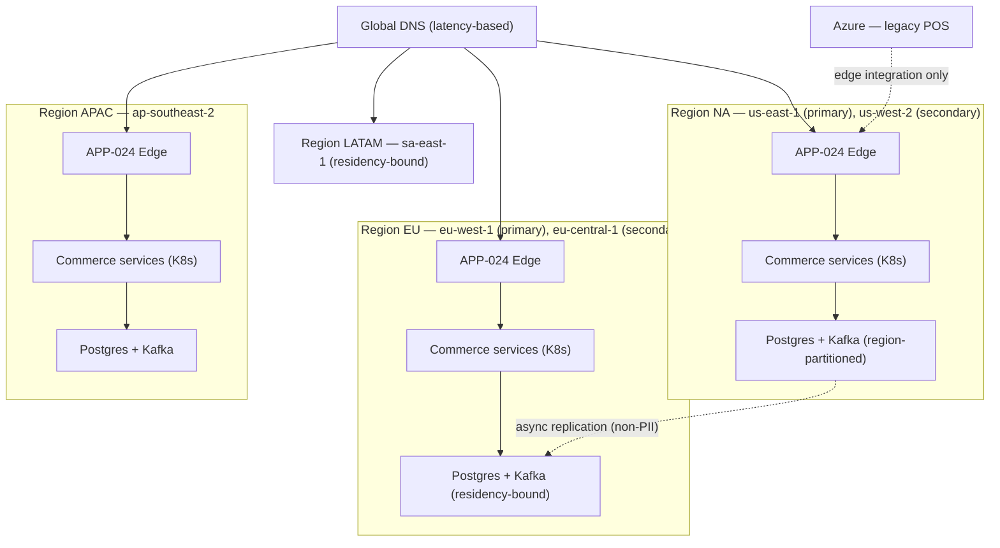
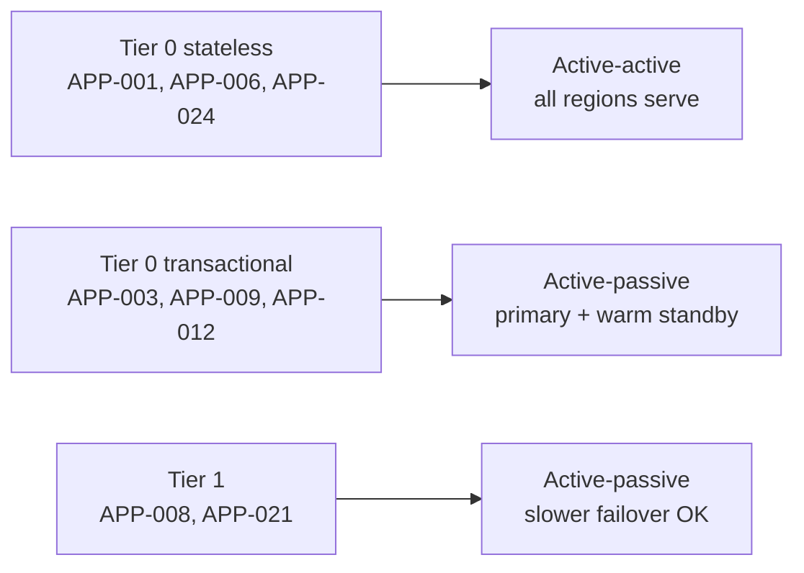

# AD-0020 — Multi-Region Topology

| Field | Value |
|---|---|
| Doc id | AD-0020 |
| Title | Multi-Region Topology |
| Owner team | TEAM-030 |
| Apps | Platform / cross-cutting |
| Status | Accepted |
| Related | KN-206, KN-220, APP-024, APP-005, APP-010, APP-012, INC-2026-004, ADR-0043, ADR-0026 |

## Purpose

This document defines Meridian Commerce Group's (MCG) multi-region topology: how the four
canonical business regions map to cloud regions, how data residency is enforced, and how
each service tier chooses between active-active and active-passive operation. It is the
authoritative reference for region codes, which are used pervasively for data partitioning,
feature flagging, and routing.

MCG runs primarily on AWS. A single legacy point-of-sale (POS) estate remains on Azure and is
integrated at the edge only. This document exists so that every commerce service treats
"region" consistently — the same codes, the same residency rules, and the same failover
expectations — rather than each team inventing its own regional model.

## Context

Canon regions and their member markets:

| Region code | Markets | Primary AWS region | Secondary AWS region |
|---|---|---|---|
| NA | US, CA, MX | us-east-1 | us-west-2 |
| LATAM | BR | sa-east-1 | us-east-1 |
| EU | GB, DE | eu-west-1 | eu-central-1 |
| APAC | AU | ap-southeast-2 | ap-southeast-1 |

Region codes are canon and appear as a partition key in Kafka topics and Postgres tables, as
a dimension on every metric, and as the scoping key for feature flags and pricing rules. The
APAC regional price-rule misconfiguration (INC-2026-004) is the standing reminder that
region-scoped configuration is a first-class, testable concern, not an afterthought.

Business drivers: data-residency law (notably EU and BR), latency for a global customer base,
and regulatory isolation of payment data. Constraints: personal data for EU/BR customers must
remain in-region (ADR-0043 — sensitivity, including residency class, travels with the data);
open standards for routing and identity (ADR-0026). The edge, APP-024, performs latency-based
routing so a customer reaches their nearest healthy region.

## Architecture

Each region is a self-contained cell: its own edge, service mesh, data stores, and Kafka
cluster. Global concerns (DNS, identity trust, cross-region replication) span cells.

Active-active is used for stateless read-heavy tiers; active-passive with a warm secondary is
used for stateful transactional tiers where cross-region strong consistency is impractical.

## Key decisions

1. **Region-per-cell isolation** (cloud-native, §8). Each region is an independent failure and
   deployment cell with its own edge, mesh, and datastore. Trade-off: more infrastructure to
   run, but a regional outage cannot cascade globally.
2. **Region code as a canonical partition/flag key.** NA/LATAM/EU/APAC are used verbatim for
   Kafka partitioning, Postgres partitions, metric dimensions, and feature-flag scoping. This
   makes region-scoped config testable and auditable — the control INC-2026-004 needed.
3. **Residency-bound data for EU and LATAM** (security-by-design, ADR-0043). EU and BR personal
   data never leaves its primary region; only non-PII, aggregated, or tokenised data replicates
   cross-region. Residency class is a data attribute, enforced at write time.
4. **Active-active for stateless read tiers.** Storefront (APP-001), Search (APP-006), and Edge
   (APP-024) serve from every region; DNS steers by latency. Trade-off: cache coherence handled
   per AD-0022 rather than by shared state.
5. **Active-passive for transactional tiers.** Checkout (APP-003), OMS (APP-009), Payments
   (APP-012) run a primary with a warm standby in the secondary region; failover is a promotion,
   not a live dual-write, to avoid split-brain on order/payment state.
6. **Latency-based routing at the edge** (APP-024). Global DNS resolves to the nearest healthy
   region; the edge health-checks regional service health and withdraws from DNS on failure.
7. **Azure confined to legacy POS.** The POS estate integrates only through the edge as a
   north-bound API client; no core commerce service depends on Azure. Rationale: contain legacy
   without letting it constrain the AWS-native design.
8. **Open-standard routing and trust** (ADR-0026). GeoDNS, health checks, and OIDC trust
   federation use standard protocols so regions and the Azure POS interoperate without bespoke glue.

## Data & APIs

- **Region-partitioned Postgres**: transactional tables are declaratively partitioned by
  `region_code`; residency-bound partitions (EU, LATAM) are physically pinned to in-region
  storage. Example: `orders` partitioned `LIST (region_code)`.
- **Kafka**: topics carry a `region` partition key; each region has its own cluster, with a
  MirrorMaker path for non-PII analytics topics feeding APP-020 regional zones.
- **Feature flags**: flag evaluation context always includes `{ region, market, tier }`; a flag
  may be enabled per region. Pricing rules (APP-007) and promo rules (APP-008) are region-scoped.
- **Routing API** at APP-024: `GET /healthz/region` returns `{ "region": "EU", "status": "healthy",
  "primary": true }`, consumed by the global health checker.
- **Residency metadata**: every record carries `residency_class ∈ {global, eu-bound, br-bound}`
  (ADR-0043); replication filters on this attribute.
- **Error envelope** includes `region` so a cross-region misroute is diagnosable:
  `{ "code": "REGION_MISMATCH", "region": "APAC", "expected": "EU" }`.

## Failure modes & resilience

- **Regional outage.** Stateless tiers: DNS withdraws the region, traffic shifts to nearest
  healthy region (active-active). Transactional tiers: warm standby promoted in the secondary
  AWS region; RTO minutes, RPO bounded by replication lag.
- **Region-scoped config error (INC-2026-004).** An APAC price rule misconfig affected only
  APAC because rules are region-scoped — blast radius contained to one region. Corrective:
  region-scoped config now has pre-deploy validation and a per-region canary.
- **Replication lag / partition.** Cross-region async replication may lag; because transactional
  tiers are active-passive, no dual-write conflict arises. Analytics topics tolerate lag.
- **Residency violation attempt.** A write tagged `eu-bound` targeting a non-EU store is rejected
  at the data-access layer, not merely alerted — fail-closed for compliance.
- **Azure POS unreachable.** POS integration degrades to store-and-forward at the edge; core
  commerce is unaffected because nothing depends on Azure.

## Observability

- **Per-region golden signals**, every metric tagged with `region`: edge availability, service
  latency, error rate, saturation.
- **DNS/routing SLO**: latency-based routing steers ≥ 99% of requests to the nearest healthy
  region; failover DNS convergence p95 < 60s.
- **Replication lag**: non-PII cross-region replication p95 < 30s; alert > 5 min.
- **Residency guardrail**: count of rejected out-of-region writes (should trend to zero;
  non-zero is a bug or attack).
- **Failover drills**: monthly game-day promoting a secondary region; RTO/RPO recorded.

Dashboards are region-faceted so an operator can compare NA/EU/APAC/LATAM side by side. Alerts
route to TEAM-030 (platform) with regional on-call escalation; residency-guardrail breaches
also notify TEAM-040 (Security).

## Cross-references

- APP-024 Edge (TEAM-030, latency-based routing, health checks).
- Region-scoped consumers: APP-005, APP-007, APP-008, APP-010, APP-012.
- Incidents: INC-2026-004 (APAC regional price-rule misconfig).
- ADRs: ADR-0043 (residency/sensitivity travels with data), ADR-0026 (open standards).
- Sibling ADs: AD-0019 (data platform regional zones), AD-0022 (caching coherence), KN-206, KN-220.
- Teams: TEAM-030 (Core Platform), TEAM-040 (Security), TEAM-032 (SRE), TEAM-060 (Data Platform).
