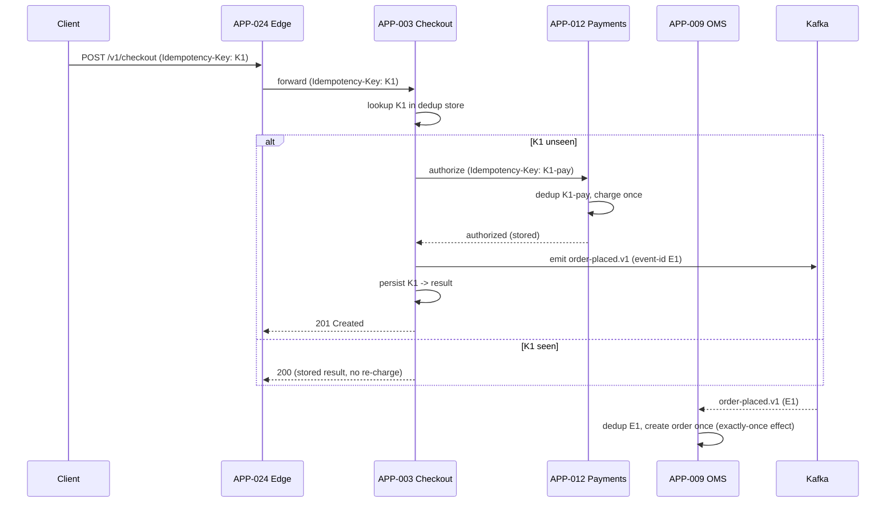
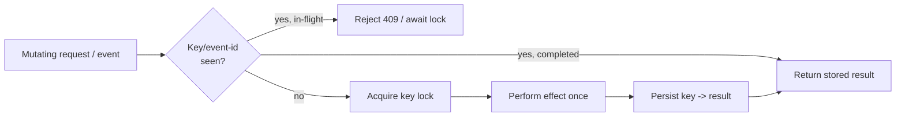

# AD-0021 — Idempotency Patterns

| Field | Value |
|---|---|
| Doc id | AD-0021 |
| Title | Idempotency Patterns |
| Owner team | TEAM-030 |
| Apps | Platform / cross-cutting |
| Status | Accepted |
| Related | KN-207, KN-215, APP-003, APP-009, APP-012, INC-2026-002, CHK-1421, ADR-0045 |

## Purpose

This document defines the idempotency patterns every mutating commerce operation at Meridian
Commerce Group (MCG) must follow: idempotency keys on client-initiated writes, deduplication
stores for retried requests and redelivered events, and the distinction between at-least-once
delivery and exactly-once *effects*.

Distributed commerce is built on retries — clients retry timeouts, gateways retry upstreams,
Kafka consumers reprocess after rebalance. Without idempotency, a retry becomes a duplicate
order, a double charge, or a duplicated loyalty account. This document exists to make "safe to
retry" a platform-wide guarantee rather than a per-team convention, and it is a direct
application of ADR-0045 (idempotent execution & rollback plans).

## Context

Idempotency is enforced across the checkout write path: the edge (APP-024) and clients supply
idempotency keys; APP-003 (Checkout), APP-012 (Payments), and APP-009 (OMS) each maintain a
dedup store and a state machine that make repeated requests converge to a single effect.

The canonical failure this addresses is INC-2026-002: during guest checkout (CHK-1421), a
retried registration/checkout flow created orphaned loyalty accounts because the loyalty-link
step was not idempotent. Guest checkout is exactly the scenario where clients retry aggressively
(no session to lean on), so idempotency is non-negotiable on that path.

Upstream/downstream: APP-003 depends on APP-012 and APP-009 (canon direction — checkout depends
on payments/OMS, never the reverse). Idempotency keys propagate downward along this dependency
chain so the same logical attempt is recognised at every hop.

## Architecture

An idempotency key minted at the client/edge travels down the synchronous call chain; each
service persists key→result before performing side effects and returns the stored result on
replay. Asynchronous effects use a consumer-side dedup store keyed by event id.





Two storage tiers back the dedup store: Redis for a fast in-flight lock and hot-key cache, and
Postgres for the durable key→result record. Redis alone is insufficient because a failover
(cf. INC-2026-001) can lose recent keys; Postgres is the source of truth, Redis is the fast path.

## Key decisions

1. **Client-supplied idempotency key on every mutating API** (API-first, §8). `Idempotency-Key`
   is required on POST/PUT for checkout, payment, and order operations. Absent key → 400. The
   key scopes to `{route, actor}` to prevent cross-endpoint collisions.
2. **Persist-before-effect.** A service writes the key record (state=in-flight) and takes a lock
   *before* performing the side effect, then updates it to completed with the response. A crash
   mid-flight leaves an in-flight record that a retry can safely resume or a reaper can reconcile.
3. **Durable dedup in Postgres, fast lock in Redis** (cloud-native). Redis provides the low-latency
   in-flight lock and hot dedup; Postgres holds the authoritative key→result with a unique
   constraint. Trade-off: two stores, but survives Redis failover (INC-2026-001).
4. **Key propagation down the dependency chain.** Checkout derives deterministic child keys
   (`K1-pay`, `K1-oms-link`) so payments and OMS dedup the same logical attempt. Never reverse:
   downstream services never mint keys for upstream.
5. **At-least-once delivery, exactly-once effects.** Kafka consumers are at-least-once; effects
   are made idempotent by an event-id dedup store, not by chasing exactly-once delivery. Ties to
   the event-driven principle and avoids fragile EOS transactions across service boundaries.
6. **Idempotent loyalty linking on guest checkout** (fixes INC-2026-002, CHK-1421). Linking a
   guest order to a loyalty/registered account is keyed on a deterministic
   `(order-id, email)` fingerprint so retries converge to one account, never an orphan.
7. **Bounded key retention with reconciliation** (ADR-0045). Keys retained 7 days (payments 30);
   a reaper reconciles in-flight records whose owning transaction never completed, tying into the
   documented rollback plan.
8. **Deterministic response replay.** A repeated key returns the *original* response and status,
   including the original resource id — clients cannot tell a retry from the first call.

## Data & APIs

- **Header**: `Idempotency-Key: <uuid>` (required on mutating routes; propagated as
  `X-Idempotency-Parent` to downstream calls).
- **Postgres dedup table** (per service):

  ```sql
  CREATE TABLE idempotency_key (
    key            TEXT PRIMARY KEY,
    actor_id       TEXT NOT NULL,
    route          TEXT NOT NULL,
    state          TEXT NOT NULL,        -- in_flight | completed | failed
    response_code  INT,
    response_body  JSONB,
    created_at     TIMESTAMPTZ NOT NULL DEFAULT now(),
    expires_at     TIMESTAMPTZ NOT NULL
  );
  ```

- **Redis keyspace**: `idem:{service}:{key}` → lock token, TTL = request timeout + margin.
- **Event dedup**: `dedup:{consumer-group}:{event-id}` in Redis, backed by a Postgres
  `processed_event(event_id, consumed_at)` for durability.
- **Topics**: `commerce.checkout.order-placed.v1`, `commerce.payments.payment-authorized.v1`
  carry a stable `event-id` (CloudEvents `id`) used as the dedup key.
- **Error envelope**: `{ "code": "IDEMPOTENCY_IN_PROGRESS", "retry_after_ms": 500 }` (HTTP 409)
  when a concurrent request holds the in-flight lock.

## Failure modes & resilience

- **Client retry after timeout.** Second request carries the same key; service returns the stored
  result — no duplicate order/charge. This is the core guarantee.
- **Redis failover (INC-2026-001).** Recent in-flight locks may be lost; Postgres key records
  survive, so the durable path still dedups. Effects remain exactly-once; only lock contention
  latency is affected.
- **Consumer rebalance / reprocessing.** Redelivered events hit the event-id dedup store and are
  skipped after their effect is recorded — at-least-once delivery, exactly-once effect.
- **Crash between effect and key-completion.** Reaper finds the in-flight record; if the effect is
  verifiable (payment authorized), it completes the record; otherwise it invokes the ADR-0045
  rollback plan (void authorization) and marks failed.
- **Guest-checkout duplicate registration (INC-2026-002).** Deterministic loyalty-link fingerprint
  collapses retries to a single account; a duplicate attempt is a no-op returning the same link.
- **Key collision / spoofing.** Keys scoped to `{route, actor}`; a mismatched actor on an existing
  key is rejected 409, preventing one client replaying another's result.

## Observability

APP-003/012/009 are Tier 0; idempotency adds a small, bounded cost that is itself monitored:

- **Dedup hit rate** per route (baseline retry pressure; a spike signals upstream instability).
- **In-flight lock wait**: p95 < 20ms, p99 < 100ms; saturation alert on lock contention.
- **Duplicate-effect count**: target 0; any non-zero is a Sev-2 correctness alert.
- **Reaper backlog**: in-flight records older than the request timeout; alert if > 100.
- **Event dedup skip rate** per consumer group; sudden rise indicates rebalance storms.
- **Checkout write SLO** unaffected: p99 < 800ms including the dedup lookup.

Traces carry the idempotency key as a span attribute so a retried attempt is visually stitched
to its original across APP-024 → APP-003 → APP-012 → APP-009. Alerts route to TEAM-030 with the
owning service on-call; duplicate-effect alerts page immediately.

## Cross-references

- APP-003 Checkout, APP-012 Payments, APP-009 OMS (the idempotent write path).
- Edge APP-024 (key origination/propagation).
- Incidents: INC-2026-002 (guest-checkout orphaned loyalty accounts), INC-2026-001 (Redis failover).
- Jira: CHK-1421 (guest checkout).
- ADRs: ADR-0045 (idempotent execution & rollback plans).
- Sibling ADs: AD-0022 (caching / Redis), AD-0023 (resilience & retries), KN-207, KN-215.
- Teams: TEAM-030 (Core Platform), TEAM-004 (Checkout), TEAM-009 (Payments), TEAM-006 (OMS).
