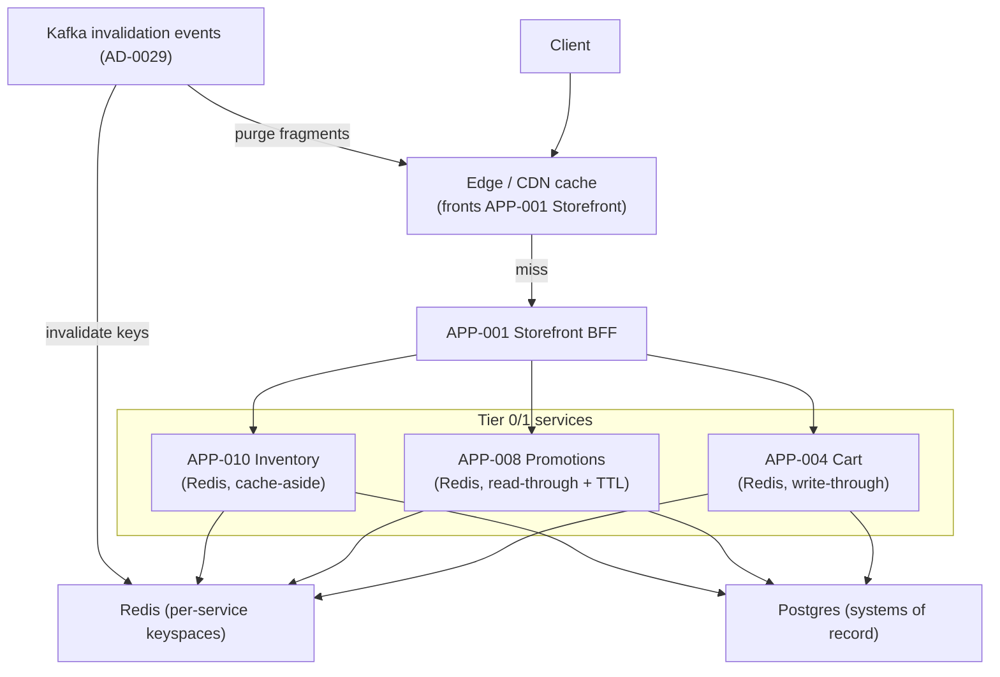
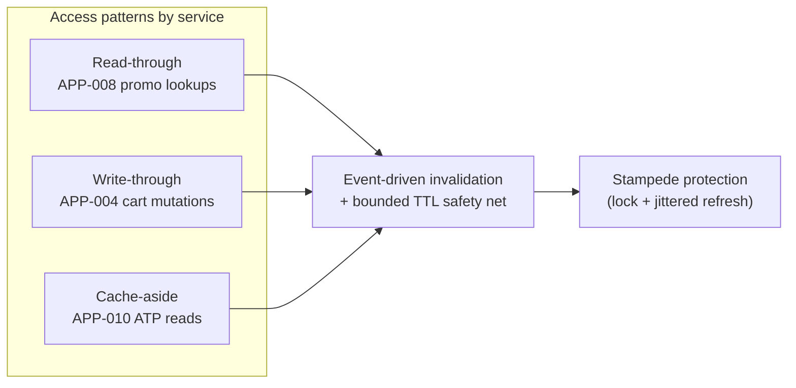

# AD-0022 — Caching Strategy

| Field | Value |
|---|---|
| Doc id | AD-0022 |
| Title | Caching Strategy |
| Owner team | TEAM-030 |
| Apps | Platform / cross-cutting |
| Status | Accepted |
| Related | KN-208, KN-218, APP-001, APP-004, APP-008, APP-010, INC-2026-007, INC-2026-011, INC-2026-018, AD-0029 |

## Purpose

This document defines Meridian Commerce Group's (MCG) layered caching strategy: the caching
tiers (edge/CDN and Redis), the access patterns each service uses (read-through, write-through,
cache-aside), how time-to-live (TTL) and invalidation are managed, and how the platform protects
against cache stampedes.

Caching is what lets Tier 0 read paths meet their latency SLOs at scale, but stale caches are a
recurring source of correctness incidents. This document exists to make caching decisions
deliberate and to encode the hard lessons from the promo-staleness incident series
(INC-2026-007, -011, -018): a cache without a correct invalidation contract is a latent bug.

## Context

Caching operates at two layers. The edge (APP-001 Storefront Web fronted by the CDN) caches
rendered fragments and static/product assets. Redis backs hot service state: APP-004 (Cart),
APP-008 (Promotions Engine), and APP-010 (Inventory) all use Redis for low-latency reads.

The promo cache incidents anchor this design. INC-2026-007 (a promo-window price change didn't
invalidate the promo cache) and INC-2026-011 (promo cache staleness during a flash sale) were
both invalidation failures; INC-2026-018 was the systemic fix. The correct posture — event-driven
invalidation with a bounded TTL as a safety net — is the through-line of the decisions below.
The invalidation event contract itself is specified in AD-0029.

Constraints: cart data is per-user and privacy-sensitive; promo and inventory data are highly
volatile; edge caches are geographically distributed (see AD-0020) and cannot be invalidated
instantly everywhere. Caching must degrade safely — a cache outage must slow the system, not
break it.

## Architecture

The invariant across all layers: **the datastore is always the system of record; the cache is a
performance optimisation that must be safe to lose.** Every cached value has both an explicit
TTL and an event-driven invalidation path, so correctness never depends solely on a human
remembering to purge.

## Key decisions

1. **Two cache layers, clear ownership** (cloud-native, §8). Edge/CDN caches presentation and
   static assets (owned with APP-001); Redis caches service state (owned per service). No service
   caches another service's private state.
2. **Access pattern chosen per data volatility.** Cart uses **write-through** (mutation updates
   Redis and Postgres together — reads must reflect the user's last action). Promotions uses
   **read-through** with a short TTL. Inventory ATP uses **cache-aside** (compute-on-miss, tolerate
   brief staleness). Rationale: match consistency need to pattern rather than one-size-fits-all.
3. **Event-driven invalidation is primary; TTL is the safety net** (event-driven, resilience).
   Every cached entity subscribes to an invalidation event (AD-0029); TTL bounds worst-case
   staleness if an event is missed. This dual mechanism is the systemic fix from INC-2026-018.
4. **Short, tier-appropriate TTLs on volatile data.** Promo TTL 30s, inventory ATP 10s, price
   fragments 60s. Trade-off: more backend load vs. tighter freshness; volatile pricing/promo
   favours freshness after INC-2026-007/-011.
5. **Stampede protection everywhere it matters** (resilience). On miss, a single request acquires
   a Redis lock to recompute while others serve the stale value or briefly wait; refresh happens
   *before* expiry (probabilistic early recompute) so hot keys never all expire at once —
   critical under flash-sale load (INC-2026-011).
6. **Cache-outage degradation, never failure** (fixes the fragility exposed by INC-2026-001 for
   cart). A Redis outage falls back to Postgres reads with reduced throughput and a load-shed
   guard, rather than returning errors. Correctness preserved, latency degraded.
7. **Cache keys carry version + region** (cf. AD-0020). Keys embed a content version and region
   code so a deploy or a regional price change can invalidate a whole namespace by bumping the
   version prefix — instant logical purge without scanning keys.
8. **No caching of secrets or full PII** (security-by-design). Cart caches item/quantity, not
   payment data; promo/inventory caches carry no personal data.

## Data & APIs

Redis keyspaces:

| Service | Keyspace | Pattern | TTL | Invalidation event |
|---|---|---|---|---|
| APP-004 Cart | `cart:{user}:{cart-id}` | write-through | 24h idle | on mutation (self) |
| APP-008 Promotions | `promo:{region}:v{ver}:{sku}` | read-through | 30s | `promo-rule-changed.v1` |
| APP-010 Inventory | `atp:{region}:{sku}:{node}` | cache-aside | 10s | `inventory.atp-changed.v1` |

- **CDN**: product/asset URLs cached with `Cache-Control: public, max-age=60, stale-while-revalidate=30`;
  fragment purge via `POST /v1/cache/purge { "tags": ["sku:12345", "region:EU"] }` driven off
  invalidation events.
- **Invalidation topic** (AD-0029): `commerce.cache.invalidate.v1` with payload
  `{ "namespace": "promo", "region": "EU", "keys": ["sku:12345"], "version": 42 }`.
- **Stampede lock**: Redis `SET lock:{key} <token> NX PX <ttl>`; holder recomputes, others serve
  `stale` value read from a shadow key with a longer TTL.
- **Error/response headers**: `X-Cache: HIT|MISS|STALE`, `X-Cache-Age: <seconds>` for diagnosis.

## Failure modes & resilience

- **Missed invalidation → staleness (INC-2026-007).** Root cause was an invalidation gap on
  promo-window price changes. Fix: promo cache now subscribes to `promo-rule-changed.v1` *and*
  carries a 30s TTL, so the worst case is 30s stale, not indefinite.
- **Flash-sale stampede (INC-2026-011).** Many keys expiring simultaneously overwhelmed the promo
  backend. Fix: probabilistic early recompute + per-key lock so only one recompute per hot key.
- **Systemic promo staleness (INC-2026-018).** Addressed by mandating the event+TTL dual
  mechanism platform-wide and by AD-0029's explicit invalidation contract.
- **Redis primary failover (INC-2026-001).** Cart falls back to Postgres write-through path;
  degraded latency, correct data. Load-shed guard caps concurrency to protect Postgres.
- **CDN edge staleness.** `stale-while-revalidate` serves stale briefly while revalidating; tag
  purge propagates within seconds but not instantly across regions — accepted for presentation.
- **Cache poisoning / key collision.** Region + version in the key prevents cross-region and
  cross-deploy bleed; a bad value self-heals at TTL and on next invalidation event.

## Observability

- **Hit ratio** per keyspace: cart > 95%, promo > 90%, inventory ATP > 85%.
- **Staleness bound**: measured max age of served values vs. TTL; alert if served age > TTL
  (indicates a broken TTL or clock skew).
- **Invalidation lag**: event emitted → key evicted; p95 < 2s. A rising lag is the early warning
  the promo incidents lacked.
- **Stampede lock contention**: recompute concurrency per hot key (should be ~1); alert on spikes.
- **Backend load on miss**: promo/inventory Postgres QPS attributable to cache misses.
- **Storefront latency SLO** (Tier 0): p95 < 300ms, p99 < 800ms with cache; degraded-mode budget
  documented so an operator knows the expected slowdown on a Redis outage.

Dashboards facet by service and region (AD-0020). Traces annotate spans with `X-Cache` outcome so
a slow request attributable to a miss is obvious. Alerts route to TEAM-030 and the owning service;
promo-staleness alerts also notify TEAM-008.

## Cross-references

- APP-001 Storefront (edge/CDN), APP-004 Cart, APP-008 Promotions, APP-010 Inventory (Redis).
- Incidents: INC-2026-007, INC-2026-011, INC-2026-018 (promo cache staleness series),
  INC-2026-001 (Redis failover).
- Sibling ADs: AD-0029 (cache invalidation event contract), AD-0020 (regional cache coherence),
  AD-0023 (degraded modes), AD-0021 (Redis dedup interplay), KN-208, KN-218.
- Teams: TEAM-030 (Core Platform), TEAM-004 (Cart), TEAM-008 (Promotions), TEAM-012 (Inventory).
