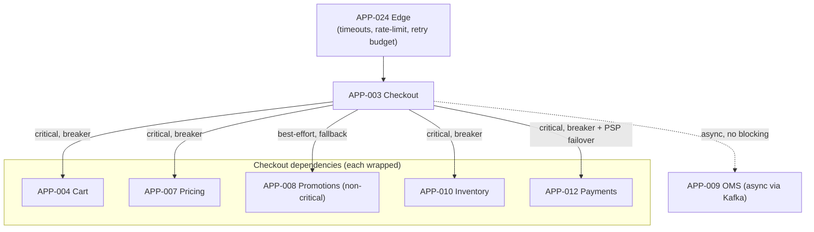
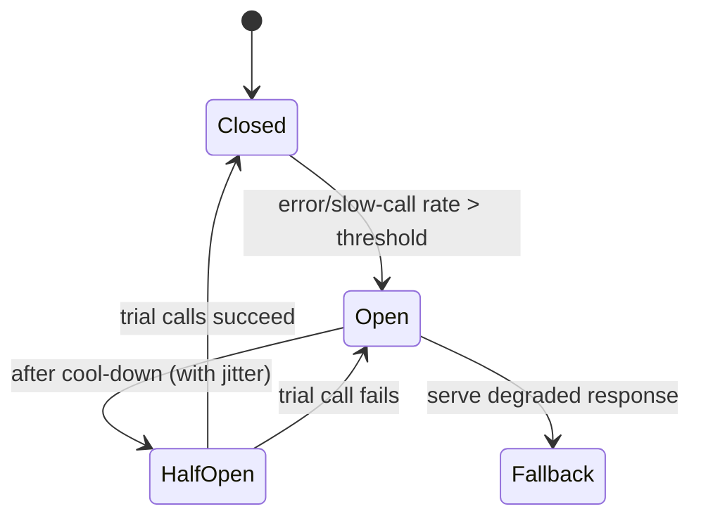

# AD-0023 — Resilience & Circuit Breaking

| Field | Value |
|---|---|
| Doc id | AD-0023 |
| Title | Resilience & Circuit Breaking |
| Owner team | TEAM-030 |
| Apps | Platform / cross-cutting |
| Status | Accepted |
| Related | KN-209, KN-216, APP-003, APP-008, APP-012, APP-024, INC-2026-009, INC-2026-001, INC-2026-019, ADR-0045 |

## Purpose

This document defines the resilience patterns that keep Meridian Commerce Group's (MCG) checkout
path available under partial failure: request timeouts, retries with jitter, circuit breakers,
bulkheads, fallbacks, and graceful degradation. It specifies where each pattern lives along the
checkout call chain and what the intended degraded behaviour is.

The checkout path (APP-001 → APP-024 → APP-003 → {APP-004, APP-007, APP-012, APP-010, APP-009})
is MCG's most revenue-critical flow and its most exposed to cascading failure. This document
exists so that a slow or failing dependency degrades gracefully instead of taking down checkout —
the failure mode behind INC-2026-009 (PSP auth-latency degradation) and INC-2026-019 (checkout p99
regression from a synchronous promo call).

## Context

Resilience is a shared-platform capability applied consistently across services. The patterns are
implemented partly in the service mesh / edge (APP-024, Envoy) and partly in application libraries
(Resilience4j for the Java/Kotlin services APP-003/APP-008/APP-012). TEAM-030 owns the standard;
service teams tune thresholds per dependency.

Three incidents anchor the design:

- **INC-2026-009** — the primary payment service provider (PSP) degraded auth latency. Without a
  breaker, checkout threads blocked on the slow PSP and the pool exhausted. Fix: breaker + timeout
  + failover to secondary PSP.
- **INC-2026-001** — Cart Redis primary failover. Cart must degrade to Postgres rather than fail.
- **INC-2026-019** — checkout p99 regressed because a promo enrichment call (APP-008) was made
  synchronously on the critical path. Fix: make promo non-blocking with a fallback.

Dependency direction is canon: checkout depends on payments/promo/inventory, never the reverse;
resilience controls sit on the *caller* side of each of those edges.

## Architecture

Each outbound dependency edge from checkout is wrapped in a resilience decorator: timeout →
retry(jitter) → circuit breaker → bulkhead → fallback. Non-critical enrichment is made
best-effort so its failure cannot regress the critical path.





The bulkhead isolates each dependency into its own bounded thread pool / connection budget, so a
slow PSP (INC-2026-009) cannot starve the pool serving cart or pricing. When a breaker is Open,
the caller invokes a fallback immediately rather than waiting on a timeout.

## Key decisions

1. **Per-dependency timeouts, tighter than the client's** (observability, §8). Every outbound call
   has an explicit timeout budget (e.g. payments authorize 2s, pricing 300ms, promo 150ms) summing
   to less than the edge's overall checkout budget, so no single dependency can blow the SLO.
2. **Retries with full jitter, and a retry budget.** Idempotent reads retry up to 2x with
   exponential backoff + full jitter; retries are capped by a token-bucket retry budget at the edge
   to prevent retry storms. Mutations retry only when idempotent (see AD-0021).
3. **Circuit breakers on every remote dependency.** Breakers trip on error-rate or slow-call-rate;
   Open state fails fast to a fallback. This is the control absent in INC-2026-009.
4. **Bulkhead isolation per dependency** (cloud-native). Each dependency gets a dedicated bounded
   pool so one slow upstream cannot exhaust resources shared with healthy ones.
5. **Promo is best-effort, not critical** (fixes INC-2026-019). The APP-008 enrichment call has a
   150ms timeout and a fallback to list price / no-promo; a promo failure or slowness never blocks
   order placement. Promo can also be resolved async post-placement.
6. **Payment failover to secondary PSP** (resilience; INC-2026-009). When the primary PSP breaker
   opens, APP-012 fails over to a secondary PSP; if both are degraded, checkout enters a
   deferred-auth degraded mode with a documented rollback (ADR-0045).
7. **Cart degrades to Postgres on Redis loss** (INC-2026-001). A Redis-backed read failure falls
   through to Postgres with load-shedding, preserving checkout at reduced throughput.
8. **OMS coupling is asynchronous.** Order hand-off to APP-009 is via Kafka after placement, so OMS
   slowness never blocks the synchronous checkout response — order creation is an exactly-once
   effect downstream (AD-0021).
9. **Load-shedding at the edge.** Under saturation, APP-024 sheds lower-priority traffic (guest
   browse) before checkout, protecting the revenue path; shed responses are retryable 503s.

## Data & APIs

- **Timeout/retry config** (per dependency, declarative):

  ```yaml
  payments:
    timeout_ms: 2000
    retry: { max_attempts: 1, backoff: none }     # non-idempotent w/o key
    circuit_breaker: { failure_rate: 50, slow_call_ms: 1500, wait_open_ms: 5000 }
    bulkhead: { max_concurrent: 40 }
  promotions:
    timeout_ms: 150
    retry: { max_attempts: 2, backoff: exp_jitter }
    circuit_breaker: { failure_rate: 30, slow_call_ms: 120, wait_open_ms: 3000 }
    fallback: list_price_no_promo
  ```

- **Fallback responses** carry `{ "degraded": true, "reason": "promo_unavailable" }` so downstream
  and clients know a best-effort path was taken.
- **Edge headers**: `X-Retry-Budget-Remaining`, `Retry-After` on shed 503s.
- **Breaker state metric/event**: `commerce.resilience.breaker-state-changed.v1` emitted on
  Open/HalfOpen/Closed transitions for alerting and audit.
- **Error envelope**: `{ "code": "UPSTREAM_UNAVAILABLE", "dependency": "payments-psp-primary",
  "degraded_mode": "psp_failover" }`.

## Failure modes & resilience

- **PSP auth-latency degradation (INC-2026-009).** Payments breaker opens on slow-call-rate; traffic
  fails over to secondary PSP; if both degraded, deferred-auth degraded mode. Bulkhead prevents pool
  exhaustion from blocking cart/pricing.
- **Sync promo on critical path (INC-2026-019).** Promo now has a 150ms timeout + breaker +
  list-price fallback; a slow APP-008 no longer regresses checkout p99. Optionally resolved async.
- **Cart Redis failover (INC-2026-001).** Cart reads fall through to Postgres with load-shedding;
  checkout stays up at reduced throughput.
- **Retry storm.** Retry budget token bucket at the edge caps aggregate retries; excess requests
  fail fast rather than amplifying load on a struggling upstream.
- **Cascading saturation.** Bulkheads + load-shedding contain blast radius; the edge sheds browse
  before checkout. Breakers convert slow failures into fast fallbacks.
- **Fallback correctness.** Degraded responses are explicitly flagged; deferred/async effects use
  idempotent, rollback-planned execution (ADR-0045) so no double charge on recovery.

## Observability

- **Checkout critical-path SLO** (Tier 0): p95 < 500ms, p99 < 800ms, success ≥ 99.9%.
- **Breaker state**: time-in-Open per dependency; any Open on payments pages immediately.
- **Timeout / retry rate** per dependency; a rising retry rate is an early degradation signal.
- **Bulkhead saturation**: rejected-due-to-full count per pool.
- **Degraded-mode rate**: fraction of checkouts served with a fallback (e.g. no-promo, PSP
  failover, deferred-auth) — a business-visible metric.
- **Load-shed rate** at the edge and which priority class was shed.

Distributed traces span the full checkout chain with breaker state and timeout outcomes as span
attributes, so a degraded checkout is diagnosable end to end. Alerts route to TEAM-030 and the
owning service on-call; payment breaker-open and dual-PSP-degraded are immediate pages. Game-day
fault injection (latency, breaker trips) runs monthly against staging.

## Cross-references

- APP-003 Checkout, APP-012 Payments, APP-008 Promotions, APP-024 Edge; async APP-009 OMS.
- Incidents: INC-2026-009 (PSP latency), INC-2026-001 (Redis failover), INC-2026-019 (sync promo p99).
- ADRs: ADR-0045 (idempotent execution & rollback plans).
- Sibling ADs: AD-0021 (idempotency for safe retries), AD-0022 (cache degraded modes),
  AD-0020 (regional failover), KN-209, KN-216.
- Teams: TEAM-030 (Core Platform), TEAM-032 (SRE), TEAM-004 (Checkout), TEAM-009 (Payments).
