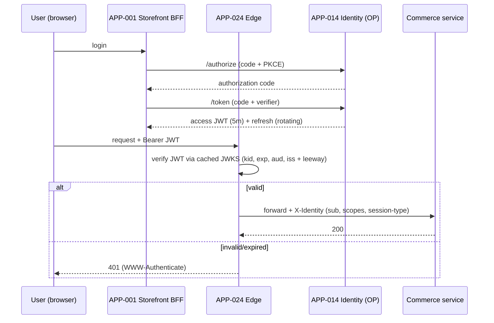
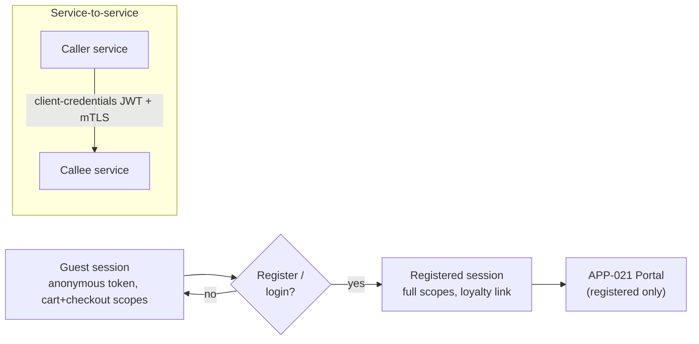

# AD-0024 — Authentication & Authorization (OIDC)

| Field | Value |
|---|---|
| Doc id | AD-0024 |
| Title | Authentication & Authorization (OIDC) |
| Owner team | TEAM-014 |
| Apps | APP-014 |
| Status | Accepted |
| Related | KN-210, KN-219, APP-014, APP-024, APP-003, APP-021, INC-2026-014, REL-2026-007, ADR-0043, ADR-0026 |

## Purpose

This document describes Meridian Commerce Group's (MCG) authentication and authorization
architecture: the Go-based identity service (APP-014), its use of OIDC/OAuth2, where tokens are
issued and verified, how guest and registered sessions differ, how service-to-service authZ
works, and how personal data is protected.

Identity is the trust root for all of commerce. Every request that mutates customer or order
state must be authenticated and authorized consistently. This document exists so that token
issuance and verification are specified precisely — the ambiguity that produced INC-2026-014
(the edge OIDC filter rejected valid tokens) and the fix shipped in REL-2026-007.

## Context

APP-014 (Identity, TEAM-014, Go, OIDC/OAuth2, PostgreSQL) is the OpenID Provider (OP) and
OAuth2 authorization server for MCG. It issues tokens; it does not sit on every request's hot
path. Token *verification* happens at the edge (APP-024, Envoy/Kong) so that downstream services
receive an already-validated identity context, and again defensively inside high-value services.

Upstream/downstream: APP-024 depends on APP-014 (canon direction). Customer-facing apps —
APP-001 Storefront, APP-021 Customer Portal, APP-003 Checkout — consume identity via the edge.
The Customer Portal (APP-021) requires a registered session; Storefront and Checkout support both
guest and registered sessions (guest checkout, CHK-1421).

INC-2026-014 is the anchoring incident: the edge OIDC filter rejected valid tokens due to a JWKS
key-rotation / clock-skew handling bug. REL-2026-007 fixed JWKS caching, `kid` selection, and
clock-skew leeway. Constraints: PII is sensitive (ADR-0043 — sensitivity travels with data);
identity uses open standards (ADR-0026 — OIDC/OAuth2/JWT, no bespoke auth).

## Architecture

Authorization Code + PKCE for interactive clients; short-lived JWT access tokens verified at the
edge against APP-014's JWKS; OAuth2 client-credentials + mesh mTLS for service-to-service calls.

Tokens are validated at the edge to centralise verification and give every service a uniform,
trusted `X-Identity` context. High-value services (APP-003, APP-012 via APP-024) re-verify
defensively — the edge is trusted but not sole.

## Key decisions

1. **OIDC/OAuth2 with JWT, no custom auth** (open standards, §8; ADR-0026). Authorization Code +
   PKCE for browser/BFF clients; standard claims (`sub`, `aud`, `iss`, `exp`, `scope`). Trade-off:
   protocol complexity vs. interoperability and audited security.
2. **Edge-terminated verification** (security-by-design). APP-024 verifies JWTs against APP-014's
   JWKS and injects a signed `X-Identity` header; downstream services trust it but the highest-value
   services re-check. Centralises the control that INC-2026-014 exposed.
3. **Robust JWKS handling** (fix for INC-2026-014, REL-2026-007). Edge caches JWKS with background
   refresh, selects key by `kid`, tolerates overlapping keys during rotation, and applies a bounded
   clock-skew leeway (±60s). No valid token is rejected due to rotation or skew.
4. **Short-lived access tokens + rotating refresh tokens.** Access JWT 5 min; refresh tokens rotate
   on use with reuse detection. Limits blast radius of a leaked token; refresh reuse revokes the chain.
5. **Guest vs registered sessions are distinct scopes.** A guest gets an anonymous session token
   scoped to cart + checkout only (CHK-1421); registration/login upgrades to a registered session
   and links loyalty idempotently (AD-0021, avoiding INC-2026-002 orphans). Portal (APP-021) requires
   registered.
6. **Service-to-service authZ via client-credentials + mesh mTLS** (cloud-native). Inter-service
   calls carry a client-credentials JWT with a service identity and are additionally mutually
   authenticated by the mesh; authZ decisions use scopes, not network position.
7. **PII minimisation and classification** (ADR-0043). Tokens carry `sub` (opaque) and coarse
   claims, never full PII; APP-014's Postgres stores PII with column-level classification and
   encryption; audit logs are pseudonymised.
8. **Deny-by-default authorization.** Absence of a required scope is a 403; new endpoints require an
   explicit scope grant. Rate-limiting and lockout on the token endpoints (auth abuse protection).

## Data & APIs

- **OIDC/OAuth2 endpoints** (APP-014): `/authorize`, `/token`, `/jwks`, `/userinfo`,
  `/introspect`, `/revoke`, `/.well-known/openid-configuration`.
- **Access token claims**: `{ "sub", "iss": "https://id.mcg", "aud": "commerce", "exp",
  "scope": "cart checkout", "sess": "guest|registered", "region": "EU" }`.
- **Edge → service header**: `X-Identity: {sub, scopes, session_type}` signed by the edge; services
  reject unsigned or edge-bypassing requests.
- **Postgres (APP-014)**: `identity_user`, `credential`, `oauth_client`, `refresh_token`
  (with rotation lineage for reuse detection); PII columns tagged `sensitivity=pii` (ADR-0043).
- **Guest upgrade**: `POST /v1/session/upgrade { guest_session_id }` → issues registered tokens and
  triggers idempotent loyalty link.
- **Error envelope**: `401 { "code": "TOKEN_INVALID", "reason": "expired|bad_signature|kid_unknown" }`,
  `403 { "code": "SCOPE_DENIED", "required": "checkout" }`.

## Failure modes & resilience

- **Edge rejects valid tokens (INC-2026-014).** Root cause: stale JWKS cache + no clock-skew leeway
  during key rotation. Fix (REL-2026-007): background JWKS refresh, `kid`-based selection tolerant of
  overlapping keys, ±60s leeway. Guardrail metric on rejection reasons prevents silent recurrence.
- **Identity service (APP-014) outage.** Token *issuance* stops (new logins fail), but already-issued
  tokens keep verifying at the edge from cached JWKS until expiry — existing sessions continue.
  Verification does not synchronously depend on APP-014 being up.
- **JWKS unreachable at rotation.** Edge serves last-known-good JWKS within a bounded staleness
  window; refuses to hard-fail all traffic on a transient fetch error.
- **Refresh-token theft.** Rotation + reuse detection revokes the whole token family on replay.
- **Guest→registered race.** Upgrade is idempotent (AD-0021); a retried upgrade converges to one
  registered account, never an orphaned loyalty record (INC-2026-002).
- **Service-to-service token compromise.** Short TTL + mTLS binding limits use; scope checks are
  deny-by-default so a stolen token can only do what its scopes allow.

## Observability

- **Edge auth SLO** (Tier 0 path): JWT verification p95 < 5ms, p99 < 15ms (local JWKS cache).
- **Token-rejection rate by reason** (`expired`, `bad_signature`, `kid_unknown`) — the metric that
  would have caught INC-2026-014 instantly; alert on any spike in `kid_unknown` during rotation.
- **Issuance latency / error rate** at `/token`; login success ratio ≥ 99.9%.
- **JWKS refresh health**: age of cached keyset, refresh failures.
- **Refresh-reuse-detection events** (security signal) routed to TEAM-040.
- **AuthZ denials (403)** by endpoint/scope — surfaces missing grants and probing.

Traces carry `sub` (pseudonymised) and `session_type` so a request's identity context is visible
end to end without leaking PII. Alerts route to TEAM-014 with TEAM-040 (Security) copied on
auth-abuse and reuse-detection signals; JWKS/rotation anomalies page immediately.

## Cross-references

- APP-014 Identity (TEAM-014, OP/authZ server); verification at APP-024 Edge.
- Consumers: APP-001 Storefront, APP-021 Customer Portal (registered only), APP-003 Checkout
  (guest + registered).
- Incidents: INC-2026-014 (edge OIDC rejected valid tokens); Jira/guest context CHK-1421,
  INC-2026-002 (loyalty orphans).
- Releases: REL-2026-007 (JWKS/rotation/skew fix).
- ADRs: ADR-0043 (PII sensitivity travels with data), ADR-0026 (open standards).
- Sibling ADs: AD-0021 (idempotent guest upgrade), AD-0020 (regional token/residency),
  AD-0023 (edge resilience), KN-210, KN-219.
- Teams: TEAM-014 (Identity), TEAM-030 (Edge/Platform), TEAM-040 (Security).
