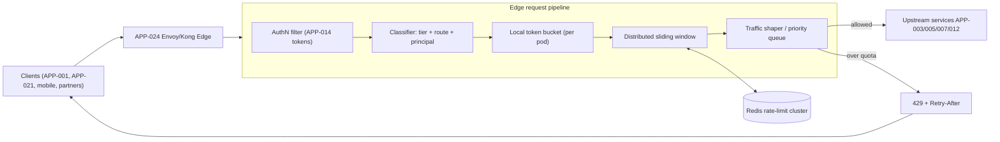
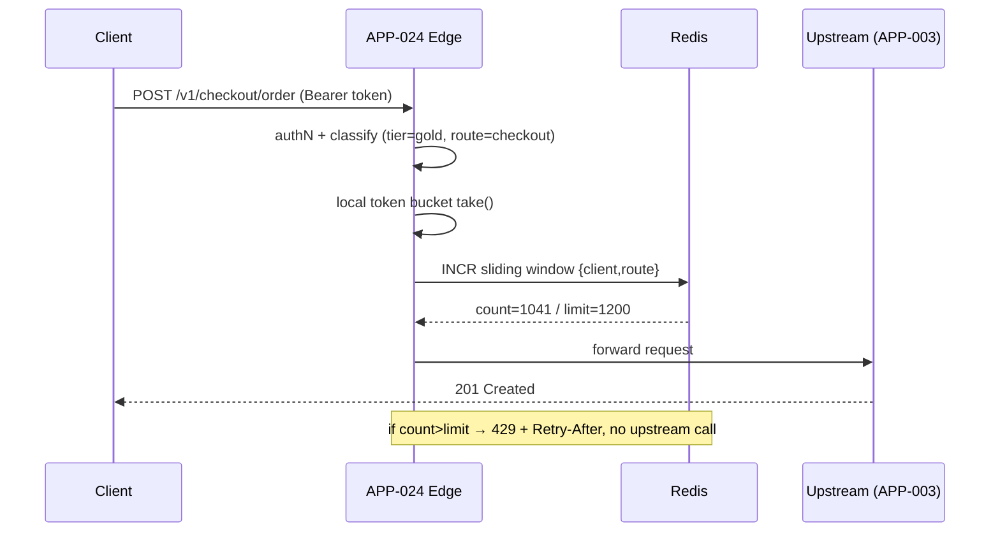

# AD-0025 — Rate Limiting & Traffic Shaping

| Field | Value |
|---|---|
| Doc id | AD-0025 |
| Title | Rate Limiting & Traffic Shaping |
| Owner team | TEAM-030 |
| Apps | APP-024 |
| Status | Accepted |
| Related | KN-215, APP-024, APP-014, APP-001, INC-2026-013, REL-2026-007, CHK-1421, ADR-0026 |

## Purpose

This document defines how the MCG API Gateway / Edge (APP-024) enforces rate limiting and
traffic shaping across all north–south traffic entering the commerce platform. It exists to
protect Tier 0 backends (Checkout APP-003, Catalog APP-005, Pricing APP-007, Payments APP-012)
from overload, abusive clients, and correlated retry storms, while giving well-behaved clients
predictable, fair access to capacity.

Rate limiting at the edge is the platform's first line of defence for availability. It is a
shared, cross-cutting concern owned by Core Platform (TEAM-030) so that individual product
teams inherit consistent quota semantics, `429` behaviour, and observability rather than each
service re-implementing throttling in an ad-hoc way.

The design also captures the operational lesson from **INC-2026-013**, where a threshold
tuned too aggressively immediately after the **REL-2026-007** rollout caused legitimate
storefront (APP-001) traffic to be rejected during a normal-load window.

## Context

APP-024 (Envoy/Kong edge, Go + Lua) is the single ingress for external clients — storefront
web (APP-001), the customer portal (APP-021), native mobile apps, and partner integrations.
It sits in front of the service mesh and depends on Identity (APP-014) for token validation.
Every request is classified by **client tier**, **authenticated principal**, and **route**
before any quota is consumed.

Business drivers: flash sales and peak events (see AD-0028) generate order-of-magnitude
traffic spikes; MCG operates across NA, LATAM, EU and APAC regions on AWS, so limits must be
enforced consistently per region without a single global bottleneck. Constraint: the edge
must add negligible latency (Tier 0 budget) while still coordinating counters across many
Envoy pods.

## Architecture

The edge evaluates a layered policy: a fast local token bucket per pod for burst absorption,
backed by a distributed sliding-window counter in Redis for accurate per-client/per-route
quotas across the fleet.



Local token buckets absorb sub-second bursts without a Redis round-trip. When a bucket
approaches exhaustion the filter consults the distributed sliding-window counter, which is the
authoritative fleet-wide view. Traffic shaping then applies priority: checkout and payment
routes are protected ahead of browse/search when the platform is saturated, enabling the
graceful degradation described in AD-0028.



## Key decisions

1. **Token bucket at the pod, sliding window in Redis.** Local buckets keep the hot path
   allocation-free and mesh-latency-friendly; the Redis sliding window gives accuracy across
   the fleet. This hybrid honours the observability/SLO and cloud-native principles by keeping
   the edge horizontally scalable. Trade-off: brief over-admission during local/Redis skew,
   bounded by bucket size.
2. **Distributed counters in a dedicated Redis rate-limit cluster** (separate from Cart's
   Redis in APP-004) so a rate-limit hotspot cannot degrade cart sessions. Counters use
   `EXPIRE`d rolling windows and Lua scripts for atomic check-and-increment.
3. **Quotas keyed on `{principal|apiKey, route-class, region}`.** Per-client and per-route
   isolation prevents one partner or one endpoint from starving others (API-first principle).
4. **Tiered limits** — anonymous < registered < gold < partner < internal — expressed as
   declarative policy in config, versioned in the gateway repo (mcg-api-gateway) and rolled
   out via ADR-0031 trunk-based flow. Limits are data, not code, so tuning does not require a
   binary release.
5. **`429 Too Many Requests` always carries `Retry-After` and `RateLimit-*` headers** so
   clients back off deterministically instead of hammering (mitigates retry storms). SDKs
   honour `Retry-After` with jitter.
6. **Priority-aware shaping.** Under saturation the shaper sheds low-priority routes (search,
   recommendations) first and protects checkout/payments, aligning with load-shedding in
   AD-0028. Security-by-design: auth failures are rate-limited independently to blunt
   credential-stuffing.
7. **Fail-open on counter store, fail-safe on ambiguity.** If Redis is unreachable the edge
   falls back to local buckets only (fail-open to preserve availability) but tightens local
   limits, trading precision for continuity.
8. **Change safety after INC-2026-013.** Threshold changes ship behind a percentage rollout
   with an automatic “observe-only / shadow” mode that logs would-be `429`s before enforcing,
   preventing a repeat of the too-aggressive REL-2026-007 threshold.

## Data & APIs

Enforcement is transparent to callers; management is via an internal admin API.

```
# Admin / policy API (internal, mTLS)
GET    /v1/ratelimit/policies                      # list policies
PUT    /v1/ratelimit/policies/{routeClass}         # upsert tiered limits
GET    /v1/ratelimit/policies/{routeClass}/status  # observe-only vs enforcing
POST   /v1/ratelimit/policies/{routeClass}/shadow  # enable observe-only rollout
```

Response headers on every proxied request:

```
RateLimit-Limit: 1200
RateLimit-Remaining: 159
RateLimit-Reset: 42
Retry-After: 42          # only on 429
```

Error envelope (consistent platform format):

```json
{
  "error": {
    "code": "RATE_LIMITED",
    "message": "Quota exceeded for route-class checkout",
    "retryAfterSeconds": 42,
    "traceId": "..."
  }
}
```

| Store | Key / topic | Purpose |
|---|---|---|
| Redis (rate-limit cluster) | `rl:{principal}:{routeClass}:{region}` | sliding-window counters, TTL = window |
| Redis | `rl:policy:{routeClass}` | hot policy cache, version-stamped |
| Kafka | `platform.edge.ratelimit-decision.v1` | CloudEvents stream of allow/deny for analytics (APP-020) |

Idempotency: `POST /v1/checkout/order` carries an `Idempotency-Key`; a `429` never consumes
it, so a retried request after `Retry-After` is safe (ties to ADR-0045).

## Failure modes & resilience

- **Threshold set too aggressively (INC-2026-013).** Blast radius: legitimate APP-001 traffic
  rejected. Mitigation: observe-only rollout + auto-rollback if legit-`429` rate exceeds a
  guard SLO within the first 10 minutes of a policy change.
- **Redis rate-limit cluster unavailable.** Fail-open to local buckets with tightened limits;
  alert TEAM-032. No hard dependency on Redis for request admission.
- **Redis hot-key on a single popular partner.** Sharded keys per region + client, plus local
  pre-check to shed obvious over-limit before touching Redis.
- **Retry storm after backend 5xx.** `Retry-After` with jitter + circuit breaking at the edge
  prevents amplification; edge sheds retries before they reach saturated upstreams.
- **Clock skew across pods.** Sliding window uses Redis server time, not pod time, to keep
  windows consistent.

## Observability

Tier 0 SLOs for the edge admission path:

- Added latency p50 < 2 ms, p95 < 6 ms, p99 < 12 ms (excluding upstream).
- Availability of admission decision ≥ 99.99%.
- Legitimate-`429` rate (false-positive throttles) < 0.05% — primary guard metric post
  INC-2026-013.

Key metrics: `edge_ratelimit_decisions_total{result,routeClass,tier}`, `edge_429_total`,
`edge_redis_latency_seconds`, `edge_local_bucket_depletion_ratio`. Distributed traces span
edge → upstream with the rate-limit decision annotated on the span. Alerts: legit-`429` guard
breach (page TEAM-030), Redis latency > 5 ms sustained, fail-open activated. Dashboards live in
the SRE (TEAM-032) Grafana folder with per-region and per-route-class breakdowns.

## Cross-references

- KN-215 — edge platform knowledge doc
- APP-024 API Gateway / Edge (owner TEAM-030); depends on APP-014 Identity
- APP-001 Storefront, APP-021 Customer Portal — primary north–south clients
- INC-2026-013 — rate-limit threshold too aggressive after rollout
- INC-2026-016 — storefront latency under load (see AD-0028 for shedding)
- REL-2026-007 — release that introduced the threshold change
- AD-0028 — Peak-Readiness & Load Shedding (priority queues, degradation)
- ADR-0026 — open standards (RateLimit headers); ADR-0045 — idempotent execution
- TEAM-030 Core Platform, TEAM-032 Observability/SRE
