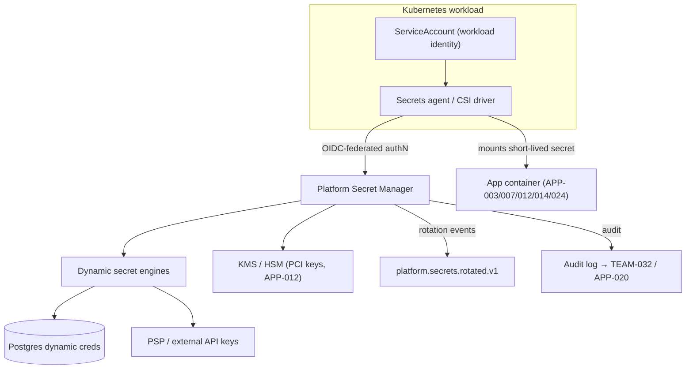
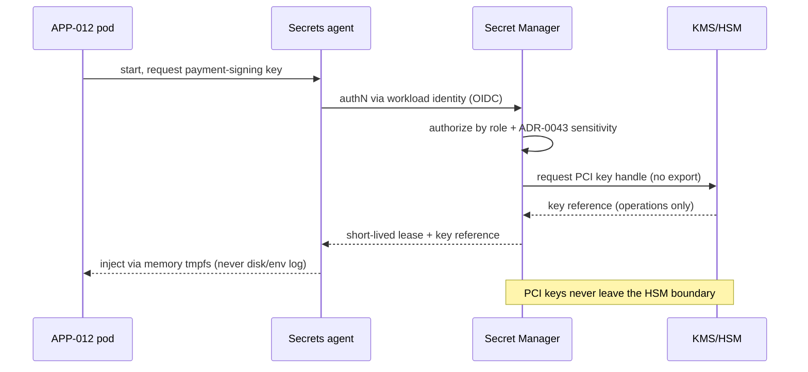

# AD-0026 — Secrets Management

| Field | Value |
|---|---|
| Doc id | AD-0026 |
| Title | Secrets Management |
| Owner team | TEAM-040 |
| Apps | Platform / cross-cutting |
| Status | Accepted |
| Related | KN-216, APP-012, APP-014, APP-024, ADR-0043, ADR-0045, CHK-1421 |

## Purpose

This document defines how secrets — database credentials, API keys, PSP tokens, TLS material,
and signing keys — are stored, distributed, rotated, and audited across the MCG platform. It
exists so that no MCG service embeds long-lived credentials in source, container images,
config files, or logs, and so that PCI-scoped material for Payments (APP-012) is handled to a
higher standard than general application secrets.

Secrets management is a cross-cutting concern owned by Security Engineering (TEAM-040). It is
foundational to the **security-by-design** principle (§8): every other service — Checkout
(APP-003), Pricing (APP-007), Payments (APP-012), Identity (APP-014), the edge (APP-024) —
consumes secrets through the same platform contract rather than each team inventing its own.

The design also operationalises **ADR-0043** (sensitivity travels with the data): a secret's
classification and its handling constraints are attributes of the secret itself and follow it
through the mesh, into brokers, and into audit logs.

## Context

MCG runs cloud-native on AWS (Azure only for legacy POS) with services on Kubernetes behind a
service mesh. Workloads authenticate to the secret manager using **workload identity**
(Kubernetes ServiceAccount → cloud IAM via OIDC federation with APP-014 as the trust anchor
pattern), never static bootstrap credentials. Constraints: PCI-DSS obligations for APP-012
require key handling separation and strict audit; multi-region operation (NA/LATAM/EU/APAC)
requires region-scoped secret replication without cross-region leakage.

Upstream/downstream: the platform secret manager is depended on by essentially every Tier 0/1
service. It integrates with the CI/CD platform (TEAM-031) for build-time injection and with
Observability (TEAM-032) for audit-log shipping.

## Architecture

The platform secret manager is the single source of truth. Applications obtain **dynamic,
short-lived secrets** at runtime; static secrets are the exception and are always rotated.



Workloads never see a master credential. The secrets agent authenticates with its workload
identity, receives a lease on a dynamic secret (e.g. a Postgres role valid for 60 minutes),
and renews it. Leases are revoked automatically when a pod terminates, shrinking the window of
any leaked credential.



## Key decisions

1. **One platform secret manager, no per-team stores.** Uniform authZ, rotation, and audit
   (security-by-design). Trade-off: it is a Tier 0 dependency and must meet 99.99% availability
   with regional replicas.
2. **Workload identity, never bootstrap secrets.** Pods authenticate via federated OIDC tied
   to their Kubernetes ServiceAccount; there is no “first secret” to leak. Cloud-native
   principle.
3. **Dynamic secrets by default.** Database and PSP credentials are minted per-workload with
   short leases and auto-revocation, so a compromised pod yields a credential that expires in
   minutes.
4. **PCI keys stay in the HSM/KMS boundary for APP-012.** Payment signing/decryption keys are
   never exported; services get operation handles, not key material, keeping PCI scope small.
5. **No secrets in code, config, images, or logs.** Enforced by CI scanning (TEAM-031),
   admission-controller policy, and structured-logging redaction. This is a hard gate, not a
   guideline.
6. **Sensitivity travels with the secret (ADR-0043).** Each secret carries a classification
   that dictates replication region, log redaction, and who may read it; the classification is
   propagated into audit events.
7. **Rotation is scheduled and event-driven.** Rotation emits `platform.secrets.rotated.v1`;
   consumers reload without downtime. Rollback plans for rotation follow ADR-0045
   (idempotent, reversible).
8. **Full, tamper-evident audit.** Every read/lease/rotation is logged with principal, secret
   id, and classification, shipped to TEAM-032 and the data platform (APP-020) for retention.

## Data & APIs

Consumption is via the agent/CSI mount; direct API use is limited and mTLS-authenticated.

```
# Secret manager API (internal, mTLS + workload identity)
GET    /v1/secrets/{path}                 # read (lease-returning) — authZ by role + ADR-0043 class
POST   /v1/secrets/{path}/rotate          # trigger rotation (TEAM-040 / automation)
GET    /v1/leases/{leaseId}               # inspect lease
POST   /v1/leases/{leaseId}/renew         # renew before expiry
POST   /v1/leases/{leaseId}/revoke        # explicit revoke
GET    /v1/pci/keys/{keyId}/handle        # operation handle only (APP-012), never material
```

Rotation event (CloudEvents on Kafka):

```json
{
  "type": "platform.secrets.rotated.v1",
  "subject": "secret/payments/psp-primary",
  "data": { "secretId": "...", "classification": "pci", "version": 42, "region": "EU" }
}
```

| Store | Key / path | Purpose |
|---|---|---|
| Secret manager | `secret/{app}/{name}` | canonical secret paths, versioned |
| KMS/HSM | `pci/{keyId}` | non-exportable PCI keys (APP-012) |
| Kafka | `platform.secrets.rotated.v1` | rotation notifications |
| Audit store | append-only | tamper-evident access log → TEAM-032 |

Error envelope on denied read: `{ "error": { "code": "SECRET_FORBIDDEN", "class": "pci",
"traceId": "..." } }`. No secret value is ever included in an error or log line.

## Failure modes & resilience

- **Secret manager unavailable.** Blast radius: new pods cannot start / renew leases.
  Mitigation: regional replicas, cached leases valid past a single outage window, and
  staggered lease TTLs so the fleet does not renew simultaneously.
- **Leaked credential in a pod.** Bounded by short lease TTL + auto-revoke on pod exit; dynamic
  secrets make static exfiltration low-value.
- **Rotation breaks a consumer.** Rotation events + dual-version (old+new valid) overlap window
  let consumers reload gracefully; rollback follows ADR-0045.
- **HSM outage (PCI).** APP-012 fails closed for signing operations (declines rather than
  processes without valid keys); alert paged to TEAM-040 and TEAM-009.
- **Accidental secret in logs.** Redaction filter + CI/pre-commit scanning; any detection
  triggers immediate rotation of the exposed secret.

## Observability

Cross-cutting SLOs (platform-critical):

- Secret read/lease availability ≥ 99.99%; read latency p95 < 25 ms, p99 < 60 ms.
- Rotation success rate ≥ 99.9%; zero secrets older than policy max-age.
- Zero secrets detected in source/images/logs (target: hard zero, alert on any hit).

Metrics: `secrets_leases_active`, `secrets_lease_ttl_seconds`, `secrets_rotation_total{result}`,
`secrets_read_denied_total{class}`, `pci_key_ops_total`. Audit trails are queryable in APP-020.
Alerts: rotation failure, HSM error rate, denied-read spikes (possible probing), secret-in-log
detection (page TEAM-040). Dashboards owned jointly by TEAM-040 and TEAM-032.

## Cross-references

- KN-216 — security platform knowledge doc
- APP-012 Payments (PCI key handling), APP-014 Identity (OIDC trust anchor), APP-024 Edge
- ADR-0043 — sensitivity travels with data; ADR-0045 — idempotent execution & rollback
- AD-0027 — Disaster Recovery (secret/key restore ordering)
- TEAM-040 Security Eng (owner), TEAM-031 DevEx (CI scanning), TEAM-032 Observability/SRE
- CHK-1421 — guest checkout (token/credential handling touchpoints)
