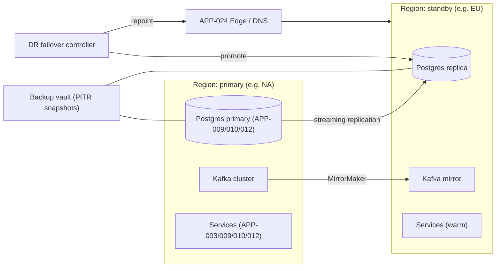
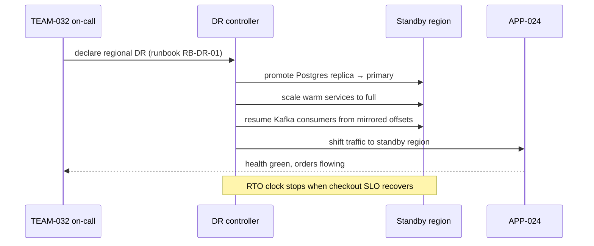

# AD-0027 — Disaster Recovery

| Field | Value |
|---|---|
| Doc id | AD-0027 |
| Title | Disaster Recovery |
| Owner team | TEAM-032 |
| Apps | Platform / cross-cutting |
| Status | Accepted |
| Related | KN-217, APP-003, APP-009, APP-010, APP-012, APP-020, ADR-0033, ADR-0045 |

## Purpose

This document defines MCG's disaster-recovery (DR) posture: the recovery objectives per
service tier, backup and restore mechanics, cross-region failover, backward-compatible
database migrations, and the drills and runbooks that keep DR credible. It exists so that a
region-level or store-level failure results in a bounded, rehearsed recovery rather than an
improvised one.

DR is owned by Observability/SRE (TEAM-032) as a cross-cutting capability. It builds directly
on the multi-region foundation in **AD-0020**: DR is what turns "we run in multiple regions"
into "we can lose a region and keep taking orders." It reflects the observability/SLO and
cloud-native principles and depends on schema-evolution discipline from **ADR-0033**.

The core promise: recovery objectives (RPO/RTO) are defined per tier, restore paths are
tested regularly, and every migration is expand-contract so a rollback never requires a data
rewind.

## Context

MCG runs primarily on AWS across NA, LATAM, EU and APAC regions (Azure only for legacy POS).
Tier 0 order-path services — Checkout (APP-003), OMS (APP-009), Inventory (APP-010), Payments
(APP-012) — carry the strictest objectives; Tier 1 services (Promotions APP-008, Customer
Portal APP-021) and analytics (Data Platform APP-020) are more relaxed. Constraints: PCI data
in APP-012 must be restored consistently with its keys (see AD-0026); event history in Kafka
must survive a region loss to avoid dropped orders.

Business driver: an omnichannel retailer cannot stop taking orders. A regional outage during
peak (see AD-0028) is the scenario DR is designed against.

## Architecture

Each Tier 0 datastore replicates cross-region; Kafka mirrors topics between regions; a
failover controller promotes the standby region and repoints the edge (APP-024).



Failover promotes the standby database, activates warm services, and repoints the edge. Because
migrations are expand-contract (ADR-0033), the standby can run either the old or new schema
version during the transition, so failover never blocks on a migration state.



## Key decisions

1. **RPO/RTO defined per tier, not per app.** Tiers give predictable, auditable objectives:
   Tier 0 RPO ≤ 30 s / RTO ≤ 15 min; Tier 1 RPO ≤ 5 min / RTO ≤ 60 min; analytics (APP-020)
   RPO ≤ 24 h / RTO ≤ 8 h. Observability/SLO principle.
2. **Continuous cross-region replication for Tier 0 datastores** plus point-in-time recovery
   (PITR) snapshots to an immutable backup vault. Streaming replication gets low RPO; PITR
   protects against logical corruption that replication would faithfully copy.
3. **Kafka topics mirrored cross-region** so event history (orders, inventory adjustments)
   survives region loss and consumers resume from mirrored offsets — event-driven principle.
4. **Expand-contract migrations only (ADR-0033).** Schema changes are always
   backward-compatible across at least one release, so old and new code both run during
   failover/rollback and no migration is a DR blocker.
5. **Warm standby, not cold.** Standby regions run services at reduced scale; failover scales
   them up rather than cold-starting, meeting Tier 0 RTO. Trade-off: steady-state cost for
   speed and reliability of recovery.
6. **Failover is controller-driven and idempotent (ADR-0045).** Promotion, traffic shift, and
   consumer resume are repeatable steps with explicit rollback, avoiding split-brain.
7. **PCI restore ordering.** APP-012 data is restored only after its keys are available from
   the secret manager (AD-0026); the runbook enforces key-before-data.
8. **Quarterly DR drills with published runbooks.** Objectives are only real if rehearsed;
   drills validate RPO/RTO and keep runbooks current. TEAM-032 owns the drill calendar.

## Data & APIs

DR orchestration exposes an internal control API; recovery status is observable.

```
# DR controller API (internal, mTLS)
POST   /v1/dr/failover            # initiate regional failover {targetRegion}
GET    /v1/dr/status              # current active region, replication lag, RPO estimate
POST   /v1/dr/failback            # controlled return to original region
GET    /v1/dr/backups             # list PITR restore points per datastore
POST   /v1/dr/restore             # restore a datastore to a timestamp {store, ts}
```

DR lifecycle event:

```json
{
  "type": "platform.dr.failover-initiated.v1",
  "subject": "region/NA",
  "data": { "targetRegion": "EU", "tier0": true, "runbook": "RB-DR-01" }
}
```

| Store | Mechanism | Objective |
|---|---|---|
| Postgres (APP-009/010/012) | streaming replication + PITR vault | RPO ≤ 30 s (Tier 0) |
| Redis (APP-004/010) | cross-region replica, rebuildable | best-effort; cache reheat on failover |
| Kafka | MirrorMaker cross-region | no event loss |
| OpenSearch (APP-005/006) | snapshot restore + reindex from source | rebuildable from Postgres |
| APP-020 lake/warehouse | snapshot + object versioning | RPO ≤ 24 h |

Idempotency: failover/restore calls carry a `dr-operation-id`; re-issuing the same id is a
no-op, preventing double-promotion (ADR-0045).

## Failure modes & resilience

- **Full region loss.** Blast radius: entire primary. Mitigation: promote standby, shift edge;
  RTO governed by warm-standby scale-up time. Rehearsed quarterly.
- **Logical data corruption replicated to standby.** Streaming replication copies it; PITR
  vault provides a clean restore point predating the corruption.
- **Replication lag exceeds RPO.** Continuous lag monitoring; if lag breaches the Tier 0 RPO
  guard, page TEAM-032 and throttle write-heavy batch jobs (APP-020) until caught up.
- **Split-brain on failover.** Prevented by fenced promotion (old primary demoted/fenced
  before standby accepts writes) and idempotent controller operations.
- **Migration mid-flight during DR.** Expand-contract (ADR-0033) guarantees both schema
  versions are valid, so failover proceeds without waiting on migration completion.
- **Key unavailable for PCI restore.** APP-012 restore blocks until AD-0026 keys are present;
  runbook enforces ordering rather than restoring unusable ciphertext.

## Observability

Cross-cutting DR SLOs and readiness signals:

- Replication lag (RPO proxy): Tier 0 p95 < 15 s, alert at 30 s.
- Measured drill RTO: Tier 0 < 15 min; tracked per drill, regression = action item.
- Backup success rate ≥ 99.9%; every Tier 0 store has a verified restore point < 24 h old.

Metrics: `dr_replication_lag_seconds{store,region}`, `dr_backup_success_total`,
`dr_last_successful_restore_test_ts`, `dr_failover_duration_seconds`. Traces cover the failover
controller steps. Alerts: replication lag breach, backup failure, stale restore point, drill
RTO regression. Dashboards in the TEAM-032 SRE folder, reviewed after every drill; each drill
produces an updated runbook (RB-DR-01…) linked from KN-217.

## Cross-references

- KN-217 — reliability/DR knowledge doc
- AD-0020 — Multi-region foundation (DR builds on it)
- AD-0026 — Secrets Management (PCI key restore ordering)
- AD-0028 — Peak-Readiness & Load Shedding (regional loss during peak)
- APP-003 Checkout, APP-009 OMS, APP-010 Inventory, APP-012 Payments, APP-020 Data Platform
- ADR-0033 — expand-contract schema evolution; ADR-0045 — idempotent execution & rollback
- TEAM-032 Observability/SRE (owner)
