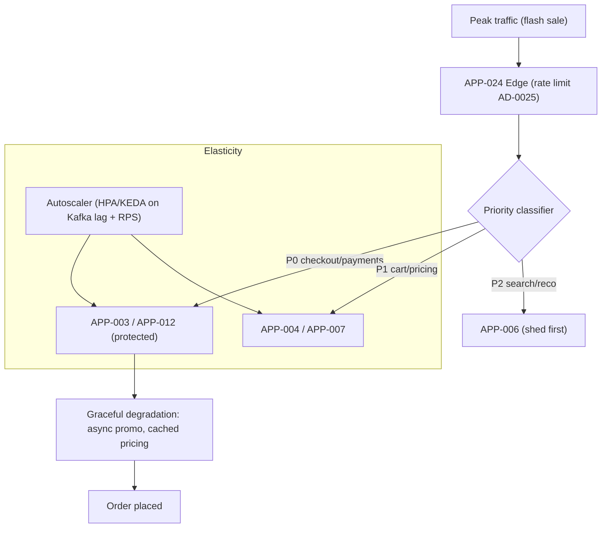
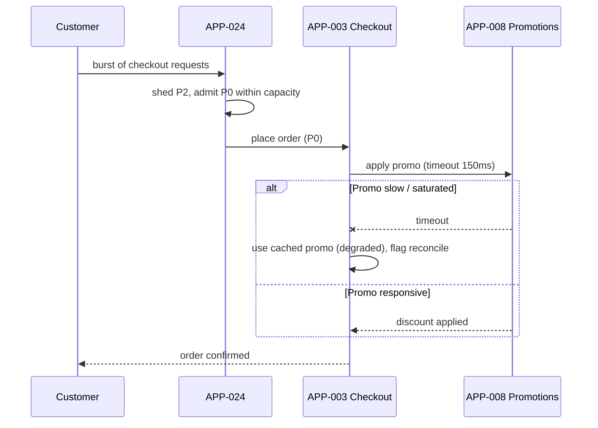

# AD-0028 — Peak-Readiness & Load Shedding

| Field | Value |
|---|---|
| Doc id | AD-0028 |
| Title | Peak-Readiness & Load Shedding |
| Owner team | TEAM-032 |
| Apps | Platform / cross-cutting |
| Status | Accepted |
| Related | KN-218, APP-001, APP-003, APP-008, APP-024, INC-2026-011, INC-2026-016, REL-2026-009, ADR-0045 |

## Purpose

This document defines how MCG prepares for and survives traffic peaks — flash sales, holiday
events, and marketing-driven spikes — through capacity planning, autoscaling, load shedding,
priority queues, graceful degradation, and game days. It exists so that peak events produce
slower-but-successful commerce rather than cascading failure.

Peak-readiness is a cross-cutting SRE concern owned by TEAM-032. It coordinates behaviour
across the edge (APP-024), storefront (APP-001), checkout (APP-003), and the promotions engine
(APP-008), and it is the platform-wide sibling of the edge rate-limiting policy in AD-0025.

The design is grounded in two real events: **INC-2026-011**, where promo-cache staleness
during a flash sale amplified load, and **INC-2026-016**, where storefront latency degraded
under load. **REL-2026-009** shipped the load-shedding and priority-queue mechanisms described
here.

## Context

MCG is an omnichannel retailer whose worst-case load is a flash sale: a single hot SKU or promo
drives an order-of-magnitude spike concentrated on browse (APP-006), pricing (APP-007),
promotions (APP-008), cart (APP-004), and checkout (APP-003). Traffic enters through APP-024
across NA/LATAM/EU/APAC on AWS/Kubernetes. Constraint: Tier 0 order completion must be
protected even if it means shedding lower-value work (search, recommendations, non-essential
personalization).

Business driver: revenue during peak is concentrated in minutes; a checkout brownout is far
costlier than degraded browse. The strategy therefore always protects the money path.

## Architecture

Load management is layered: predictive capacity + autoscaling handle expected load; priority
shedding and graceful degradation handle the surprise beyond forecast.



When demand exceeds provisioned + burst capacity, the priority classifier sheds P2 work first,
then throttles P1, always preserving P0. Graceful degradation lets checkout complete on
last-known-good pricing/promo (async, non-blocking) rather than failing on a slow dependency —
the pattern that INC-2026-011 and INC-2026-019 motivated (see AD-0029, AD-0030).



## Key decisions

1. **Capacity planning from forecasts + headroom.** Peak capacity is provisioned from
   historical peaks plus a marketing-informed multiplier and a fixed headroom buffer, validated
   by load tests before each known event. Observability/SLO principle.
2. **Autoscale on leading indicators.** Scale on request rate and **Kafka consumer lag**, not
   just CPU, so async backlogs trigger scale-out before latency degrades. Cloud-native
   principle.
3. **Explicit priority tiers (P0/P1/P2).** Checkout/payments = P0 (never shed), cart/pricing =
   P1 (throttle), search/reco = P2 (shed first). Priority is a first-class routing attribute at
   the edge (AD-0025).
4. **Load shedding beats collapse.** When saturated, shed low-priority load early and
   deterministically (`429`/`503 Retry-After`) instead of letting queues grow unbounded and
   time out everything. Directly addresses INC-2026-016.
5. **Graceful degradation on the money path.** Checkout falls back to cached/async pricing and
   promo rather than blocking on a slow dependency; discrepancies are reconciled
   post-purchase. Ties to AD-0029/AD-0030.
6. **Priority queues for async work.** Kafka consumers process order-critical topics ahead of
   analytics; non-urgent work (APP-020 feeds) is deprioritized during peak.
7. **Game days.** TEAM-032 runs scheduled fault-injection and peak-simulation game days;
   load-shedding thresholds are tuned from results and rehearsed like DR drills (AD-0027).
8. **Idempotent shed/retry (ADR-0045).** Shed requests carry idempotency keys so client retries
   after `Retry-After` never double-submit orders.

## Data & APIs

Peak controls are exposed as an internal operations surface; degradation is signalled in
responses.

```
# Peak / shedding control API (internal, mTLS)
GET    /v1/peak/mode                       # normal | elevated | shedding
POST   /v1/peak/mode                       # set mode {mode, priorityFloor}
GET    /v1/peak/capacity                   # provisioned vs observed, headroom
POST   /v1/gameday/scenario                # trigger a game-day fault-injection
```

Degradation signalled to clients / downstreams:

```
X-Degraded-Mode: promo-cached      # checkout used cached promo
Retry-After: 5                     # shed low-priority request
```

Peak-mode change event:

```json
{
  "type": "platform.peak.mode-changed.v1",
  "subject": "region/NA",
  "data": { "mode": "shedding", "priorityFloor": "P1", "trigger": "kafka-lag" }
}
```

| Store / topic | Purpose |
|---|---|
| Kafka `commerce.checkout.order-placed.v1` | P0 topic, highest consumer priority |
| Kafka `platform.peak.mode-changed.v1` | broadcasts current shedding mode |
| Redis (APP-008) | promo cache used for degraded checkout (see AD-0029) |
| Prometheus | autoscaling signals (RPS, consumer lag, saturation) |

## Failure modes & resilience

- **Flash-sale spike beyond forecast (INC-2026-011).** Blast radius: promo/pricing/cart.
  Mitigation: shed P2, degrade to cached promo (AD-0029), autoscale on lag; protect checkout.
- **Storefront latency under load (INC-2026-016).** Edge sheds early with `Retry-After`;
  storefront serves cached catalog/pricing; checkout stays within budget (AD-0030).
- **Autoscaler too slow / at cloud quota.** Pre-scaling before known events + reserved capacity;
  shedding covers the gap until scale-out completes.
- **Thundering-herd retries.** `Retry-After` with jitter + edge circuit breaking (AD-0025)
  prevents amplification.
- **Priority inversion (P2 starving shared resource).** Dedicated pools/quotas per priority so
  P2 cannot exhaust P0 capacity.
- **Degraded-mode data drift.** Cached-promo checkouts are flagged and reconciled asynchronously
  to catch mispriced orders.

## Observability

Peak SLOs (Tier 0 money path must hold under load):

- Checkout success rate ≥ 99.9% even in `shedding` mode; checkout p99 ≤ 900 ms (see AD-0030).
- Shed requests are P2-first: < 0.1% of P0 requests shed during peak.
- Autoscale reaction: capacity added within 90 s of a sustained lag/RPS breach.

Metrics: `peak_mode`, `shed_requests_total{priority}`, `checkout_success_ratio`,
`kafka_consumer_lag{topic}`, `autoscale_events_total`, `degraded_checkouts_total`. Traces show
degraded-mode spans (promo timeout → cached fallback). Alerts: P0 shed detected (page TEAM-032),
checkout SLO breach, sustained consumer lag, headroom < 20%. Game-day results and peak
retrospectives are tracked in KN-218 with dashboards in the SRE folder.

## Cross-references

- KN-218 — reliability/peak-readiness knowledge doc
- AD-0025 — Rate Limiting & Traffic Shaping (edge priority, `Retry-After`)
- AD-0027 — Disaster Recovery (regional loss during peak; drills discipline)
- AD-0029 — Promotion-Cache Write-Through (degraded-mode promo correctness)
- AD-0030 — Checkout Latency Budget (money-path budget under load)
- INC-2026-011 — promo-cache staleness during flash sale; INC-2026-016 — storefront latency
- REL-2026-009 — load-shedding & priority-queue release; ADR-0045 — idempotent execution
- APP-001, APP-003, APP-004, APP-006, APP-007, APP-008, APP-024; TEAM-032 (owner)
