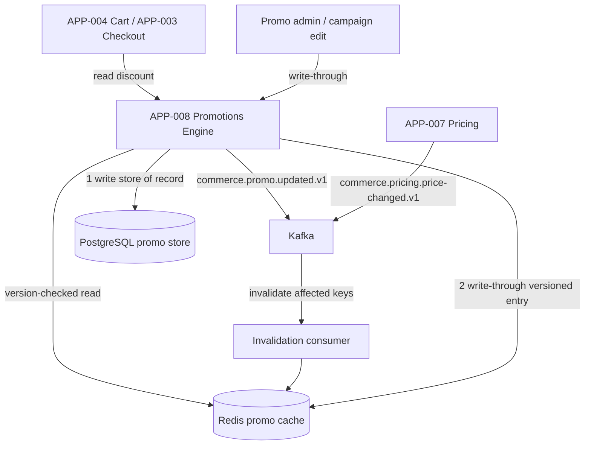
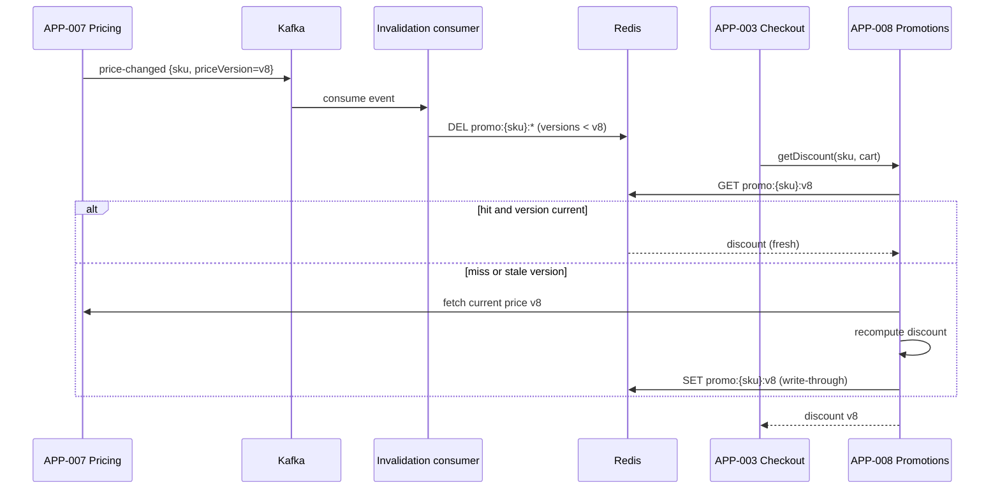

# AD-0029 — Promotion-Cache Write-Through Design

| Field | Value |
|---|---|
| Doc id | AD-0029 |
| Title | Promotion-Cache Write-Through Design |
| Owner team | TEAM-008 |
| Apps | APP-008 |
| Status | Accepted |
| Related | KN-219, AD-0008, APP-007, APP-005, INC-2026-007, INC-2026-011, INC-2026-018, REL-2026-010, ADR-0045 |

## Purpose

This document specifies the systemic fix for the recurring promo-cache staleness series in the
Promotions Engine (APP-008): a **write-through cache with event-driven invalidation** keyed on
price/promo versions, kept coherent with the Pricing Service (APP-007). It exists because the
same class of defect recurred three times — **INC-2026-007** (promo-window price change didn't
invalidate the promo cache), **INC-2026-011** (promo-cache staleness during a flash sale), and
**INC-2026-018** (the third recurrence that mandated a systemic fix rather than another patch).

Parent document **AD-0008** describes the Promotions Engine's overall architecture; this
document is the focused design that replaces its cache-aside pattern with a write-through,
version-coherent design. **REL-2026-010** ships it.

The goal: after any price or promo change is committed, no cache path can serve a stale
discount. Staleness becomes structurally impossible rather than probabilistically rare.

## Context

APP-008 (Kotlin/Spring Boot, Redis) computes promotional discounts. Per canon it depends on
Pricing (APP-007), the loyalty-adjacent APP-015, and Kafka. It is consumed on the money path by
Cart (APP-004) and Checkout (APP-003). The root cause of the staleness series was a cache-aside
Redis layer that could serve an old promo after the underlying price/promo definition changed,
because invalidation was best-effort and time-based (TTL) rather than change-driven.

Constraints: promo evaluation is latency-sensitive (Tier 1 service on a Tier 0 path), so we
cannot drop the cache; correctness must instead come from coherence with APP-007's price
versions. Region/tier: applies in all regions; flash-sale conditions (AD-0028) are the stress
case that turned a latent bug into customer-visible mispricing.

## Architecture

Promo definitions and computed promo results are written through the cache atomically with the
store of record, and every cache entry is stamped with the **price version** and **promo
version** it was computed against. Price/promo changes emit events that invalidate exactly the
affected versioned keys.



Reads validate the cached entry's `{priceVersion, promoVersion}` against the current version
map; a mismatch forces a recompute from APP-007 and a write-through refresh. Because writes go
store-of-record-first then cache, and invalidation is event-driven on the exact versioned key,
there is no window where a committed change is masked by a stale cache line.



## Key decisions

1. **Write-through, not cache-aside.** Every promo definition/result write updates Postgres
   (store of record) and Redis in one path, closing the aside gap that caused INC-2026-007.
   Trade-off: slightly higher write cost for structural correctness.
2. **Versioned cache keys `promo:{sku}:{priceVersion}` (and campaign version).** A stale entry
   is simply an old key, never a wrong value under a current key; reads that see a version
   mismatch recompute. This is the core defence against the whole staleness series.
3. **Event-driven invalidation coherent with APP-007.** APP-008 subscribes to
   `commerce.pricing.price-changed.v1`; a price bump invalidates exactly the affected keys —
   event-driven principle. No reliance on TTL for correctness (TTL remains only as a memory
   backstop).
4. **Coherence contract with Pricing (APP-007).** APP-008 never computes a discount against a
   price version older than the latest observed for that SKU; it fetches current price on any
   ambiguity, honouring the canon dependency direction (Promotions → Pricing).
5. **Idempotent invalidation (ADR-0045).** Invalidation and write-through are idempotent and
   ordered by version, so out-of-order or replayed events cannot resurrect a stale entry.
6. **Fail-safe under cache/dependency trouble.** On Redis miss or pricing timeout during peak,
   checkout may use last-known-good with an explicit `X-Degraded-Mode: promo-cached` flag
   (AD-0028) and asynchronous reconciliation — degradation is bounded and visible, not silent.
7. **Flash-sale hardening (INC-2026-011).** Hot-SKU keys are pre-warmed before known events and
   protected from stampede via single-flight recompute, so a burst cannot spawn a thundering
   herd of recomputes.
8. **Emit `commerce.promo.updated.v1`** on every change so downstreams (search APP-006 pricing
   badges, analytics APP-020) converge to the same version.

## Data & APIs

```
# Promotions API (APP-008)
GET    /v1/promotions/discount?sku=...&cartId=...   # returns discount + priceVersion used
POST   /v1/promotions/campaigns                     # create/update campaign (write-through)
GET    /v1/promotions/campaigns/{id}
POST   /v1/promotions/cache/invalidate              # admin force-invalidate (idempotent)
```

Response includes the version it was computed against, so callers can audit coherence:

```json
{ "sku": "SKU-99", "discount": { "type": "PERCENT", "value": 15 },
  "priceVersion": "v8", "promoVersion": "c412", "cache": "hit" }
```

| Store / topic | Key / name | Purpose |
|---|---|---|
| PostgreSQL | `promo_campaign`, `promo_result` | store of record |
| Redis | `promo:{sku}:{priceVersion}:{promoVersion}` | versioned write-through cache |
| Redis | `pricever:{sku}` | current price version pointer for read validation |
| Kafka (consume) | `commerce.pricing.price-changed.v1` | invalidation trigger from APP-007 |
| Kafka (produce) | `commerce.promo.updated.v1` | downstream convergence |

Idempotency: writes carry an `Idempotency-Key`; invalidation is version-monotonic (an older
version can never overwrite a newer cached entry), per ADR-0045.

## Failure modes & resilience

- **Price change not reflected (INC-2026-007).** Root cause eliminated: invalidation is
  event-driven on versioned keys; a read against an old version recomputes.
- **Staleness during flash sale (INC-2026-011).** Pre-warm hot keys + single-flight recompute +
  degraded-mode flag; stale results cannot silently persist.
- **Recurrence / systemic gap (INC-2026-018).** Correctness now derives from version coherence
  with APP-007, not timing, so the defect class is closed rather than re-patched.
- **Kafka invalidation lag.** Read-time version check catches any not-yet-invalidated entry;
  the event stream is an optimization, the version check is the guarantee.
- **Redis unavailable.** Recompute from Postgres/APP-007 (higher latency); checkout degrades
  gracefully per AD-0028 rather than serving wrong prices.
- **Out-of-order price events.** Version-monotonic invalidation ignores stale-version events.

## Observability

Tier 1 service on a Tier 0 path:

- Discount read p50 < 8 ms, p95 < 25 ms, p99 < 60 ms (cache hit path).
- **Stale-discount rate = 0** (primary correctness SLO after the INC series) — measured by
  auditing served `priceVersion` vs current at read time.
- Invalidation propagation p99 < 500 ms after a `price-changed` event.

Metrics: `promo_cache_hit_ratio`, `promo_stale_served_total` (must be 0),
`promo_recompute_total{reason}`, `promo_invalidation_lag_seconds`, `promo_degraded_total`.
Traces link price-change events to invalidations and recomputes. Alerts: any
`promo_stale_served_total > 0` (page TEAM-008), invalidation lag breach, hit-ratio collapse
during peak. Dashboards in the TEAM-008 folder, cross-linked from the AD-0008 parent doc.

## Cross-references

- KN-219 — promotions/pricing coherence knowledge doc
- AD-0008 — Promotions Engine architecture (parent doc)
- APP-008 Promotions Engine (owner TEAM-008); APP-007 Pricing; APP-005 Catalog
- APP-004 Cart, APP-003 Checkout — money-path consumers
- INC-2026-007, INC-2026-011, INC-2026-018 — the promo-cache staleness series
- REL-2026-010 — release delivering the write-through fix; ADR-0045 — idempotent execution
- AD-0028 — Peak-Readiness (degraded-mode promo); AD-0030 — Checkout Latency Budget
- TEAM-008 (owner), TEAM-007 Pricing
