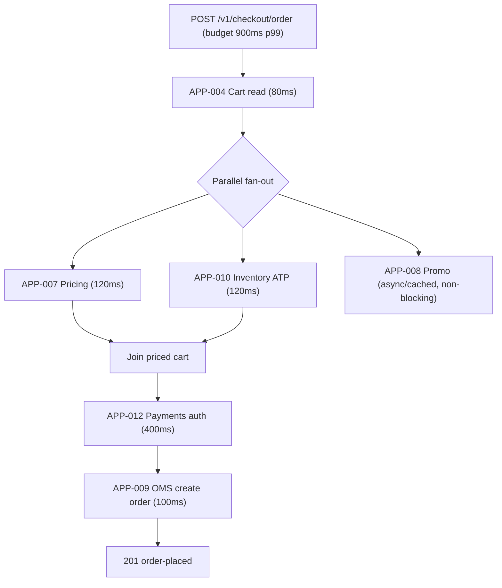
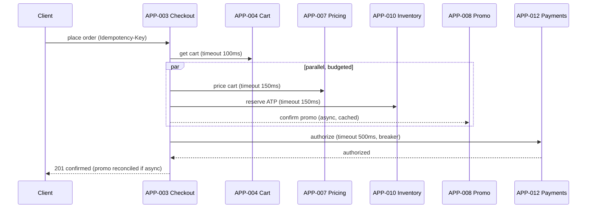

# AD-0030 — Checkout Latency Budget

| Field | Value |
|---|---|
| Doc id | AD-0030 |
| Title | Checkout Latency Budget |
| Owner team | TEAM-004 |
| Apps | APP-003 |
| Status | Accepted |
| Related | KN-220, AD-0003, AD-0023, APP-004, APP-007, APP-008, APP-010, APP-012, INC-2026-019, REL-2026-010, ADR-0045 |

## Purpose

This document defines the end-to-end p99 latency budget for the Checkout Service (APP-003) and
how that budget is decomposed across its downstream calls — cart, pricing, promotions,
inventory, and payments — then enforced with per-hop timeouts, parallelization, and async
promo evaluation. It exists so that checkout latency is a governed, allocated resource rather
than an emergent property of whatever each dependency happens to do.

It responds directly to **INC-2026-019**, a checkout p99 regression caused by a synchronous
promo call that was added inline on the critical path. That incident showed that without an
explicit, enforced budget, a single well-intentioned dependency call can silently blow the
whole SLO. **REL-2026-010** ships the budget-enforcement mechanism alongside the promo-cache
fix in AD-0029.

Parent context comes from **AD-0003** (Checkout Service architecture) and **AD-0023** (the
service-to-service resilience/timeout patterns this budget applies).

## Context

APP-003 (Java/Spring Boot, Tier 0) orchestrates order placement. Per canon it depends on Cart
(APP-004), Pricing (APP-007), Payments (APP-012), Inventory (APP-010), and OMS (APP-009); it
also consults Promotions (APP-008) for final discount confirmation. Checkout is the money path:
its p99 directly affects conversion, and it must hold even under peak load (AD-0028).

Constraint: checkout cannot simply call every dependency serially and hope — the sum of
worst-case latencies exceeds any acceptable budget. Region/tier: Tier 0 in all regions; the
budget is defined for the steady state and a degraded-but-successful mode under stress.

## Architecture

The p99 budget is 900 ms end-to-end. Independent calls run in parallel; each hop has a strict
timeout smaller than its budget slice; promo confirmation is moved off the blocking path
(async / cached), which is the specific fix for INC-2026-019.



Cart, pricing, and inventory are cheap and partly parallelizable; payments (external PSP) is the
largest and least compressible slice, so it gets the biggest allocation and the tightest guard.
Promotions is read from the write-through cache (AD-0029) and, when it cannot answer within its
tiny slice, is applied asynchronously post-authorization with reconciliation — never blocking
the critical path.



## Key decisions

1. **Explicit 900 ms p99 budget, decomposed per hop.** Cart 80 / Pricing 120 / Inventory 120 /
   Payments 400 / OMS 100, with ~80 ms orchestration+network slack. The budget is a governed
   artifact reviewed on every dependency change. Observability/SLO principle.
2. **Parallelize independent calls.** Pricing and inventory-ATP run concurrently rather than
   serially, reclaiming latency that a naive sequence would waste. Trade-off: more in-flight
   load per checkout, bounded by connection pools.
3. **Async / cached promo — the INC-2026-019 fix.** Promo confirmation is read from the
   write-through cache (AD-0029) and, on miss/slow, applied after payment authorization with
   reconciliation, so promo is never a synchronous blocker on the critical path.
4. **Per-hop timeouts strictly below the budget slice (AD-0023).** Each call times out inside
   its allocation, so one slow dependency cannot consume another's budget; breakers open on
   sustained failure.
5. **Payments gets the largest, tightest slice.** External PSP latency (APP-012, see
   INC-2026-009 history) is least compressible, so it owns 400 ms with a hard 500 ms timeout and
   a circuit breaker; degradation there fails the order cleanly rather than hanging.
6. **Budget enforced in code and CI.** A budget guard rejects a build/config where the sum of
   declared hop timeouts exceeds the budget, and a runtime assertion emits a violation metric —
   preventing a repeat of an unbudgeted sync call slipping in.
7. **Idempotent placement (ADR-0045).** `Idempotency-Key` makes a client retry after a
   near-budget timeout safe; no double order, no double authorization.
8. **Degrade, don't stall, under peak (AD-0028).** When saturated, checkout tightens promo to
   cached-only and sheds non-essential enrichment, keeping the money path inside budget.

## Data & APIs

```
# Checkout API (APP-003)
POST   /v1/checkout/order            # Idempotency-Key required; returns order + budget report
GET    /v1/checkout/order/{id}
GET    /v1/checkout/budget           # current per-hop allocations & timeouts (introspection)
```

Per-hop budget (declared config, enforced by the guard):

```json
{
  "totalP99Ms": 900,
  "hops": {
    "cart":     { "budgetMs": 80,  "timeoutMs": 100 },
    "pricing":  { "budgetMs": 120, "timeoutMs": 150 },
    "inventory":{ "budgetMs": 120, "timeoutMs": 150 },
    "promo":    { "mode": "async-cached", "blocking": false },
    "payments": { "budgetMs": 400, "timeoutMs": 500, "breaker": true },
    "oms":      { "budgetMs": 100, "timeoutMs": 150 }
  }
}
```

| Store / topic | Name | Purpose |
|---|---|---|
| Kafka (produce) | `commerce.checkout.order-placed.v1` | order event to OMS/analytics |
| Kafka (produce) | `commerce.checkout.promo-reconcile.v1` | async promo reconciliation trigger |
| Redis (via APP-008) | `promo:{sku}:{priceVersion}` | cached promo for non-blocking read (AD-0029) |
| Postgres (APP-009 OMS) | order records | store of record for placed orders |

Error envelope on hop timeout: `{ "error": { "code": "DEP_TIMEOUT", "hop": "payments",
"budgetMs": 400, "traceId": "..." } }`.

## Failure modes & resilience

- **Sync promo call regression (INC-2026-019).** Root cause removed: promo is async/cached and
  non-blocking; the budget guard would reject any config re-introducing a blocking promo hop.
- **PSP latency spike (APP-012).** 500 ms hard timeout + breaker fails the order cleanly and
  offers retry; does not consume other hops' budget (history: INC-2026-009).
- **Pricing/inventory slow.** Parallel calls + per-hop timeouts contain the blast radius; a
  timed-out inventory reserve fails the order rather than overselling (see INC-2026-012).
- **Cascading retries.** Idempotency-Key + breakers + edge `Retry-After` (AD-0025) prevent
  amplification.
- **Peak saturation.** Degrade to cached-only promo and shed enrichment (AD-0028) to stay in
  budget; checkout success prioritized over completeness.
- **Partial success (auth done, OMS slow).** Idempotent OMS create + reconciliation event
  ensure the authorized order is eventually recorded exactly once.

## Observability

Tier 0 money-path SLOs:

- Checkout p50 ≤ 350 ms, p95 ≤ 650 ms, **p99 ≤ 900 ms** (the budget); error rate < 0.1%.
- Per-hop latency tracked against its allocation; a hop exceeding its slice at p99 alerts even
  if the total is still within budget (early-warning).
- Budget-violation count = 0 (CI guard + runtime assertion).

Metrics: `checkout_latency_ms{quantile}`, `checkout_hop_latency_ms{hop,quantile}`,
`checkout_budget_violation_total`, `checkout_promo_async_total`, `checkout_breaker_open_total`.
Distributed traces span all hops with the budget annotated per span, making a regression like
INC-2026-019 visible as a hop overrunning its allocation. Alerts: p99 budget breach (page
TEAM-004), any budget violation, payments breaker open. Dashboards in the TEAM-004 folder,
cross-linked from AD-0003 and AD-0023.

## Cross-references

- KN-220 — checkout performance knowledge doc
- AD-0003 — Checkout Service architecture (parent); AD-0023 — service resilience/timeout patterns
- AD-0029 — Promotion-Cache Write-Through (source of cached/async promo)
- AD-0028 — Peak-Readiness & Load Shedding (degraded-mode budget)
- APP-003 Checkout (owner TEAM-004); APP-004 Cart; APP-007 Pricing; APP-008 Promotions;
  APP-009 OMS; APP-010 Inventory; APP-012 Payments
- INC-2026-019 — checkout p99 regression from sync promo call; INC-2026-009 — PSP auth latency;
  INC-2026-012 — ATP oversell
- REL-2026-010 — release; ADR-0045 — idempotent execution & rollback
- TEAM-004 (owner)
