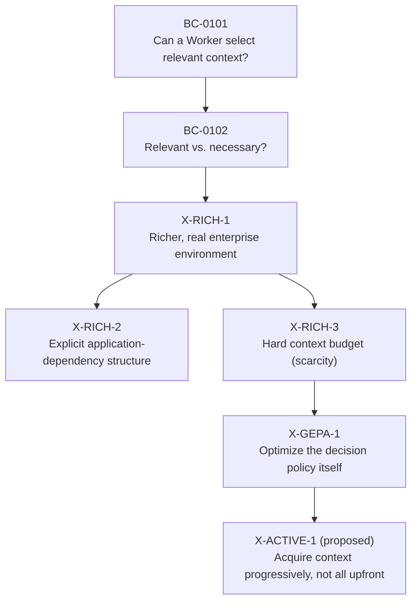
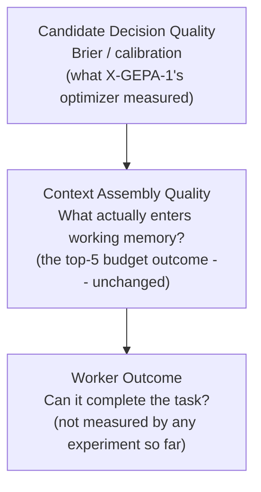
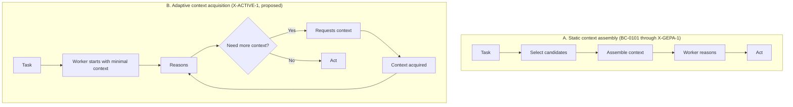
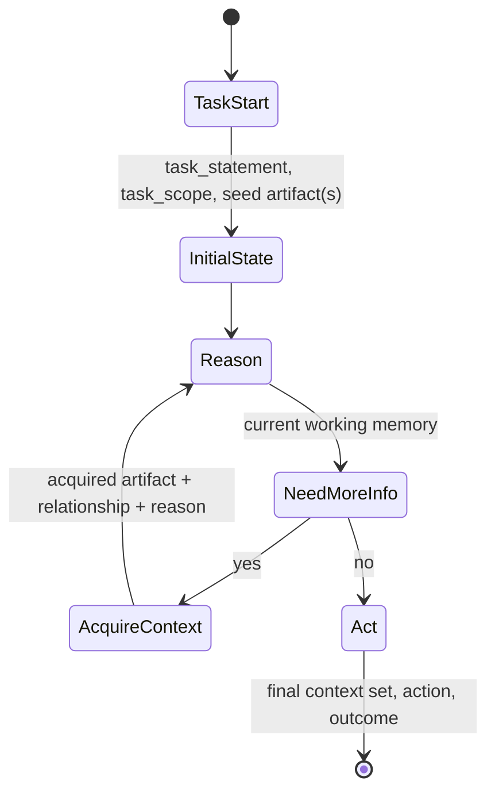

# X-ACTIVE-1 — Research Foundation and Design Proposal

**Status: research foundation + design proposal only. Nothing here is
implemented.** No experiment code exists yet, no historical file was
touched to produce this document, and no snapshot/manifest files have been
created — this document proposes their structure and gives one worked
example inline, but building them is future work (see §P).

This document does two things: (1) establishes a durable, verified
foundation — what the enterprise corpus actually contains, how it's been
used so far, and what X-GEPA-1 actually taught us — and (2) proposes,
without implementing, the next experiment: **X-ACTIVE-1**.

---

## A. Repository / corpus inventory

Verified directly against the repository (not assumed from prior
documentation). Where a number matches a previously-stated approximation,
that's stated explicitly; one real discrepancy was found and is flagged.

### Aggregate corpus

| Category | Previously stated | Verified | Source |
|---|---|---|---|
| Knowledge artifacts | ~145 | **145** (confirmed exact) | `enterprise/knowledge/{api-specs,architecture-docs,business-rules,postmortems,runbooks}.json` — 25+30+50+15+25 = 145, matching `enterprise/knowledge/index.json`'s own count of 145 |
| Experience artifacts | ~13 | **13** (confirmed exact) | `corpus/experience_store.json` — a single list; **no separate `enterprise/experience/` directory exists** |
| Applications | ~12 | **12** (confirmed exact) | `enterprise/registry/applications.json` |
| Tasks | (implied `enterprise/tasks/`) | **no such directory exists** | The only task definition in active use, `CHK-1421`, lives in `benchmarks/examples/benchmark_case.example.json` |

`enterprise/` actually contains: `api-specs/`, `architecture/`, `commits/`,
`incidents/`, `jira/`, `knowledge/`, `postmortems/`, `pull-requests/`,
`registry/`, `runbooks/`, `schemas/`, `tests/` — a richer structure than
the four directories named in the prompt (`knowledge/experience/registry/
tasks`), and `experience` and `tasks` specifically are not among the real
directories.

### Knowledge record schema (from real records, not assumed)

```
id, schema_version, created_at, title, body, owner_team, app, sensitivity,
authority, version, status, canon_refs, metadata,
freshness: { last_validated, sla_days, index },
relations: { depends_on[], referenced_by[], referenced_by_incidents[] },
promoted_from_experience  (optional — a real knowledge <- experience edge)
```

`KN-045` is a real, verified instance of every relationship type the design
brief's §10 diagram describes:

```json
{
  "id": "KN-045", "title": "Checkout domain rules", "app": "APP-003",
  "relations": { "depends_on": ["KN-052", "KN-063"],
                 "referenced_by_incidents": ["INC-2026-007"] },
  "promoted_from_experience": "EXP-090"
}
```

### Application dependency graph (all 12, verified)

```
APP-001 Storefront Web    -> APP-004,005,006,007,024
APP-003 Checkout Service  -> APP-004,007,009,010,012
APP-004 Cart Service      -> APP-005,007,008
APP-005 Product Catalog   -> APP-020
APP-006 Search & Browse   -> APP-005,020,024
APP-007 Pricing Service   -> APP-005,020
APP-008 Promotions Engine -> APP-007,015
APP-009 Order Management  -> APP-010,011,012
APP-010 Inventory Service -> APP-011
APP-012 Payments Service  -> APP-013,024
APP-021 Customer Portal   -> APP-009,014,015
APP-024 API Gateway/Edge  -> APP-014
```

**Boundary condition worth documenting for the snapshot manifest:**
dependencies reference `APP-011/013/014/015/020`, which are **not
themselves entries in this 12-app registry** — real edges pointing outside
the registered set (presumably other apps in the wider CANON that this
reference-enterprise slice doesn't include). Any manifest that walks the
dependency graph needs to represent "dependency points outside this
registry" as a valid, non-error state.

### The 15 artifacts already in use (X-RICH-1 pool)

| ID | Classification | Kind | Content available | Canonical source |
|---|---|---|---|---|
| EXP-055, EXP-090, EXP-206, EXP-209 | acceptable_optional / must_include / related_but_unnecessary ×2 | experience | ✓ | `corpus/experience_store.json` |
| KN-045 | must_include | knowledge | ✓ | see data-quality note below |
| KN-047 | unresolvable | knowledge | **✗ — no body anywhere** | n/a (provenance-only) |
| KN-052, KN-063, KN-101, KN-122, KN-128, KN-146 | mixed (incl. `KN-101` CONTESTED) | knowledge | ✓ | `enterprise/knowledge/business-rules.json` |
| KN-311, KN-313 | must_exclude / related_but_unnecessary | knowledge | ✓ | `enterprise/knowledge/postmortems.json` |
| KN-411 | related_but_unnecessary | knowledge | ✓ | `enterprise/knowledge/runbooks.json` |

**New data-quality finding (not previously documented anywhere in this
repository's research docs):** `research/jev_context_decision/candidates.py`'s
`KNOWLEDGE_SOURCES` search order checks `schemas/examples/
knowledge_object.example.json` **before** `enterprise/knowledge/
business-rules.json`. `KN-045` exists in both files. I diffed them
directly: **currently byte-identical**, so there is no live divergence
today — but the experiment's actual resolved provenance for `KN-045` is a
schema *illustration* file, not the canonical enterprise record. If either
file is ever edited independently, this would silently drift. A snapshot
manifest's `canonical_source` field should point at `enterprise/knowledge/
business-rules.json` (the real canonical location), and this quirk in
`candidates.py`'s resolution order should be noted, not silently fixed —
per §18, nothing about `candidates.py`'s existing behavior is being changed
here, only documented.

### Existing snapshot/versioning pattern

**None exists.** Searched `research/`, `docs/`, `ecosystem/`, `schemas/`
for "snapshot", "corpus version", "content_hash" used in this sense — the
only hits are general architecture/versioning discussion in `docs/adr/
ADR-0037.md`, `docs/rfcs/RFC-0025.md`, `ADR-0006.md`, `RFC-0024.md`, none
of which implement a corpus-snapshot mechanism. `research/corpus/` does
not exist. **Whatever snapshot design gets adopted is greenfield** — it
extends no existing convention, and doesn't conflict with one either.

---

## B. Proposed corpus snapshot/versioning structure

Given there's no existing pattern to follow, the design below is new but
deliberately mirrors conventions already used elsewhere in this repo:
`content_hash`-style integrity checks (JSON Schema validation is already
used this way for `WorkerExecutionBundle`s), and the "frozen record +
reproducible re-derivation" pattern `BenchmarkRun` already uses (recording
model/seed/version so a run "replays bit-for-bit").

```
research/
  corpus/
    snapshots/
      x-rich-1/
        manifest.json
```

**One principle drives the schema: reference, never copy.** A snapshot
manifest never stores artifact bodies — only enough to (a) prove which
exact version of an artifact an experiment used, via a content hash of the
resolved body, and (b) let a reader find the canonical source without
re-deriving the candidate-loading logic.

Worked example — an X-RICH-1 snapshot for `KN-045` and `KN-101`, using
real, verified data:

```json
{
  "snapshot_id": "x-rich-1",
  "created_at": "2026-09-20T19:27:33Z",
  "source": "EnterpriseSim enterprise corpus (enterprise/, corpus/)",
  "derived_from_commit": "<git commit hash at capture time>",
  "artifacts": [
    {
      "artifact_id": "KN-045",
      "type": "knowledge",
      "classification": "must_include",
      "canonical_source": "enterprise/knowledge/business-rules.json",
      "resolved_via": "schemas/examples/knowledge_object.example.json",
      "resolved_via_note": "candidates.py's KNOWLEDGE_SOURCES checks this path first; currently byte-identical to canonical_source, see X_ACTIVE_1_PROPOSAL.md §A",
      "application": "APP-003",
      "relationships": {"depends_on": ["KN-052", "KN-063"], "promoted_from_experience": "EXP-090"},
      "content_hash": "sha256:<hash of the resolved title+body>",
      "used_by_benchmarks": ["BC-0101", "BC-0102", "X-RICH-1", "X-RICH-2", "X-RICH-3", "X-GEPA-1"]
    },
    {
      "artifact_id": "KN-101",
      "type": "knowledge",
      "classification": "CONTESTED",
      "canonical_source": "enterprise/knowledge/business-rules.json",
      "resolved_via": "enterprise/knowledge/business-rules.json",
      "application": "APP-007",
      "relationships": {"structural_dependency": "APP-003 -> APP-007 (enterprise/registry/applications.json)"},
      "content_hash": "sha256:<hash>",
      "used_by_benchmarks": ["BC-0101", "BC-0102", "X-RICH-1", "X-RICH-2", "X-RICH-3", "X-GEPA-1"],
      "data_quality_note": "ground_truth.notes in BC-0101 describes this artifact as 'marketplace seller onboarding'; its real content is 'Regional price resolution and currency binding'. Documented, not corrected -- see benchmark_quality.py."
    }
  ]
}
```

**Why `resolved_via` is a separate field from `canonical_source`:** the
`KN-045` finding above is exactly the case this distinction exists for — a
manifest that only recorded one path couldn't represent "the canonical
home of this data" and "the actual file this experiment's code happened to
read it from" as two different, both-true facts.

This is proposed, not built. Building it (§P) would mean one manifest per
already-frozen experiment (`bc-0101`, `bc-0102`, `x-rich-1` — `x-rich-2`
and `x-rich-3` reuse `x-rich-1`'s pool unchanged, so they could reference
the same snapshot rather than get their own), generated once from the
existing frozen candidate-loading code, never regenerated for those
historical snapshots even if the live corpus later changes.

---

## C. Research lineage diagram



**Flagging a discrepancy rather than silently fixing it:** the arc given
in this task's own framing (§1) lists `BC-0101 -> BC-0102 -> X-RICH-1 ->
X-GEPA-1 -> NEXT`, omitting `X-RICH-2` and `X-RICH-3` entirely. Both are
real, completed, documented experiments — and `X-GEPA-1` is not actually a
direct descendant of `X-RICH-1`: it explicitly reuses `X-RICH-3`'s
`apply_budget()` mechanism unchanged (confirmed directly in
`run_experiment_x_gepa_1.py`'s imports). The "budget was an implementation
constraint in earlier experiments" language in this task's §2 is, in fact,
describing `X-RICH-3` specifically. The diagram and table here include the
full, accurate lineage rather than the abbreviated one, per the explicit
instruction elsewhere in this task not to invent or omit real results.

---

## D. Research lineage table

All numbers below are read from result files already in the repository —
none are invented. Full detail and caveats for each: `RESEARCH_STATE.md`.

| Experiment | Question | Environment | Main variable | Outcome |
|---|---|---|---|---|
| `BC-0101` | Can context be selected by relevance? | Original 7-candidate pool | relevance criterion | Both Jev and GPT selected the identical 5-item set every run; score 0.400 (fail); both included the contested `KN-101` |
| `BC-0102` | Relevant vs. necessary? | Same 7 candidates | necessity criterion | GPT: `KN-101` included 5/5 (unchanged), score 0.3868. Jev: `KN-101` included 2/5 (dropped from BC-0101's 5/5), score 0.5848. Criterion wording mattered, differently per model |
| `X-RICH-1` | Does a richer, real enterprise environment change selection? | 15 candidates (7 + 8 new), `KN-101` reclassified CONTESTED | candidate pool richness | Both retained all required items; Jev fully deterministic (score 0.683, 0 variance); GPT varied run to run (mean 0.6794); agreement with Jev ranged 13-14/15 depending on the GPT run |
| `X-RICH-2` | Does explicit application-dependency structure change selection? | X-RICH-1 pool + full application registry appended to every prompt | explicit structural context | Jev unchanged, bit-for-bit. GPT: precision 0.557->0.478, related-but-unnecessary inclusion 0.533->0.733. Consistent with the structural-context hypothesis; does not establish causation |
| `X-RICH-3` | What happens under a hard context budget? | X-RICH-1 pool, capped at 5 of 15 | scarcity (budget mechanically imposed post-hoc) | Jev: identical top-5 across all 5 runs, 100% MUST_INCLUDE retention. GPT: selection varied run to run, displaced a required artifact in 2 of 5 runs |
| `X-GEPA-1` | Can the decision *policy* be optimized (not just the environment)? | X-RICH-3's budget mechanism, unchanged | GEPA-optimized `jev_instructions` | Val score 0.9411->0.9735, held-out test 0.74478->0.75862 -- but the final top-5 working context **did not change** (see §E) |
| `X-ACTIVE-1` (proposed) | Can context be acquired progressively rather than assembled upfront? | TBD | acquisition strategy | TBD — not yet run |

---

## E. X-GEPA-1 lessons: two evaluation layers

X-GEPA-1's central finding, precisely reconstructed last session (exact
per-example scores, not estimated): optimization measurably improved
per-candidate decision quality (val 0.9411->0.9735, held-out test
0.74478->0.75862, driven by real, traceable score movement on specific
examples), and `MUST_INCLUDE` retention held at 100% — but the actual
top-5 working context that survived the budget was **identical** before
and after optimization. The only candidate-level verdict change in the
downstream comparison was `EXP-206` flipping include->exclude, and that
candidate's confidence was already far below the 5th-place cutoff either
way — the improvement happened entirely among candidates that were never
competing for a budget slot.



**This does not mean Brier/calibration scoring is unnecessary** — it's a
real, correctly-computed measurement of layer 1, and it moved for real,
traceable reasons. It measures *one layer* of a three-layer system. Whether
a set-level or process-level metric is needed for layer 2, and a
task/outcome metric for layer 3, is the open research question this
finding raises — not an assumption to build X-ACTIVE-1 around
automatically.

---

## F. Static vs. adaptive context architecture



The static path is what every experiment so far has done, including
X-GEPA-1 — GEPA optimized *which* candidates got selected in one
upfront pass; it never touched *when* or *whether to keep going*, because
there was no "keep going" in the design. That's the actual gap
X-ACTIVE-1 targets.

---

## G. X-ACTIVE-1 research question

Two formulations were given to explore:

1. **Accessible framing:** "Can an AI Worker acquire the right enterprise
   context progressively rather than trying to assemble the entire context
   upfront?"
2. **Architectural framing:** "How should an AI Worker decide what
   enterprise context to acquire, when to acquire it, and when it has
   enough context to act?"

**Recommendation: use the architectural framing as the actual research
question, and the accessible framing as the one-line public-facing
summary** — the same two-register pattern `RESEARCH_STATE.md` already uses
throughout (a plain-English hook, then the precise question). The
accessible framing alone under-specifies the experiment: "acquire
progressively" doesn't by itself say what triggers acquisition, what
triggers stopping, or what "enough" means — and those three sub-questions
are where X-ACTIVE-1's actual design decisions live. The architectural
framing forces each of those to be answered explicitly, which is also why
§14 (stopping) and §J (state machine) exist as their own sections rather
than being incidental implementation details.

---

## H. Experiment variants (not ranked — trade-offs only)

### Variant A — Worker requests artifact IDs explicitly

**Architecture:** the Worker sees a manifest of available artifact IDs
(not their content) and requests specific IDs by name.
**Advantages:** simplest to implement and log; request/response pairs are
trivially auditable; closest to X-RICH-3's existing mechanics (a
known-quantity extension, not a leap).
**Risks:** requires the Worker to already know the ID scheme exists and
roughly what's useful — doesn't test whether it can *discover* relevant
context, only whether it can *select* it incrementally. Risks becoming
X-RICH-3 with extra steps.
**Observability:** high — every request is a discrete, typed event.
**Reproducibility:** high — deterministic request format.
**Implementation complexity:** low.
**Scientific question it actually answers:** does incremental selection
(same information, spread over multiple decisions) change what gets
included, compared to one-shot selection?

### Variant B — Worker requests context by query/question

**Architecture:** the Worker emits a natural-language query; a retrieval
step (real or simulated) returns matching artifacts.
**Advantages:** more realistic simulation of how a Worker without a
pre-enumerated ID list would actually behave; tests query formulation as
its own skill.
**Risks:** introduces a whole new component (the retriever) as a
confound — a bad result could mean "the acquisition strategy is bad" or
"the retriever is bad," and this experiment can't distinguish them without
extra controls. Much harder to keep reproducible (retrieval quality can
drift with corpus phrasing).
**Observability:** medium — need to log query text, not just an ID.
**Reproducibility:** medium — depends on retriever determinism.
**Implementation complexity:** high (a retrieval layer doesn't exist in
this repo yet and would need to be built and separately validated).
**Scientific question it actually answers:** can a Worker formulate
information needs as queries, and does query-based acquisition surface
different context than ID-based selection?

### Variant C — Worker follows enterprise relationships from an initial artifact

**Architecture:** the Worker starts from one seed artifact (e.g. the task's
directly-declared knowledge) and can traverse `depends_on` /
`promoted_from_experience` / application-dependency edges — exactly the
real relationships verified in §A (`KN-045 -> KN-052`, `APP-003 ->
APP-007 -> KN-101`) — to reach further artifacts.
**Advantages:** directly exploits real, already-existing relationship data
(no new corpus needed); gives a clean, mechanistic way to test the
structural-vs-semantic-vs-necessity distinction (§10) that `X-RICH-2`
raised but couldn't cleanly isolate, because `X-RICH-2` handed the whole
graph to the model at once rather than letting the model choose whether to
follow an edge.
**Risks:** traversal can be gamed by graph topology rather than genuine
need (a densely-connected artifact gets over-visited regardless of
relevance); doesn't test free-form information-seeking, only graph
navigation.
**Observability:** high — each traversal step is a typed edge-follow
event.
**Reproducibility:** high — the graph is static and already frozen.
**Implementation complexity:** medium.
**Scientific question it actually answers:** does the Worker use real
structural relationships to decide what to acquire next, and can it tell a
structural neighbor (like `KN-101` via `APP-007`) is not automatically
necessary just because it's reachable?

### Variant D — Combined: reasoning + relationship traversal + targeted retrieval

**Architecture:** all three above, composed — the Worker can request by
ID, follow a relationship, or issue a query, and chooses which mechanism
to use at each step.
**Advantages:** most realistic; most general.
**Risks:** confounds every risk of A, B, and C simultaneously; with three
acquisition mechanisms in play, a result showing "context assembly
improved" can't be attributed to any one of them without careful ablation
— which turns one experiment into effectively three. Weakest starting
point for a *first* experiment in this line, strongest as a later
consolidation once A/B/C are each understood alone.
**Observability:** requires the full event model (§K) plus a
mechanism-choice field per event.
**Reproducibility:** lowest of the four (most moving parts).
**Implementation complexity:** highest.
**Scientific question it actually answers:** given all three acquisition
mechanisms available, which does the Worker actually use, and does having
a choice improve outcomes over any single mechanism alone?

---

## I. Recommended research direction

**Recommend Variant C (relationship traversal) as the first X-ACTIVE-1
experiment**, not because it's "best" in the abstract but because it's the
variant with the clearest causal story and the least new infrastructure:

- It uses relationship data that's **already real and already frozen**
  (§A) — no retriever to build (unlike B), no new corpus to invent.
- It directly operationalizes the exact distinction this whole research
  line has been circling since the original `KN-101` discovery: structural
  relationship (`APP-003 -> APP-007`) vs. semantic relevance (price/
  currency content plausibly relevant to checkout) vs. task necessity
  (still unresolved). Variant C is the first design that could actually
  *observe* whether a Worker treats a structural edge as automatic grounds
  for acquisition, or evaluates each hop on its own merits — which
  `X-RICH-2` raised as a question but, by handing over the whole graph at
  once, couldn't isolate.
- It reuses X-RICH-3's proven observability/checkpointing patterns most
  directly of the four (each traversal step is a discrete, loggable event,
  same shape as an `apply_budget()` decision).
- Variant A is a reasonable *fallback* if C's traversal logic proves harder
  to implement than expected — it's lower-risk but answers a narrower
  question (incremental vs. one-shot, not structural-vs-necessity).
  Variant B and D are better framed as *follow-ups* once C's simpler,
  single-mechanism result exists to compare against.

---

## J. Worker state machine



**What crosses each transition:**
- `TaskStart -> InitialState`: `task_statement`, `task_scope` (both already
  exist, `providers/base.py` / `task_scope.py` — reused unchanged, never
  threaded into a prompt before, exactly as `RESEARCH_STATE.md` already
  flags as an open question), and whatever seed artifact(s) the task
  declares directly.
- `InitialState -> Reason`: the current working-memory set (initially
  just the seed).
- `Reason -> NeedMoreInfo`: an explicit sufficiency judgment (see §14) —
  not implicit; the Worker's state at this point is exactly what §K's
  event model needs to capture, if it can be captured safely.
- `NeedMoreInfo -> AcquireContext`: a request (shape depends on which
  variant from §H — an ID, a relationship-follow, or a query).
- `AcquireContext -> Reason`: the acquired artifact, its relationship to
  what triggered the request, and the stated reason for the request —
  logged before reasoning continues, not reconstructed after the fact.
- `Act -> [*]`: the final working-memory set, the action taken, and
  whatever outcome signal exists (task-level correctness is a genuinely
  open question — see §N).

---

## K. Context acquisition event model

No existing schema in this repo covers this (verified in §A — the
`schemas/` directory has per-ECL-stage schemas like `context_object.
schema.json`, but nothing at this granularity of "one acquisition
decision"). Proposed shape, following this repo's existing JSON Schema
convention rather than inventing a new one:

```
ContextEvent
------------
event_id            -- unique per event
run_id               -- ties events to one experiment run
step                  -- ordinal position in this run's sequence
request_type       -- "id_request" | "relationship_follow" | "query" | "stop"
artifact_id          -- if applicable
reason                -- the Worker's stated reason for this request (free text or structured)
source                -- what triggered the request (task-declared / relationship-derived / self-generated)
relationship        -- the edge followed, if request_type is relationship_follow (e.g. "depends_on", "promoted_from_experience")
result                -- artifact returned, or "not found" / "no further edges"
timestamp
worker_reasoning_state  -- captured only where it can be captured safely -- see caveat below
continue_decision  -- bool, whether the Worker chose to keep acquiring
final_context_set   -- set only on the terminal event
```

**Caveat on `worker_reasoning_state`:** this repo's existing providers
(`JevProvider`, `GPTProvider`) return a verdict + confidence + rationale
per call — there is no existing mechanism for capturing an ongoing
reasoning *state* across multiple calls, because no experiment so far has
needed one (every prior experiment made independent, single-shot
decisions). Capturing this for X-ACTIVE-1 is itself a design question, not
a solved problem — proposed here as a field to fill in if the chosen
implementation approach supports it, not a hard requirement.

Where this would live if built: `schemas/context_acquisition_event.
schema.json`, following the existing per-object-type schema convention,
plus a JSONL event log per run (same pattern X-GEPA-1's
`_CheckpointCallback` already established for iteration events).

---

## L. Metric framework

Deliberately not collapsed into one score — kept as four layers, matching
§E's finding that a single-layer metric (Brier/calibration) can improve
while a different layer (context assembly) stays flat.

| Layer | Metric | What it measures |
|---|---|---|
| Candidate | Precision | Of acquired artifacts, what fraction were actually needed |
| Candidate | Recall | Of needed artifacts, what fraction were acquired |
| Candidate | Brier / calibration | Per-decision probability calibration (what X-GEPA-1 measured) |
| Candidate | False inclusion | Acquired but unnecessary |
| Candidate | False exclusion | Needed but never acquired |
| Process | Acquisition steps | How many acquisition actions the run took |
| Process | Unnecessary acquisitions | Steps that added nothing the task needed |
| Process | Missing context | Required context never acquired by the time of Act |
| Process | Context growth | Working-memory size over the course of the run |
| Process | Duplicate acquisitions | Same artifact requested more than once |
| Process | Stopping correctness | Did the Worker stop at the right point — not too early, not too late |
| Task | Task completion | Whether the downstream task was actually completed |
| Task | Correctness | Whether the completed task was correct |
| Task | Required invariant satisfaction | Whether task-specific invariants (e.g. `KN-045`'s order-placement invariants) held |
| Task | Action correctness | Whether the final action taken matches what the task required |
| System | Latency | Wall-clock time, as recorded throughout this whole research line |
| System | Token usage | As already captured per-call in every existing provider |
| System | Cost | As already captured/reconciled for GPT, partially for Jev |
| System | Retrieval calls | Count of acquisition-mechanism invocations (variant-B/D specific) |

Task-layer metrics are the most speculative row — **no experiment in this
repository has measured actual task completion/correctness yet**; every
experiment so far has measured context-selection quality as a proxy. This
is itself an open question (§N), not a settled capability to build on.

---

## M. Reproducibility checklist

Directly following the pattern X-GEPA-1 established (manifest + native
checkpoint state + JSONL iteration log + progress file + proposal doc +
tests), generalized:

- [ ] Experiment ID
- [ ] Corpus snapshot reference (§B, once built) or explicit note that none
      was used
- [ ] Benchmark/task version (`benchmark_case.example.json`'s version, or
      equivalent)
- [ ] Candidate pool / graph version (which artifacts + relationships were
      reachable)
- [ ] Model(s) and exact pinned version string(s)
- [ ] Provider/transport (OpenRouter vs. direct API, as this repo already
      distinguishes)
- [ ] Prompt/instruction text actually sent, per component
- [ ] Criteria / decision policy in force
- [ ] Full configuration (acquisition variant, stopping criterion,
      max-steps cap if any)
- [ ] Seed, if any stochastic element exists
- [ ] Run count
- [ ] Raw per-run results
- [ ] Aggregate results
- [ ] Environment metadata (Python version, package versions — X-GEPA-1's
      `gepa_version` field is the precedent)
- [ ] Timestamps
- [ ] Git commit the run was executed against
- [ ] A config-manifest + resume mechanism if the run is long-running
      enough to need crash resilience (X-GEPA-1's checkpointing pattern)

---

## N. Risks / open questions

- **No task-outcome metric exists anywhere in this repository yet.** Every
  experiment through X-GEPA-1 measures context-selection quality as a
  proxy for task success, never task success itself. X-ACTIVE-1 could
  either continue that proxy pattern (lower risk, consistent with prior
  work) or attempt a real outcome measure for the first time (higher risk,
  but the only way to eventually answer whether any of this research
  actually helps a Worker complete tasks correctly).
- **Confidence-threshold stopping is not obviously sufficient** (see §14) —
  any variant needs an explicit stance on this before implementation, not
  an assumed default.
- **Relationship traversal (Variant C) can be gamed by graph topology.** A
  densely-connected artifact might get visited regardless of genuine
  relevance — worth a control that checks whether traversal correlates
  with actual necessity or just with edge count.
- **`worker_reasoning_state` capture is unsolved** (§K) — may end up
  scoped out of a first implementation.
- **The `APP-011/013/014/015/020` boundary artifacts** (§A) mean any
  traversal-based variant will hit dependency edges pointing outside the
  registered 12-app set — needs an explicit "external dependency, cannot
  traverse further" terminal state, not a silent failure.
- **Multi-step live experiments cost more and take longer** than the
  single-shot decisions every prior experiment made — X-GEPA-1's own live
  run needed the checkpoint/retry infrastructure built last session
  specifically because single failures used to destroy whole runs; a
  multi-step acquisition loop has strictly more failure points per run and
  should inherit that infrastructure from day one, not bolt it on after a
  first crash.

---

## O. Proposed repository structure

Following this repo's established convention (one research package, many
`experiment_*`/`run_experiment_*.py` files within it) rather than
inventing a new top-level layout:

```
research/
  jev_context_decision/
    experiment_x_active_1_scenarios.py   # seed artifacts + relationship graph slice used
    x_active_1_worker_loop.py             # the REASON/ACQUIRE/ACT state machine
    x_active_1_event_log.py               # ContextEvent (§K) capture
    run_experiment_x_active_1.py          # CLI entrypoint, same --live gating pattern
    tests/test_x_active_1.py
  X_ACTIVE_1_PROPOSAL.md                  # this document
  corpus/
    snapshots/
      x-rich-1/manifest.json              # §B, if adopted
schemas/
  context_acquisition_event.schema.json   # §K, if formalized
```

This keeps X-ACTIVE-1 inside the same package as every prior experiment
in this line (consistent import access to `candidates.py`,
`experiment_3_candidates.py`, `scoring.py`, `providers/`, exactly as
X-GEPA-1 did), rather than starting a parallel research tree.

---

## P. Files that would need to be created for implementation

All new, none existing — implementing X-ACTIVE-1 (not done here) would add:

- `research/jev_context_decision/experiment_x_active_1_scenarios.py`
- `research/jev_context_decision/x_active_1_worker_loop.py`
- `research/jev_context_decision/x_active_1_event_log.py`
- `research/jev_context_decision/run_experiment_x_active_1.py`
- `research/jev_context_decision/tests/test_x_active_1.py`
- `research/corpus/snapshots/x-rich-1/manifest.json` (§B, optional but
  recommended before X-ACTIVE-1 so the new experiment references a
  versioned snapshot rather than the live corpus directly)
- `schemas/context_acquisition_event.schema.json` (§K, optional)

## Q. Files that must remain untouched

Everything already established as frozen across this research line,
unchanged by this document and not to be touched by any future
implementation without an explicit, separate decision:

- `research/jev_context_decision/candidates.py`
- `research/jev_context_decision/experiment_3_candidates.py`
- `research/jev_context_decision/scoring.py`
- `research/jev_context_decision/task_scope.py`
- `research/jev_context_decision/decision.py`
- `research/jev_context_decision/providers/base.py` (`BC_0101`, `BC_0102`)
- `research/jev_context_decision/providers/{jev_provider,gpt_provider,openrouter,openai_direct}.py`
- `research/jev_context_decision/run_experiment.py`,
  `run_experiment_3.py`, `run_experiment_x_rich_2.py`,
  `run_experiment_x_rich_3.py`, `run_experiment_x_gepa_1.py`
- `research/jev_context_decision/gepa_jev_adapter.py`,
  `experiment_x_gepa_1_candidates.py`
- Every file under `research/jev_context_decision/results/`
- `benchmarks/examples/benchmark_case.example.json` (ground truth,
  including `KN-101`'s frozen, contested `must_exclude` label — not to be
  resolved by this or any future experiment)
- `enterprise/**` and `corpus/experience_store.json` (the corpus itself —
  X-ACTIVE-1 should reference it, per §4's core principle, never fork or
  duplicate it)
- `RESEARCH_STATE.md` (the historical research record — X-ACTIVE-1 gets
  documented as a new entry when it actually runs, not by editing this
  document's account of what already happened)

