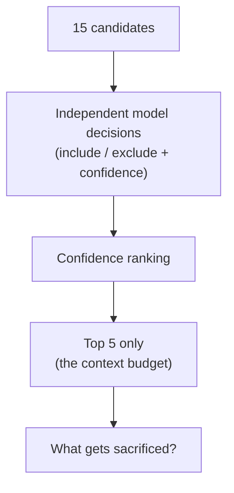
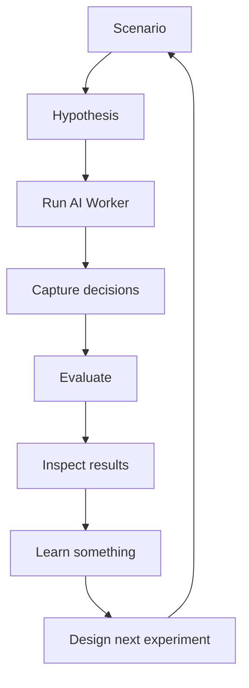

# EnterpriseSim Research: What Should an AI Worker Remember?


## The business use case and problem, in two sentences

**Use case:** an AI Worker is implementing guest checkout order placement
(task `CHK-1421`) for the Checkout Service (`APP-003`) — a customer who
isn't logged in completing an order. **Problem:** the Worker has access to a
large pile of enterprise knowledge that's potentially relevant, and it needs
to decide which pieces actually belong in its working context for this one
task, not just which pieces are on-topic. Everything below is five different
ways of testing that decision.

## Quick reference — the IDs you'll see below

Before I get into what actually happened, a short cast-of-characters. I
named things as I built them, the way you name things when you're the only
one who has to remember what they mean — so a few of these IDs will come up
again and again below, and I'd rather explain them once here than make you
stop and guess every time one shows up in the story.

- **`BC-0101` / `BC-0102`** — "Benchmark Case" 101 and 102, my names for the
  first two experiments. Same 7 candidate artifacts in both; the number just
  tracks which decision criterion I used (101 = relevance, 102 = necessity).
- **`X-RICH-1` / `X-RICH-2` / `X-RICH-3`** — my names for the three
  follow-up experiments (a richer 15-candidate environment, then explicit
  enterprise structure, then a hard context budget). Each builds on
  `X-RICH-1`, not on each other.
- **`KN-xxx`** — an ID for one article in the enterprise knowledge base
  (e.g. `KN-101` is knowledge-base entry 101). It's a candidate artifact a
  Worker could pull into its context.
- **`EXP-xxx`** — an ID for one entry in the experience/incident corpus (a
  past postmortem, lesson, or operational record), same idea as `KN-xxx`
  but drawn from a different corpus.
- **`APP-xxx`** — an ID in the enterprise application registry. `APP-003` is
  the Checkout Service, the app this whole task belongs to. `APP-007` is the
  Pricing Service, which matters later.
- **`MUST_INCLUDE` / `ACCEPTABLE_OPTIONAL` / `RELATED_BUT_UNNECESSARY` /
  `MUST_EXCLUDE` / `UNRESOLVABLE` / `CONTESTED`** — the six labels I used to
  classify each candidate artifact for scoring: the task needs it / it helps
  but isn't required / it's genuinely about the same domain but not needed
  for this task / it's clearly wrong / there's no real content to judge / or
  it's genuinely ambiguous (this last one only ever applied to one artifact,
  `KN-101` — see below).

## Why I built EnterpriseSim

EnterpriseSim exists to simulate enterprise situations and see how an AI
Worker actually behaves inside them. This is the first of a set of use cases
I intend to build out and publish — the checkout scenario below is one
concrete exercise, not a claim that I've modeled an entire real enterprise.

What I wanted was a controlled environment where I could define a scenario,
define the candidate information or actions available to an agent, ask it to
make a decision, repeat that decision, inspect exactly what happened, and
score it. That loop — define, decide, repeat, inspect, evaluate — is the
whole point of the project. It's open-source, it's a testbed, and it doesn't
solve context assembly by existing. It just gives me somewhere to ask the
question and get an actual answer back instead of an opinion.

## The problem I was actually trying to test

An AI Worker doing real enterprise work can potentially reach a huge amount
of internal knowledge — checkout rules, payment rules, loyalty behavior,
pricing policy, past incidents, application dependencies, operational
runbooks. The question I kept running into, phrased a dozen different ways by
different people, was: how does the Worker decide what actually deserves a
place in its working context for one specific task?

My first instinct was to treat this as a retrieval problem — find the
relevant stuff, rank it, done. But once a system can technically retrieve
almost anything connected to a task, retrieval isn't the bottleneck anymore.
Deciding what to keep is. Context assembly isn't retrieval. It's a selection
and prioritization problem.

Take a concrete case: a Worker is responsible for placing a guest checkout
order. It has access to checkout domain rules, an idempotency standard, a
rule about loyalty accounts, pricing/promo policy, past incident writeups,
application dependency data, and a pile of other enterprise documentation.
It can't carry all of it into every decision. Some of that material is
essential, some is useful but optional, some is genuinely related to
checkout but not necessary for this task, some is irrelevant, some doesn't
even resolve to real content, and — as I found out — at least one artifact
is just genuinely ambiguous. So the question becomes: how do I measure
whether the Worker is making the right call, artifact by artifact?

## Why I started experimenting with Jev

A lot of agent evaluation eventually comes down to judging a decision, not
generating a final answer: should this artifact be included, is this
information necessary, which tool should the agent use, should it take this
action, what should it keep when it can't keep everything. That's a
different kind of question than "write me the answer," and I wanted to know
whether a structured, decision-oriented model would be useful for evaluating
that kind of agent behavior — as opposed to using a general-purpose model and
parsing free text out of it.

That's the actual reason Jev (`typesafe/jev-1.13`) shows up throughout this
research, next to GPT (`openai/gpt-5-mini`). I'm not claiming Jev is a better
model, a better judge, or that its decisions are ready to use as training
labels — none of that is established here. What I can say, and what the
experiments below actually support, is narrower: Jev gave me a structured
decision interface that was fast and cheap enough to make repeated
experimentation practical, and a second, independently-built reasoning path
to compare against GPT's.

## Turning it into an experiment

EnterpriseSim gives me the substrate for this: real interconnected knowledge
base entries, incident writeups, experience records, and an
application-dependency registry (`enterprise/registry/applications.json`),
plus a benchmark harness (`score()`) that grades a selected context set
against a fixed ground truth. The loop is:

```
Task
  ↓
Candidate enterprise artifacts
  ↓
Context-selection decisions (include / exclude, per candidate)
  ↓
Working context (the selected set)
  ↓
Evaluation (recall, precision, required-item gate, objective score)
```

The task under study throughout is `CHK-1421`: guest checkout order
placement, on the Checkout Service (`APP-003`). Everything below is the same
task, run through five experiments that each changed exactly one thing.

| Experiment | Candidates | Criterion | What changed | Status |
|---|---|---|---|---|
| BC-0101 | 7 | Relevance ("should this be included?") | Baseline | Complete, 5×5 |
| BC-0102 | Same 7 | Necessity ("is this necessary to correctly perform this task?") | Criterion wording only | Complete, 5×5 |
| X-RICH-1 | 15 (7 + 8 new) | BC-0101's criterion, reused unchanged | Candidate pool enriched; `KN-101` reclassified CONTESTED | Complete, 5×5 |
| X-RICH-2 | Same 15 | Same as X-RICH-1 | Complete, unfiltered application-dependency registry added to every prompt | Complete, 5×5 |
| X-RICH-3 | Same 15 | Same as X-RICH-1 | Hard cap of 5 selected candidates, enforced mechanically after the fact | Complete, 5×5 |

Both models, throughout: Jev via OpenRouter's alpha Decisions API; GPT via
OpenRouter for `BC-0101`, then via the direct OpenAI API from `BC-0102`
onward (OpenRouter kept truncating GPT's responses and burning credit before
a batch finished — that's the whole reason for the switch, and it means
`BC-0101`'s GPT cost/latency numbers aren't directly comparable to anything
after it).

## Experiment 1 — Is relevance enough? (`BC-0101`)

Seven candidates, one question per candidate, asked independently: "should
this be included in the Worker's working context for this task?" Five runs
each.

Both models picked the exact same 5-item set every run and scored 0.400 —
a fail. Both included one artifact, every single run, that the ground truth
said should be excluded: `KN-101`, described in the benchmark's own notes as
"marketplace seller onboarding," an out-of-scope distractor.

I went and read what `KN-101` actually says. It isn't about marketplace
seller onboarding at all — it's about regional price resolution and currency
binding, how a pricing service resolves a price per SKU/region/currency/
channel. The application registry confirms Checkout has a real, declared
dependency on the Pricing service, the app that owns `KN-101`.

That changes the story. Both models weren't missing an obvious distractor —
they were reading real content about a real dependency and reasoning it
might matter for computing an order total. Neither could have reconstructed
"marketplace seller onboarding" as a reason to exclude it, because nothing
they were shown said that.

This is a benchmark-quality finding, not a resolved one. I'm not concluding
`KN-101` should be included, and I'm not concluding it should be excluded
either. I left the original ground-truth label untouched — it's a frozen,
historical result. But I stopped trusting that artifact as an unambiguous
distractor, and every experiment after this one treats it differently. The
lesson that stuck with me: the benchmark itself needed auditing against the
artifacts it claims to evaluate, not just the model behavior against the
benchmark.

## Experiment 2 — What does "necessary" mean? (`BC-0102`)

Experiment 1 left me with a specific, nagging question, not just a general
one. Both models included `KN-101` under a plain relevance test — is this
on-topic? — and its content genuinely is on-topic, it's about pricing during
checkout. But on-topic isn't the same thing as required. I'd only ever asked
the relevance version of the question. If `KN-101` is the kind of thing a
model finds relevant without it actually being necessary to place the order
correctly, then asking about necessity instead should catch that, and
asking about relevance never could. That was the whole point of this
experiment.

Same 7 candidates. I changed only the question, from relevance to
task-specific necessity: *"Is this artifact necessary to correctly perform
this specific task? Include it only if omitting it would materially reduce
the Worker's ability to complete the task correctly."* Something can be
related to checkout without being necessary to place an order correctly —
`KN-101` being the obvious thing to test that distinction against.

With the necessity framing: GPT still selected `KN-101` in 5 of 5 runs —
identical to `BC-0101` — and every run failed the gate because of it (mean
score 0.3868). Jev's rate dropped from an effective 5/5 to 2 of 5 runs (mean
score 0.5848, a mix of partial and fail). Reframing the question changed the
outcome for one model and, in any meaningful way, not for the other. I can't
say why from this data alone — I changed one variable and got two different
responses from two different models, which at minimum tells me the wording
distinction is real enough to matter and isn't something either model was
already applying by default.

## Experiment 3 — A richer enterprise (`X-RICH-1`)

Two experiments in, and both had run on the exact same 7 candidates.
Changing one word in the question was already enough to move the outcome
for one model and not the other — which told me the criterion mattered, but
it also made me suspicious of the setup itself. Seven candidates is small
enough that a model could plausibly get the right answer by something close
to memorization, and it's nothing like a real enterprise knowledge base,
where the thing you're looking for is surrounded by dozens of other things
that are also genuinely about the same area. I wanted to know if the
pattern from the first two experiments held up once that stopped being true.

The 7-candidate pool started to feel too clean. Real knowledge bases aren't
7 tidy documents, they're hundreds of interconnected ones, most genuinely
about the area you're working in without being what you need right now. I
built `X-RICH-1` on 15 candidates — the original 7 plus 8 new ones from the
same corpus — and needed more than "include/exclude" to classify them
honestly: artifacts the task absolutely needs (**MUST_INCLUDE**), artifacts
that help but aren't required (**ACCEPTABLE_OPTIONAL**), artifacts genuinely
connected to the domain but addressing a different concern
(**RELATED_BUT_UNNECESSARY** — latency SLOs, a change-freeze policy,
postmortems about a different incident, a saga-testing rule), artifacts
clearly out of scope (**MUST_EXCLUDE**), one artifact with no retrievable
content (**UNRESOLVABLE**), and `KN-101`, now **CONTESTED** — its decision is
captured and reported every run, but removed from the scored set before
scoring, so it can never move the score either way.

Both models retained all 3 required artifacts and excluded the genuinely
forbidden ones, every run. Jev's decisions were identical across all 5 of
its own runs — a fully deterministic fingerprint, mean score 0.683, zero
variance. GPT's mean score was 0.6794, ranging 0.665–0.683 across its 5 runs
(stddev ≈0.0072) — not identical run to run. GPT also wasn't internally
consistent with itself on which candidates it picked: across its 5 runs it
disagreed with Jev's fixed selection on one candidate (a postmortem) in all
5, and on a second (a saga-testing rule) in 4 of 5. So agreement between the
two models was 14 of 15 candidates on one GPT run, and 13 of 15 on the other
four — not a flat number, and not something I want to round off to "14/15
agreement" as if it held every time. `KN-101` was selected 5 of 5 times by
both, still fully excluded from the score. Both disagreements landed on
RELATED_BUT_UNNECESSARY candidates, never on a required or truly forbidden
one.

## Experiment 4 — Give the Worker the enterprise graph (`X-RICH-2`)

`X-RICH-1` still hadn't touched something that had been sitting there since
Experiment 1: `KN-101`'s owning app has a real, declared dependency on
Checkout, and the model was never told that directly — it could only have
inferred anything dependency-shaped from the artifact's own text, if it
noticed at all. That felt like an obvious gap to close. So: narrower
question, does handing the model the actual structural information — which
apps depend on which — change anything? Everything about
`X-RICH-1` stayed fixed: same 15 candidates, same order, same candidate
bodies, same criterion, same TaskScope, same scorer, same providers. The only
addition was the complete, unfiltered application-dependency registry,
appended to every request.

Jev's scored metrics didn't move at all — same score, recall, precision, and
related-but-unnecessary rate, to the same decimal, with or without the
registry. GPT's did move: precision dropped from 0.557 to 0.478, and its
rate of admitting related-but-unnecessary candidates rose from 0.533 to
0.733. Recall stayed at 0.8 for both either way, and required/forbidden
behavior — the part that actually gates pass/fail — was unchanged. `KN-101`
remained selected 5/5 by both.

I want to be careful about the verb here. Adding the registry was
**associated with** a shift in GPT's selection behavior. The result is
**consistent with** the idea that explicit structural context can change how
liberally a model interprets "connected enough to include." It does not
establish that the registry **caused** the shift — one before/after
comparison, 5 repeats, one task, can't rule out other explanations, and it
doesn't tell me whether the same thing happens on a different task.

## Experiment 5 — Take context away (`X-RICH-3`)

Every experiment up to this point had been about giving the Worker *more* —
more candidates, then more context about those candidates. At some point I
started wondering the opposite thing: what if, instead of giving it more to
work with, I gave it less room to work in? `X-RICH-1` has 15 candidates
worth judging. What happens if the Worker only gets 5 slots in its final
context? Out of everything in this write-up, this is the experiment I'd
point someone to first, because it's the one that actually changed how I
think about the whole problem.



Before this experiment, the question every candidate faced was "should this
be included?" Under the budget, it became "which five deserve to survive?"
— and I want to be precise about what I actually did here, because it's easy to
misread. I didn't change the prompt or the criterion, and I never told
either model a budget existed. Each model made the exact same kind of
independent include/exclude decision, with a confidence score, for all 15
candidates, exactly as it had in `X-RICH-1`. Only after that did my own
aggregation code step in — it took every "include" verdict, ranked them by
the model's own stated confidence, and mechanically kept the top 5,
dropping the rest regardless of what the model originally said. So the
models didn't "handle" a five-item budget in any real sense. There was no
budget in anything they saw. I imposed the cut afterward, in code, on top
of decisions they'd already made on their own.

What came out of that was interesting. Jev put the exact same 5 candidates
on top in all 5 runs — all 3 required items, `KN-101`, and exactly one
related-but-unnecessary candidate, every single time. Recall dropped from
0.8 to 0.6, precision rose from 0.571 to 0.75, the score moved from 0.683 to
0.667. Zero variance across the five repeats — it made the same call every
time, down to the artifact. GPT's picture was messier. Its selected top five
varied from run to run, and while it kept all three required items in 3 of
the 5 runs, in the other 2 a required artifact fell below the cut line — the
loyalty-account rule in one run, the domain-rules artifact in the other —
which failed the required-item gate outright both times. Averaged across
all 5 runs: recall 0.6, precision 0.66, required-item retention 0.8667, mean
score 0.5248.

I want to be careful about what that means and doesn't mean. I'm not saying
Jev is better than GPT — a five-run, one-task, one-budget-size experiment
can't tell you that. What I can say is narrower and, I think, actually more
useful: under this specific task, candidate set, and five-artifact budget,
Jev's confidence ranking held steady across repeats, and GPT's displaced a
required artifact in 2 of 5 runs. That's an observation about how one
ranking mechanism behaved on one task, not a verdict on either model, and I
wouldn't generalize it to a different budget or a bigger sample without
actually running that experiment.

Here's the part I keep coming back to, though. Every experiment before this
one was answering "should this one thing be included," one candidate at a
time, with enough room that everyone who deserved a "yes" could get one.
The moment you cap the number of slots below the number of things worth
including, that question stops making sense on its own — the real question
becomes which of these deserve to survive, given that not all of them can.
That's a harder question, and it's the one that finally exposed a real
difference between the two models: not whether they could tell a good
artifact from a bad one — both already could, in every earlier experiment —
but whether they protected the *right* things when something had to be
sacrificed. Jev did, the same way, five times in a row. GPT didn't, twice.

I don't want to oversell a five-run experiment on one task, but this is
where the idea that had been forming across the whole project actually
became visible in the numbers instead of staying a hunch: context assembly
is starting to look less like classification — in or out? — and more like
resource allocation under uncertainty — given a limited budget and
incomplete certainty about what's necessary, what actually survives?

## All five experiments, side by side

Before I get into what I took away from all of this, here's the whole
progression in one place — the numbers and what they actually cost to
produce, since I don't think you can look at one without the other.

| Experiment | Candidates | Jev score | Jev recall / precision | Jev cost / repeat | GPT score (mean) | GPT recall / precision (mean) | GPT cost / repeat |
|---|---|---|---|---|---|---|---|
| `BC-0101` | 7 | 0.400 | 0.800 / 0.800 | $0.000186 (API-reported) | 0.400 | 0.800 / 0.800 | $0.001877 (API-reported) |
| `BC-0102` | 7 (same) | 0.5848 | 0.600 / 0.900 | not captured | 0.3868 | 0.720 / 0.780 | $0.00234 (reconciled) |
| `X-RICH-1` | 15 | 0.683 | 0.800 / 0.571 | not captured | 0.6794 | 0.800 / 0.5568 | $0.00399 (reconciled) |
| `X-RICH-2` | 15 (same) | 0.683 | 0.800 / 0.571 | not captured | 0.6594 | 0.800 / 0.4776 | $0.00650 (reconciled) |
| `X-RICH-3` | 15, capped at 5 | 0.667 | 0.600 / 0.750 | not reconciled yet | 0.5248 | 0.600 / 0.660 | not reconciled yet |

Only the `BC-0101` row is a fair Jev-vs-GPT cost comparison — same
transport, same provider-reported numbers on both sides. Every row below it
has a GPT figure and no matching Jev figure, for the reason explained in the
cost section further down: the transport split after `BC-0101`, and I never
went back and captured Jev's cost again on comparable terms.

A couple of things worth reading directly off this table rather than out of
my summary of it: Jev's score never moves except in the two experiments that
actually changed something about what it was being asked (`BC-0102`'s
necessity criterion, and `X-RICH-3`'s budget) — `X-RICH-1` and `X-RICH-2`
give it the identical 0.683, because nothing relevant to Jev's decision
changed between them. GPT's numbers move more, and move differently, in
almost every experiment. And the cost column is there specifically so
nobody reads "165,790 input tokens" in the `X-RICH-2` cost breakdown further
down and assumes that means an 8×+ cost jump — it didn't, and I explain why
in the cost section below.

It's also worth saying out loud how the context itself grew and shrank
across these five experiments, because the table above shows the effect of
that but not the shape of it. `BC-0101` and `BC-0102` both worked from the
same 7 candidates. `X-RICH-1` more than doubled that to 15, pulled from the
same underlying corpus. `X-RICH-2` kept those same 15 candidates and added
one more thing on top: the complete application-dependency registry, handed
to the model as extra structural context on every single decision. Then
`X-RICH-3` reversed direction entirely — same 15 candidates, but a hard cap
of 5 slots in the final context.

I went in expecting that adding more context would generally help, or at
worst do nothing. That's not quite what happened. Growing the candidate
pool from 7 to 15 didn't change how either model handled the original
7 — both still caught the required items and the truly forbidden ones.
Adding the registry on top of that left Jev completely unchanged and made
GPT's precision measurably worse, not better. The only experiment where
precision clearly *improved* for both models was `X-RICH-3` — the one where
I took context away. So if there's a lesson in the shape of this progression,
it's not "more context, better results." It's closer to: more context gave
the models more to potentially get wrong, and it was the constraint, not the
addition, that produced the cleanest improvement in precision — at the cost
of recall, which is its own trade-off, not a free win.

## `KN-101` — the full picture

| Experiment | `KN-101` treatment | Selection rate |
|---|---|---|
| `BC-0101` | `must_exclude` (frozen ground truth) | Jev 5/5, GPT 5/5 |
| `BC-0102` | `must_exclude` (frozen ground truth, necessity criterion) | Jev 2/5, GPT 5/5 |
| `X-RICH-1` | CONTESTED (excluded from scoring either way) | Jev 5/5, GPT 5/5 |
| `X-RICH-2` | CONTESTED | Jev 5/5, GPT 5/5 |
| `X-RICH-3` | CONTESTED, subject to the 5-item budget | Jev 5/5, GPT 2/5 |

`KN-101` has never gotten a resolved answer in this research, on purpose. Its
original ground-truth label conflicted with its actual content and with the
real enterprise dependency between Checkout and Pricing. It's structurally
connected (`APP-007` → `APP-003`), semantically plausible for the task, and
its task-specific necessity is still unresolved. I haven't changed the
historical benchmark ground truth, and I'm not using `KN-101` as evidence
that either model "failed" in some straightforward way — it's evidence that
the benchmark needed a second look.

## What I learned

1. **Relevance and necessity are different questions, and models answer them
   differently.** The same 7 candidates, the same models, produced a
   different `KN-101` outcome depending only on which question was asked.
2. **A benchmark can be wrong about its own distractor.** `KN-101`'s
   ground-truth label didn't match its actual content, and that mismatch
   survived undetected inside a passing-looking "fail" result until I
   actually read the artifact.
3. **Explicit structural context can shift selection behavior without
   changing the headline pass/fail outcome.** `X-RICH-2` didn't break
   anything and didn't fix anything — it moved GPT's precision and
   over-inclusion in a specific direction and did nothing measurable to Jev.
4. **Scarcity is what actually reveals a selection policy.** Everything
   before `X-RICH-3` could pass while quietly disagreeing on which
   related-but-unnecessary items to admit, because there was room for all of
   it. A hard budget forces a real trade-off.
5. **Context assembly is starting to look like resource allocation under
   uncertainty, not classification.** Every experiment pushed me further
   from "is this relevant" and closer to "given a limited budget and
   incomplete certainty about what's necessary, what gets kept."

I started by asking whether a Worker could retrieve the right information. I
ended up asking a harder question: when the Worker can't remember
everything, does it know what it can't afford to forget?

## Why Jev was useful

Not because it "won" anything — I'm not claiming Jev is a better model, a
better judge, or that its decisions are validated training data. What it
actually gave me:

- A structured decision interface — a typed question with an attached
  probability — instead of free-form text I then have to parse.
- Fast, cheap repeated decisions at the volume this kind of research needs.
  In `BC-0101`, its measured cost per run was about 10× lower than GPT's.
- A second, independently-built reasoning path on the same question, which
  is how I noticed the `BC-0102` divergence and the `X-RICH-3` stability
  difference in the first place. Two systems agreeing tells you something.
  Two systems disagreeing in a way that repeats tells you more.

That combination is why a future reinforcement-learning-from-contextual-
decisions (RLCD) pipeline seems worth exploring: task → candidates → Jev
decisions → feedback → decision dataset → improved selection policy. But
that's a future direction, not a result. What's observed here is that Jev is
cheap enough to make repeated decision generation practical. What's **not**
established is that Jev-generated decisions are good training signal for
anything — no experiment here tests label quality or trains a policy.

## What context actually costs

The one place I can put Jev and GPT's cost directly next to each other and
call it a fair comparison is `BC-0101` — the only experiment where both
providers ran through the same gateway (OpenRouter) and the API itself
handed back a cost figure for both, with nothing reconstructed:

| Provider | Cost per 7-candidate run (`BC-0101`, API-reported) |
|---|---|
| Jev | $0.0001859 |
| GPT | $0.0018767 |

GPT cost about 10× what Jev did, on the same task, same transport, same
number of calls. I want to flag that this is the *only* apples-to-apples
cost comparison in the whole project — every experiment from `BC-0102`
onward moved GPT to the direct OpenAI API (OpenRouter kept truncating GPT's
responses and burning credit before a batch finished), and I never captured
Jev's cost again after `BC-0101`. So everything below this point is GPT-only
cost data, reconciled from OpenAI's own usage exports rather than read off
the API response, because the direct API doesn't return a cost field the
way OpenRouter did. Full provenance:
[`GPT_COST_RECONCILIATION.md`](results/GPT_COST_RECONCILIATION.md).

| | BC-0102 (5×5 + validation) | X-RICH-1 (5×5) | X-RICH-2 (5×5) |
|---|---|---|---|
| Requests | 42 | 75 | 75 |
| Input tokens | 10,908 | 19,315 | 165,790 |
| Cached input tokens | 0 | 0 | 117,376 (≈71%) |
| Real cost | $0.011721 | $0.019951 | $0.032514 |
| Per repeat | ≈$0.00234 | ≈$0.00399 | ≈$0.00650 |

Raw input tokens jumped about 8.6× from `X-RICH-1` to `X-RICH-2` (the full
application registry, added to every call). Real cost rose only about 1.63×,
because roughly 71% of that added volume was identical repeated content,
billed at OpenAI's cached rate. Token growth isn't the same as cost growth
when the added content doesn't change between calls.

I don't have a reconciled cost figure for `X-RICH-3` yet for either
provider. And I want to say plainly what the two tables above actually let
you conclude and what they don't: the `BC-0101` comparison is real and fair,
and it says GPT cost about 10× more than Jev for that one task. It does not
tell you anything about `BC-0102` onward, because the transport changed —
Jev stayed on OpenRouter, GPT moved to direct OpenAI, and I never
reconstructed Jev's cost on the same terms as GPT's reconciled figures. So
past `BC-0101`, there's no fair Jev-vs-GPT cost number in this project — only
GPT's cost, tracked on its own across three experiments.

## What I still don't know

- Everything here is one task, one domain. None of it generalizes to other
  tasks or domains without more work.
- Five repeats per condition is enough to notice a pattern, not enough for
  statistical significance — I haven't tested for it.
- `KN-101` is still contested. Not concluded necessary, not concluded
  unnecessary.
- `X-RICH-2` is consistent with the structural-context hypothesis. It
  doesn't establish causality or that it would replicate on another task.
- Transport/accounting changed between experiments (OpenRouter → direct
  OpenAI for GPT), so cost and latency aren't comparable across that
  boundary.
- `X-RICH-3` is one five-slot budget on one fifteen-candidate pool. I don't
  know if the stability difference holds at a different budget size or a
  larger sample.
- No evidence that Jev-generated decisions are good training labels for
  anything.
- No general claim that either model is "better" at context selection.
- No claim that more context is inherently harmful.

## Open questions

- Does the `KN-101` pattern — structural dependency, plausible semantic
  relevance, unresolved necessity — show up in other candidates, or is it
  specific to this one artifact?
- Would explicit `TaskScope` information (declared apps, code target —
  designed but never threaded into a live prompt, see `README.md`) change
  either model's `KN-101` or budget-induced behavior, independent of the
  changes already tested?
- Would GPT's run-to-run variance under a budget constraint persist at a
  larger sample size, or shrink toward Jev's observed stability?
- Is Jev's decision-generation speed/cost profile enough on its own to
  justify using it for large-scale synthetic-label generation, or does that
  need independent validation of decision quality first?

## How this keeps going

Guest checkout won't be the only use case. The loop I actually followed
across these five experiments is the same one I'd use for the next one:



Each experiment here started because the last one left a specific,
answerable question open — not because I had a fixed five-experiment plan
from the start. I expect the next EnterpriseSim use case to work the same
way.

## Reproducibility

Everything above lives under `research/jev_context_decision/`: the benchmark
case (`benchmarks/examples/benchmark_case.example.json`), candidate
definitions (`candidates.py`, `experiment_3_candidates.py`), provider
integrations (`providers/`), the five experiment runners (`run_experiment.py`,
`run_experiment_3.py`, `run_experiment_x_rich_2.py`,
`run_experiment_x_rich_3.py`), the raw result files for every run reported
here (`results/*.json`), the offline test suite (`tests/`, 129 tests, no
network calls), the GPT cost reconciliation
(`results/GPT_COST_RECONCILIATION.md`), and this document. Every number in
this write-up was read from one of those files, not estimated. `RESULTS.md`
and `../EXPERIMENT_3_PROPOSAL.md` carry additional per-experiment detail for
`BC-0101` and `X-RICH-1` respectively.
