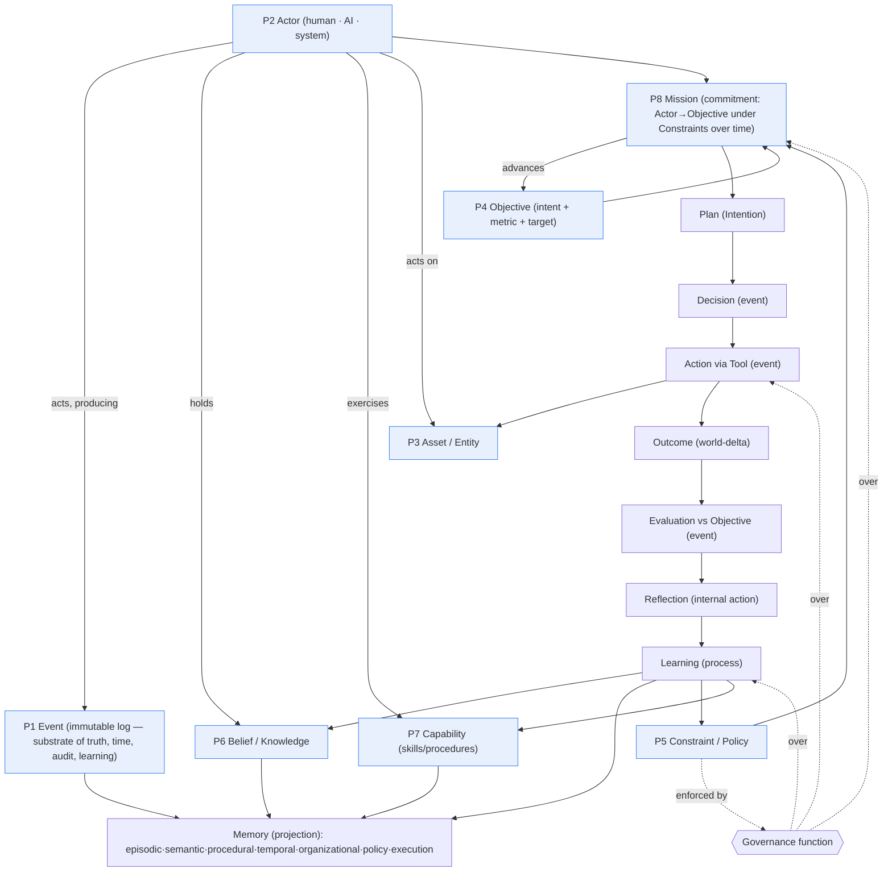

# The Ontology of Enterprise AI — A First-Principles Study

> **Committee (role-play):** senior researchers channelling OpenAI, Anthropic, Google
> DeepMind, Microsoft Research, Databricks, GitHub Copilot, LangChain, OpenTelemetry, and the
> Apache Software Foundation.
> **Mandate:** discover the *correct ontology* for Enterprise AI, from first principles.
> Defend nothing — not EnterpriseSim, not the prior review, not any framework. Assume
> Enterprise AI has never existed. If we had to invent it today, what are the primitives?

## Method

We reason from the purpose, not from existing systems. **Purpose of an enterprise:** to change
the world toward desired states (serve customers, earn revenue, manage risk) *accountably*,
using shared knowledge and systems, over time. **Purpose of Enterprise AI:** to place
autonomous and semi-autonomous agents into that accountable work alongside humans.

From that purpose, a correct ontology must capture six irreducible things:
1. **Time & fact** — what happened, when (the substrate of memory, audit, learning).
2. **Agency** — who/what can perceive, decide, act (human *and* machine, uniformly).
3. **Value / direction** — why work happens and what "success" means.
4. **Boundaries** — what is permitted, required, forbidden.
5. **Durable substance** — the systems, data and knowledge that persist and are owned.
6. **Competence** — what the organization can repeatably do.

Everything else is a composition or a projection of these. We now test each candidate concept
against that claim, then extract the minimal primitive set and the root.

> **A correction we make up front, against our own prior review.** The previous review crowned
> **Enterprise Memory** as the "crown-jewel root." On reflection that is wrong, and we say so
> plainly below: *memory is not a primitive.* Memory is a **derived, queryable projection over
> an immutable Event log plus curated Beliefs.** The prior review confused *the most valuable
> asset* (the durable substrate) with *its access layer* (memory), and it stated "Mission is
> THE root" too flatly. This study supersedes those claims.

---

## Part 0 — The Enterprise AI Ontology

### 0.1 The primitive set (our claim)

We claim **eight primitives**. Everything the user listed reduces to these or composes them.

| # | Primitive | One-line definition | Why irreducible |
|---|---|---|---|
| P1 | **Event** | An immutable, timestamped fact that something occurred. | The substrate of time, audit, memory, learning, reproducibility. Cannot be derived from anything more basic. |
| P2 | **Actor** | Anything that can perceive → decide → act: human, AI, or automated system. | Agency is irreducible; unifying human + AI is required for governance, collaboration, accountability. |
| P3 | **Entity/Asset** | A durable thing with identity and state (a system, dataset, artifact). | The objects work acts upon; identity-over-time cannot be derived. |
| P4 | **Objective** | A desired change in world-state — a target state or a target delta on a measurable. | The source of *value, evaluation and learning signal*. Nothing downstream has meaning without it. |
| P5 | **Constraint/Policy** | A boundary on states/actions: permitted, required, forbidden. | Boundaries are not derivable from objectives; they are an independent axis (safety, law, risk). |
| P6 | **Actor↔Belief** (Knowledge) | An Actor's fallible, versioned model of truth. | Truth-as-modelled is distinct from truth-as-events; beliefs can be wrong, which is itself load-bearing. |
| P7 | **Capability** | A repeatable competence (skill/procedure) an Actor can exercise. | "What we can do" is distinct from "what we know" and "what we want"; the procedural axis. |
| P8 | **Commitment (Mission)** | An Actor committing to pursue Objective(s) under Constraints over time, accountably. | The irreducible *unit of accountable work*; composition of P2+P4+P5+time, but canonical for the domain. |

Everything else is **derived** (a function/query over primitives) or **composite** (a bundle).

### 0.2 Verdict on every candidate concept

Axes: **F/D** = Fundamental or Derived (or Composite); **Persist** = persistent/ephemeral;
**Mut** = mutable/immutable; **Share** = shared/private; **Gov** = governed?; **Evolves?**;
**Learns?** (does it improve itself); **State** = owns state?

| Concept | F/D | Persist | Mut | Share | Gov | Evolves | Learns | State | Ruling |
|---|---|---|---|---|---|---|---|---|---|
| **Event** | **Fundamental (P1)** | persistent | **immutable** | shared | yes (access) | no (append-only) | no | no | Keep as *the* substrate. Everything is event-sourced. |
| **Actor** | **Fundamental (P2)** | persistent | mutable | shared | yes | yes | **yes** (AI actors) | **yes** | Keep; **unify human + AI + system**. |
| **Asset** | **Fundamental (P3)** | persistent | mutable | shared | yes | yes | no | **yes** | Keep. |
| **Objective** | **Fundamental (P4)** | persistent | mutable | shared | yes | yes | no | no | Keep — **the missing center of EnterpriseSim**. |
| **Goal** | Derived (= Objective + metric+target) | persistent | mutable | shared | yes | yes | no | no | **Merge into Objective**; "goal" = a measurable objective. Not separate. |
| **Intent** | Derived (Objective's *reason/trigger* under an Actor) | persistent | mutable | shared | yes | yes | no | no | Keep as an *attribute of a Mission/Objective*, not a standalone layer. |
| **Constraint** | **Fundamental (P5)** | persistent | mutable | shared | yes | yes | no | no | Keep. |
| **Policy** | Derived (a governed set of Constraints) | persistent | mutable | shared | **yes** | yes | no | no | = codified Constraints under Governance. |
| **Knowledge** | Fundamental-ish (P6, Belief) | persistent | mutable(versioned) | shared | yes | yes | no | no | Keep as *curated Belief*; fallible, versioned. |
| **Memory** | **Derived (projection over Events+Beliefs+Capability)** | persistent | mutable(indexes) | shared | yes | yes | no | (indexes) | **NOT a primitive.** A queryable access layer. *(revises prior review)* |
| **Experience** | Derived (a *memory type*: experiential/procedural) | persistent | mutable | shared | yes | yes | no | no | **Demote from first-class to one memory type.** |
| **Context** | Derived (ephemeral working set for a decision) | **ephemeral** | mutable | private | (policy-filtered) | no | no | transient | Keep as ephemeral worker state. |
| **Capability** | **Fundamental (P7)** | persistent | mutable | shared | yes | **yes** (improves) | yes | some | Keep; the procedural/skill axis (Voyager-style). |
| **Worker** | **Derived** (= autonomous **Actor** subtype) | ephemeral(run)/persistent(profile) | mutable | shared | yes | yes | yes | run-state | **Not fundamental.** A Worker is an AI Actor. |
| **Decision** | Derived (an Actor's selection → an **Event**) | persistent(as event) | immutable(once made) | shared | yes | no | no | no | A recorded fact; belongs to the event log. |
| **Plan** | Derived (a committed structure of intended Actions = BDI **Intention**) | persistent | mutable(revisable) | shared | yes | yes | no | no | Keep as an artifact of a Mission. |
| **Tool** | Fundamental-ish (the **Action** surface onto Assets) | persistent | mutable | shared | **yes** (grants) | yes | no | no | Keep; the external-action interface (CoALA external action). |
| **Evaluation** | Derived (judgment: Outcome vs Objective → Event) | persistent | immutable | shared | yes | no | no | no | A produced fact; not a layer that "owns" anything. |
| **Reflection** | Derived (an Actor's internal Action → Beliefs/Experience) | persistent(output) | immutable | shared | yes | no | no | no | An internal action (CoALA), not a primitive. |
| **Learning** | **Derived process** (updates Beliefs/Memory/Policy/Capability/calibration from Events+Evaluation) | (process) | — | shared | **yes** | — | — | no | A *system process*, not an object. |
| **Outcome** | Derived (observed world-delta attributable to Actions, measured vs Objective) | persistent | immutable | shared | yes | no | no | no | The evaluation target; derived from Events. |
| **Process** | Derived (a reusable template of Capabilities/Actions) | persistent | mutable | shared | yes | yes | no | no | = an instantiated Capability workflow. |
| **Domain** | Derived (a partition/classification of Knowledge/Policy/Capability) | persistent | mutable | shared | yes | yes | no | no | A tag, not a primitive. |
| **Service** | Derived (engineering: a Capability exposed via interface) | persistent | mutable | shared | yes | yes | no | yes | Deployment concept, not ontological. |
| **Human** | **= Actor (P2)** | persistent | — | shared | yes | yes | (learns, biologically) | yes | **Do not model as separate from Actor.** A first-class Actor. |
| **Organization** | Composite (structure of Actors, Assets, Policy, Capability) | persistent | mutable | shared | **yes** | yes | yes | yes | The *world/container*; composite of primitives. |
| **Governance** | **Derived function** (enforce Policy over Actors/Actions/Events) | (function) | — | shared | — | yes | no | no | A cross-cutting *function*, not an object. |
| **Enterprise Capability** | Composite (Capability at org scope) | persistent | mutable | shared | yes | yes | yes | some | = Capability; useful *product/market* framing, secondary. |
| **Mission** | **Composite-canonical (P8)** | persistent | mutable(state) | shared | **yes** | yes | (via actors) | **yes** | The **operational unit of accountable work**. |

**Key rulings (the ones that matter):**
- **Objective is fundamental and was the missing center.** Goal = measurable Objective; Intent =
  an Objective's reason. Collapse the "Intent / Goal / Objective" confusion into **Objective**
  (with `intent` and `metric/target` as attributes). Three layers were one primitive.
- **Memory is derived, not fundamental** — a projection over the immutable Event log + Beliefs +
  Capabilities. **Experience is one memory type.** *(This corrects both EnterpriseSim's
  "Experience-as-first-class" and the prior review's "Memory-as-root.")*
- **Worker and Human are both Actors.** Do not privilege the AI worker; do not bolt humans on.
- **Decision, Evaluation, Reflection, Outcome are Events** (facts), not stateful layers.
- **Learning and Governance are processes/functions**, not objects.

### 0.3 Dependency graph

Read it top-down: **primitives** (blue) → **Mission** composes Actor+Objective+Constraint over
time → produces **Plans/Decisions/Actions** (events) → yield **Outcomes** → **Evaluated** vs
Objective → **Reflection** → **Learning** updates Beliefs/Memory/Policy/Capability. **Memory** is
a projection, off to the side, fed by the Event log. **Governance** wraps the mutating edges.

---

## Part 1 — The Root Abstraction

We evaluate every candidate on the requested axes (1–5 each; higher is better), then recommend.

| Candidate | Clarity | Extensib. | Enterprise fit | Governance | Scale | Human collab | Multi-agent | Commercial | OSS | Academic | Maintainability | Total |
|---|--:|--:|--:|--:|--:|--:|--:|--:|--:|--:|--:|--:|
| **Mission (Commitment)** | 5 | 5 | 5 | 5 | 4 | 5 | 5 | 4 | 4 | 4 | 4 | **50** |
| **Objective/Outcome** | 4 | 4 | 5 | 4 | 4 | 4 | 3 | 4 | 4 | 5 | 4 | 45 |
| **Event (log)** | 3 | 5 | 4 | 5 | 5 | 3 | 4 | 3 | 5 | 4 | 5 | 46 |
| **Capability** | 4 | 5 | 5 | 3 | 4 | 3 | 3 | 5 | 4 | 3 | 4 | 43 |
| **Actor/Worker** | 4 | 4 | 3 | 3 | 4 | 4 | 5 | 3 | 3 | 3 | 3 | 39 |
| **Memory** | 3 | 3 | 4 | 3 | 4 | 2 | 3 | 4 | 4 | 4 | 3 | 37 |
| **Knowledge** | 3 | 3 | 4 | 3 | 3 | 2 | 2 | 3 | 3 | 3 | 3 | 32 |
| **Decision** | 3 | 2 | 3 | 3 | 2 | 3 | 3 | 2 | 2 | 3 | 2 | 28 |
| **Platform/Service** | 2 | 4 | 3 | 3 | 5 | 2 | 3 | 4 | 3 | 2 | 4 | 35 |
| **Process** | 3 | 3 | 4 | 3 | 3 | 3 | 3 | 3 | 3 | 2 | 3 | 33 |

### Recommendation

**Primary abstraction: the Mission (Commitment).** It is the only candidate that is
simultaneously *runnable* (you can execute it), *accountable* (it has an owner, objective,
constraints, and audit), *durable* (it outlives worker runs and spans humans + AIs), and
*evaluable* (success = objective attainment). It scores highest on the axes that decide a
decade-scale platform: enterprise fit, governance, human collaboration, multi-agent.

But the Mission is a **composite**, and naming it "the root" without its foundations is the
mistake the prior review made. So the recommendation is **layered**, not flat:

- **Semantic center:** **Objective/Outcome.** Missions exist *to attain objectives*; this is
  what makes evaluation and learning intrinsic and prevents "activity theatre."
- **Substrate:** **Event log (event-sourced).** The immutable source of truth beneath memory,
  audit, reproducibility and learning. This is the platform's foundation and its strongest
  systems/OSS/maintainability property.
- **Operational root (the product abstraction):** **Mission** — Actor(s) pursuing Objective(s)
  under Constraints, recorded as Events, governed throughout.

**Secondary abstractions (in order):** **Actor** (unifies human/AI; the agency axis),
**Capability** (the reusable-competence axis and the natural *commercial/market* unit),
**Memory-as-projection** (the recall axis over the Event log), **Policy/Governance** (the
boundary axis).

**Why not the others as root:** *Worker/Actor* is agency without purpose (means, not end, and
the ephemeral part — the error we now retract). *Memory/Knowledge* is a substrate/projection,
not a unit of work — organizing around it yields a database, not a work system. *Capability* is
competence without direction; excellent as a secondary/market unit, idle without an Objective.
*Event* is the correct *foundation* but too low-level to be the human-facing *root*.
*Decision/Process/Service* are mechanisms, not organizing concepts.

**One-line:** *Organize the platform around Missions that pursue Objectives, executed by Actors,
recorded as Events, bounded by Policy — with Memory as a projection and Capability as the
reusable competence.*

---

## Part 2 — Cognitive Model

We are not designing a new agent loop; the loop is well-understood. We are choosing what to
adopt, reject, and uniquely contribute.

| Source | Adopt | Reject |
|---|---|---|
| **BDI** (Belief–Desire–Intention) | The triad as the *semantic skeleton*: Beliefs=Knowledge/Memory, **Desire=Objective**, **Intention=committed Plan-under-reason**. This is the correct, minimal cognitive core. | Its symbolic/logical plan libraries; brittle at LLM scale. |
| **CoALA** | Memory taxonomy (working/episodic/semantic/procedural); the **internal vs external action** distinction; an explicit decision procedure. | Nothing major — it is the closest correct academic frame; adopt and cite. |
| **GraphRAG** | Graph-structured, multi-hop, community-summarized retrieval over an entity graph. | Treating it as the whole memory story; it lacks time and trust. |
| **Mem0 / OpenMemory** | Practical memory extraction + recency×importance×relevance scoring; memory as a service. | Semantic/episodic-only scope; no bitemporality, no trust/decay, no procedural memory. |
| **LlamaIndex** | Mature retrieval/index abstractions and connectors. | As a cognition model — it isn't one. |
| **LangGraph** | **Explicit graph control-flow**: cyclic, re-entrant, checkpointed, interruptible. Replace implicit linear pipelines with this. | Framework lock-in; no enterprise memory/governance/eval model. |
| **AutoGen / CrewAI** | Multi-agent role composition and conversation patterns. | Ad-hoc memory; weak evaluation; no governance/policy plane; autonomy-by-default. |
| **OpenAI Responses API** | Hosted tool-calling, structured output, server-side state as *one provider* behind a gateway. | Provider coupling; do not build the platform on a single vendor's state model. |
| **Anthropic tool use** | Robust tool-use semantics, structured/parallel tool calls, thinking traces. | Same coupling caveat. |
| **DeepMind agent research** | Grounding, evaluation rigor, planning/search, self-improvement framing. | Research-scale assumptions (unbounded compute, simulators) not directly enterprise-portable. |

**Synthesized cognitive core:** *modernized BDI over a CoALA memory substrate, expressed as an
explicit LangGraph-style control graph, retrieving via bitemporal GraphRAG + vector + lexical,
with all cognition emitted as typed, governed Events.* Beliefs (Memory/Knowledge) + Desires
(Objectives) + Intentions (Plans) + Actions (internal: reflect/retrieve; external: tools).

**What EnterpriseSim should uniquely contribute (not the loop):**
1. **A controllable, executable enterprise world** in which cognition can be *run,
   counterfactually ablated, and outcome-verified* — the thing no framework provides.
2. **Cognition-as-typed-governed-events**: every belief update, decision, evaluation and
   reflection is a first-class, schema-valid, auditable Event — enabling evaluation, replay and
   OTel-native observability of agent reasoning. This is the genuinely novel, defensible
   contribution.
3. **An open evaluation protocol** that measures outcome attainment and learning, not process
   conformance.

The cognitive *architecture* is a recombination; the *environment + event-ontology + protocol*
is the contribution. Say that.

---

## Part 3 — Enterprise Memory

**Should Experience remain first-class? No.** Experience is **one memory type** (experiential /
procedural). Elevating it while omitting episodic-as-queryable, procedural skills, temporal
views and organizational memory is the wrong cut. And *memory itself is a projection*, not the
truth: **the Event log is truth; memory is indexed, curated views over it.**

### Taxonomy (all are projections/curations over the Event log + Beliefs)

| Memory type | Contents | Built from | Read pattern |
|---|---|---|---|
| **Semantic** | Curated facts/truth (architecture, rules, contracts) | Beliefs (governed) | similarity + graph |
| **Episodic** | Specific past events: runs, incidents, decisions, outcomes | Event log directly | recency × importance × relevance × **utility** |
| **Procedural** | Reusable skills/playbooks/plans that worked | Capabilities + successful Intentions | by situation + success stats |
| **Temporal** | *As-of-time* / bitemporal views | Event log (valid-time + tx-time) | "what was believed/true at T?" |
| **Organizational** | Who knows/owns/decides; team & tacit ownership | Actor + Asset + Event graph | graph traversal |
| **Policy** | Constraints & their history and rationale | Policy events | governed lookup |
| **Execution** | Tool/action traces, artifacts, telemetry | Action/tool events | trace/span query (OTel) |

### Architecture

- **Substrate:** an **immutable, bitemporal Event log** (event-sourcing). Non-negotiable for
  audit, reproducibility, temporal recall, and clean learning signals.
- **Projections:** a **Memory Graph** (typed entities/events/edges: causes, mitigates,
  depends-on, supersedes, derived-from, owned-by) with vector, lexical and graph overlays. One
  retrieval API; three physical indexes; all rebuildable from the log.
- **Trust & decay (the hard problem):** per node — provenance strength, corroboration,
  contradiction rate, recency, **measured utility** (did recalling it move objectives?).
  Promotion between types (episodic→experiential→semantic) is *governed edge creation past a
  trust threshold*, the defence against **memory poisoning**.
- **Consolidation:** periodic compaction — cluster near-duplicate episodes/experiences into
  higher-order procedural skills (the "sleep" phase).
- **Governance & lifecycle:** `observed(event) → projected(index) → curated(belief) →
  promoted(trusted) → consolidated(skill) → decayed(down-weighted, never deleted) →
  archived(as-of history retained)`. All mutating steps are governed; nothing is hard-deleted
  (append-only substrate).

**Ruling:** Enterprise Memory = a governed, bitemporal, trust-scored **projection layer** over
the Event log, with the seven memory types above. Experience is a type within it. This both
corrects EnterpriseSim (Experience-as-first-class) and the prior review (Memory-as-root).

---

## Part 4 — Reasoning: where does it belong?

**Not in Memory** (memory recalls, it does not reason). **Not in the Mission** (a Mission is a
spec + state, not an agent). The correct split:

- **Reasoning is an Actor capability** — an Actor (human or AI) *reasons*. Fast, per-run
  deliberation (interpret, retrieve, plan, decide) lives in the Actor, exercised *within a
  Mission context* that supplies Objectives + Constraints + Beliefs.
- **A shared Decision service** provides the *heavy, reusable, correctness-critical* machinery
  that should not be re-implemented per worker and must be auditable: **constrained
  multi-objective optimization, risk models, calibration, and policy pre-checks.** It is a
  platform service the Actor *calls*, not a layer that owns the loop.
- **Reasoning outputs are Events** (a Decision is a recorded fact with its inputs, alternatives,
  trade-offs and confidence) — so reasoning is inspectable and replayable.

**Inputs to reasoning (all sourced from the Mission + platform):**

| Input | Source | Role in reasoning |
|---|---|---|
| **Intent** | Mission | Why we act — conditions retrieval and plan shape. |
| **Objectives/Goals** | Mission | The utility to maximize (measurable). |
| **Constraints** | Mission + Policy | Feasible region (hard) + penalties (soft). |
| **Policies** | Governance | Pre-action legality; hard gates. |
| **Risk** | Decision service | Tail-risk-adjusted utility; higher weight at high criticality. |
| **Business value** | Objective metrics | The scale of utility; prevents optimizing proxies. |
| **Cost** | Model Gateway + tools | A soft constraint / penalty term (tokens, $, time). |
| **Confidence** | Calibrated estimator | Uncertainty-aware choice; gates autonomy vs escalation. |
| **Human collaboration** | Actor(s) incl. humans | Preferences enter utility; approvals are constraints; hand-off on low confidence / high risk. |

**Model:** decision = argmax over feasible actions of *expected, risk-adjusted, multi-objective
utility under constraints, weighted by (calibrated) confidence*, with human preferences in the
utility and human approval as a hard constraint. Reasoning is **mixed-initiative by default**,
full-autonomy by exception (earned by calibration + low risk).

---

## Part 5 — Learning, designed to be *proven* (not asserted)

This is where the prior corpus failed (a generator asserted improvement). Here is a protocol a
skeptical reviewer would accept.

### Central claim to test
**H0 (null):** access to accumulated enterprise memory does **not** improve Worker performance.
**H1:** Workers with accumulated memory attain objectives at higher rate / lower cost / fewer
repeated failures than memory-less baselines, and the advantage **grows with accumulated
relevant memory** (a positive learning curve).

### Sub-hypotheses (each independently falsifiable)
- **H1a (episodic):** on recurring situations, episodic recall reduces repeated-failure rate.
- **H1b (procedural):** on recurring workflows, a skill library reduces cost/latency at equal
  quality.
- **H1c (loop closure):** a lesson from failure class F reduces future F-class failures vs
  baseline (`ADR-0034` made testable).
- **H1d (transfer):** memory learned in domain A helps a related domain B (positive transfer)
  more than an unrelated domain C (no/negative transfer).

### Why EnterpriseSim is the *right instrument* — if made executable
The synthetic enterprise's supposed weakness is its strength **provided outcomes are computed,
not asserted.** A simulated enterprise lets you: (1) **verify outcomes deterministically**
(run the effect, don't rubric it); (2) run **counterfactuals** a real org never could (replay a
mission with memory on/off); (3) **control contamination** and distribution shift precisely;
(4) **reproduce** with seeds. Reframe: *EnterpriseSim's job is to be a controllable, executable
world where memory-driven learning can be causally isolated.* Fix: replace asserted verdicts
with an **executable outcome model** (state transitions + deterministic checks) so `Outcome` is
measured, not claimed.

### Experimental design
- **Conditions:** (M0) no memory; (M1) semantic/knowledge only (RAG); (M2) + episodic; (M3) +
  procedural; (M4) full memory; (H) human; (O) oracle upper bound.
- **Streams:** sequential missions within task families (to reveal learning curves) + held-out
  families (generalization) + a **temporal split** (learn on months 1–4, test on 5–6, no
  leakage).
- **Baselines:** M0 (ReAct), M1 (RAG), and a static M4-frozen (no online learning) to separate
  *retrieval* benefit from *learning* benefit.

### Metrics (primary → secondary)
Objective attainment (primary, outcome-verified) → success rate → repeated-failure rate →
cost/latency per mission → **calibration (ECE)** → time-to-competence (missions to reach
threshold) → policy-violation count (must be 0 for hard constraints).

### Success criteria & statistics
Pre-registered hypotheses; ≥N seeds; **paired** comparisons (same missions, different
conditions); **bootstrap confidence intervals** and **effect sizes** (not just p); multiple-
comparison correction across families; a result counts only if **M4 > M1 > M0** with
non-overlapping CIs **and** a significantly positive learning slope **and** the ablations bite.

### Ablations
Per-memory-type removal; retrieval-conditioning on/off (intent/goal/time/policy); reflection
on/off; consolidation on/off; trust-model on/off.

### Failure modes to probe (adversarial evaluation)
- **Memory poisoning:** inject false/misleading experiences; measure harm and detection rate
  (trust model must catch it).
- **Overfitting to the past:** distribution-shift missions where old lessons mislead; measure
  graceful degradation.
- **Spurious credit assignment:** verify improvements trace to the *causally relevant* memory,
  not confounds (via targeted ablation).
- **Contamination/leakage:** hidden test sets; detect if scores inflate suspiciously.

**Only if M4 beats baselines with corrected significance, a positive learning slope, biting
ablations, and poisoning resistance may EnterpriseSim claim "Workers improve through
accumulated enterprise memory."** Anything less is a demo, not a result.

---

## Part 6 — What EnterpriseSim actually is

Tested against the ontology, EnterpriseSim is **not** a runtime (it doesn't execute production
missions), **not** an operating system (it doesn't schedule real resources), and **not** an
SDK-first product (the SDK is a means). It is, in priority order:

1. **A Simulation Environment** — a controllable, reproducible, *executable* enterprise world in
   which Enterprise AI behaviour can be run, ablated and outcome-verified. This is its deepest
   identity and its scientific value.
2. **A Benchmark** — task families + an outcome-verified evaluation protocol over that world.
3. **A Specification / candidate Standard** — the typed object + cognition-event schemas and the
   evaluation protocol, suitable for standardization.
4. **A Reference Enterprise + reference traces** — the illustrative corpus (clearly labelled as
   illustrative, not as results).
5. **A reference SDK** — the interface contracts a runtime implements.

**Clearest single positioning:**

> **EnterpriseSim is the open *simulation environment and benchmark* for Enterprise AI Workers —
> a controllable enterprise world plus an outcome-verified evaluation protocol — accompanied by
> an interface specification.**

The right mental model is **Gym/MuJoCo/ALE + SWE-bench + MLPerf, for enterprise cognition**: the
*world and the ruler*, not the *player*. Runtimes (Bytesurge and others) are the players; they
plug into the SDK and are scored on the benchmark. Selling it as a "runtime" or "cognitive
architecture" mis-positions the strongest asset and invites the weakest critique.

---

## Part 7 — Open source vs commercial vs standards vs academic

The ontology gives a clean separation rule: **open the *world, the ruler, and the contract*;
commercialize the *engine*; standardize the *interfaces and protocol*; research the *hard
problems*.**

| Layer | Belongs to | Why |
|---|---|---|
| **Simulation environment** (executable enterprise world, state model, deterministic outcome checks) | **EnterpriseSim (OSS, Apache-2.0)** | A shared world only has value if everyone trusts and inspects it; must be free and reproducible. |
| **Benchmark tasks + evaluation protocol + leaderboards** | **EnterpriseSim (OSS)** + **neutral governance** | A ruler must be neutral and open, or scores are meaningless (the MLPerf/SWE-bench lesson). |
| **Reference enterprise + illustrative traces** | **EnterpriseSim (OSS)** | Teaching/seed material; explicitly not "results." |
| **Object + cognition-event schemas; SDK interfaces** | **Industry standard** (donate to a foundation; align with **OpenTelemetry** semantic conventions for agent cognition) | Interfaces + wire formats are where a decade-scale "reference architecture" actually lives; must be vendor-neutral. |
| **Algorithms** (context ranking, memory graph internals, decision optimization, calibration, learning/credit-assignment, distillation) | **Commercial runtime** (Bytesurge et al.) | These are where quality, latency and cost differentiate; competition here drives the field. Compete *on the open benchmark*. |
| **Production memory graph, multi-tenancy, SLAs, ops, governance tooling** | **Commercial** | Operational excellence is a product, not a spec. |
| **Open problems** (credit assignment, calibrated cross-layer confidence, memory-poisoning defense, bitemporal trust models, outcome-verified synthetic environments, cross-domain transfer) | **Academic research** | Unsolved; belong in the literature, benchmarked *on* EnterpriseSim. |

**Justification.** This is the proven pattern of every field that matured: open datasets/
environments + neutral benchmarks (ImageNet, Gym, SWE-bench, MLPerf) commoditize *measurement*
and let commercial engines compete on *capability*, while standards bodies own *interoperability*
and academia owns *the frontier*. EnterpriseSim's mistake-in-waiting is to try to be the engine
too; its opportunity is to own the environment + benchmark + standard — a more durable and more
defensible position than any single runtime.

---

## Part 8 — Final Verdict

### 8.1 Where the *original EnterpriseSim* was right and wrong

**Right:** cognition-as-typed-artifacts; strict referential integrity; reproducible,
deterministic generation; the model-agnostic gateway; canon/ADR governance of the architecture
itself; and the founding instinct that a *coherent, evolving enterprise* is the right substrate.
These are real and rare.

**Wrong:** no Objectives/Intent/Constraints (no "why/what/limits"); **outcomes asserted, not
verified** (the fatal evaluation flaw); Experience elevated to first-class while episodic/
procedural/temporal/organizational memory were absent; worker-centric organization; uncalibrated
confidence; and positioning itself as a *novel cognitive architecture* rather than an
environment/benchmark.

### 8.2 Where the *prior review* was right and wrong

**Right:** identified the Intent/Goals/Constraints hole; the evaluation-soundness problem; the
BDI/CoALA positioning; two-speed learning and the challenge to "never touch weights";
calibration; humans as first-class.

**Wrong (we retract):**
1. It crowned **Enterprise Memory as the root/"crown jewel."** Incorrect — memory is a *derived
   projection* over an immutable **Event log**; the substrate is the log, the semantic center is
   the **Objective**.
2. It declared **"Mission is THE root"** flatly. More correct: Mission is the *operational* unit,
   built from the primitives Event/Actor/Objective/Constraint, over an **event-sourced** base.
3. It dismissed the synthetic corpus as "just generated" without seeing that the fix is
   **executability/outcome-verification, not real data** — the synthetic environment is a
   *strength* (controllable, counterfactual-capable), which is the whole point of Part 5.

### 8.3 The synthesized architecture (survives the most criticism)

**Event-sourced enterprise world.** **Actors** (human · AI · system, unified) pursue
**Objectives** via accountable **Missions**, bounded by **Constraints/Policy** enforced by a
**Governance** function. Actors reason (fast, per-run) and call a shared **Decision service**
(multi-objective, constrained, risk-aware, calibrated). Actions run via **Tools** on **Assets**,
producing **Events**. **Memory** is a governed, bitemporal, trust-scored *projection* (semantic/
episodic/procedural/temporal/organizational/policy/execution) over the log. **Learning** is a
governed process that updates Beliefs/Memory/Policy/Capability/calibration from *outcome-verified*
Events, measured by loop-closure. Everything is a typed, governed Event mapped to OpenTelemetry.

Minimal core to remember: **Event · Actor · Objective · Constraint · Mission · Capability ·
Belief** — with Memory, Decision, Plan, Evaluation, Reflection, Learning, Governance as derived
projections/processes. Simplicity is the feature: seven primitives, one substrate (the log), one
organizing unit (the Mission), one semantic center (the Objective).

### 8.4 The three questions

**1. The single most important concept EnterpriseSim was missing.**
> **The Objective (and its verified Outcome).** Not memory — memory was present in embryo. The
> Objective is upstream of *everything*: without a measurable desired-outcome, there is no
> reason to act, no way to evaluate, and no signal to learn from. EnterpriseSim built an
> elaborate machine for *doing work* with no representation of *what the work is for*. Intent,
> Goals, Constraints, honest Evaluation and real Learning all collapse out of the single act of
> making the Objective first-class and its Outcome verified.

**2. The single biggest strength of EnterpriseSim.**
> **It makes enterprise cognition an inspectable, reproducible, referentially-integral
> artifact.** Turning the entire reasoning process — context, decisions, evaluations,
> reflections — into typed, validated, cross-linked, regenerable objects over a coherent
> evolving enterprise is genuinely rare and is the foundation of *measurable* Enterprise AI. No
> mainstream framework offers a controllable world where cognition can be examined this cleanly.

**3. If this project succeeds over the next decade, what will people remember it for?**
> Not for a cognitive architecture — that will be superseded and forgotten. They will remember
> it as **the standard *environment and benchmark* that made Enterprise AI Workers measurable
> and comparable** — the "ImageNet / Gym / SWE-bench of enterprise cognition" — together with the
> **open event/interface standard** for agent reasoning (ideally an OpenTelemetry-aligned
> semantic convention). The world and the ruler endure; the players and their engines come and
> go. EnterpriseSim's durable legacy is *measurement and interoperability*, not any one worker.

### 8.5 Committee disposition

- As a **novel cognitive architecture:** **Reject** (derivative; and the core was mis-centered).
- As an **open simulation environment + benchmark + specification:** **Accept**, conditional on
  the six must-fixes (Objective/Outcome first-class; outcome-verified execution; memory as a
  bitemporal projection with the seven types; calibrated confidence; Mission-centric,
  event-sourced core; honest positioning). With those, it is a plausible *reference architecture
  for the measurement layer of Enterprise AI for the coming decade* — which is a bigger prize
  than being one more agent framework.

**Brutal one-line:** *Stop trying to be the brain; become the world and the ruler. Center on the
Objective, source everything from an Event log, treat Memory as a projection and the Worker as
just another Actor — and EnterpriseSim can be remembered for making Enterprise AI measurable,
which is the only kind of "reference architecture" that survives a decade.*
