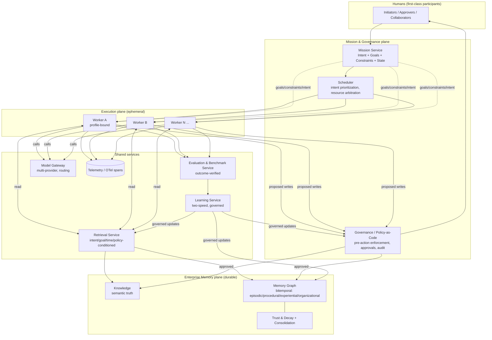
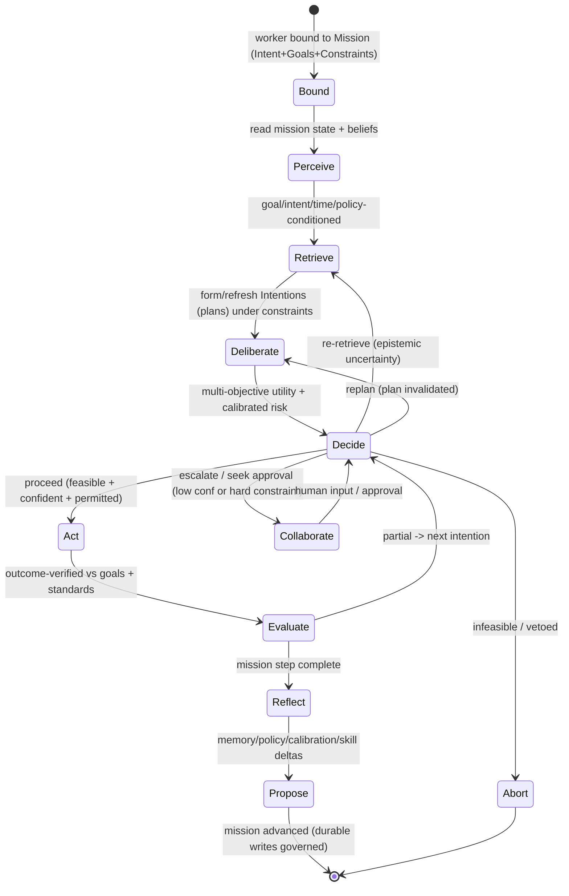
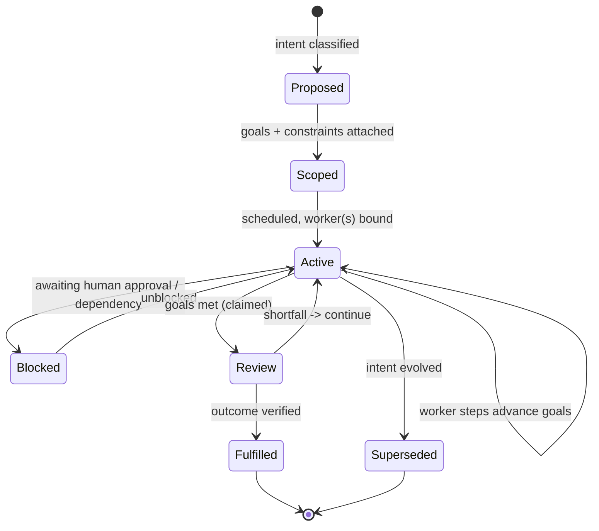

# Adversarial Architecture Review — EnterpriseSim as a Reference Cognitive Architecture for Enterprise AI Workers

> **Review panel (role-play):** senior researchers channelling OpenAI, Anthropic, Google
> DeepMind, Microsoft Research, Databricks, GitHub Copilot, LangChain, OpenTelemetry.
> **Venue framing:** reviewed as if submitted jointly to NeurIPS (learning), ICSE (software
> engineering), OSDI (systems) and SIGMOD (data/memory).
> **Mandate:** decide whether this is *fundamentally the correct architecture*, not to improve
> it at the margins. No deference to prior work in this repository. Weak ideas are cut.

---

## Executive verdict (read this first)

**Two different papers are entangled in this repository, and they deserve opposite verdicts.**

1. **EnterpriseSim as a *benchmark + reference environment + evaluation methodology*** — a
   coherent, evolving, schema-valid synthetic enterprise with referential integrity and
   reproducible generators, plus 100 typed, inspectable end-to-end cognition traces.
   **Verdict: Accept (with revisions).** This is a genuine, missing artifact for the field —
   "SWE-bench for enterprise cognition," but broader than code. It is the strongest thing here.

2. **The Enterprise Cognitive Layer (ECL) as a *novel cognitive architecture*** — the
   nine-concept loop (Knowledge → Context → Planning → Decision → Execution → Evaluation →
   Reflection → Experience → Learning). **Verdict: Weak Reject as novel; the loop is largely a
   re-derivation of BDI (1991) and CoALA (2023) that, critically, *dropped the two elements
   BDI centred*: Desire (Goals) and Intention (committed plans under an explicit reason).**

The single most damaging finding: **the architecture models the *how* (an execution loop) in
loving detail and the *why/what/within-what-limits* (Intent, Goals, Constraints) not at all.**
The user's own Parts 1–3 are not enhancements; they are **foundational gaps that make the
current evaluation story unsound** — you cannot benchmark "goal achievement" in a system that
has no goals. A 30-year-old agent theory (BDI) already had Desire and Intention as first-class.
Reintroducing them is a *regression fix*, not a feature.

The second most damaging finding: **the "learning corpus" does not demonstrate learning.** Its
improvement curve (mean score 0.68 → 0.95) is produced by a monotonic maturity function in a
generator. It proves the *schema can represent* improvement; it is zero evidence that any
Worker *does* improve. As submitted, this would be desk-rejected at NeurIPS as a synthetic
result presented without ablation, held-out tasks, or counterfactuals.

The third: the organizing abstraction — **the Worker** — is the *ephemeral* part of the system.
Centring the architecture on the actor rather than on the durable assets (**Enterprise Memory**
and **Missions under Governance**) is a category error that shows up everywhere downstream.

We elaborate all of this below, then redesign from first principles (Part 10) and give the
formal verdict (Part 11).

### Prior art this work must position against (and currently does not cite)

| Prior art | What it already established | Consequence for EnterpriseSim |
|---|---|---|
| **BDI** (Rao & Georgeff, 1991–95) | Belief–Desire–Intention: beliefs (knowledge), **desires (goals)**, **intentions (committed plans + the reason)** | ECL has Beliefs (Knowledge) but *dropped Desire and Intention*. |
| **CoALA** (Sumers, Yao, Narasimhan, Griffiths, 2023) | Cognitive Architectures for Language Agents: working/episodic/semantic/**procedural** memory; internal vs external actions; a decision procedure | ECL ≈ CoALA minus the memory taxonomy and minus procedural memory. Overlap is ~70%. |
| **ReAct / Reflexion** (Yao 2022; Shinn 2023) | Reason–act interleaving; verbal self-reflection stored to memory and reused | ECL's Reflection→Experience loop is Reflexion, renamed. |
| **Generative Agents / MemGPT / Mem0** (2023–24) | Memory with recency×importance×relevance retrieval; memory tiers; consolidation | ECL's Experience layer is a thin subset; no scoring model, no tiering, no consolidation. |
| **Voyager** (2023) | A growing **skill/procedural library** as the substrate of improvement | ECL has no procedural memory / skill library — a real gap for "Learning." |
| **SWE-bench / SWE-agent** (2023–24) | Execution-grounded, outcome-verified benchmark on real repos | EnterpriseSim's benchmark is broader but currently *synthetic-outcome*, not execution-verified. |
| **Conformal prediction; calibration (ECE)** | Distribution-free, calibrated uncertainty | ECL "confidence" is uncalibrated ad-hoc fusion — not sound. |
| **OpenTelemetry** | Traces/spans/semantic conventions for distributed systems | ECL's typed objects are *unmapped* to OTel — a huge, cheap win being left on the table. |

**Reframing recommendation up front:** stop selling the ECL as a new cognitive architecture.
Sell EnterpriseSim as **(a) an open benchmark/reference environment and (b) an
evaluation-and-provenance methodology** built on a *modernized BDI+CoALA* substrate. That is
publishable and field-defining. The current framing invites reviewers to reject the weakest
claim and miss the strongest contribution.

---

## Part 0 — The Principal Enterprise AI Worker (and where the ECL should live)

### 0.1 Is the Worker the correct organizing abstraction? No.

The Worker is the *ephemeral, interchangeable, stateless* element (the repository's own
`ADR-0002`/`ADR-0006` insist on this). Organizing a decade-defining platform around its most
disposable component is backwards. The **durable, valuable, reusable, governable** assets are:

- **Enterprise Memory** (what the organization knows and has learned) — outlives every worker.
- **Missions** (a unit of *intent + goals + constraints + state* that persists across many
  worker invocations, tools, and humans) — the real unit of enterprise work.
- **Governance/Policy** (what is permitted, by whom, with what approvals) — a cross-cutting
  invariant, not a worker feature.

**Correct top-level abstraction:** *An enterprise runs **Missions** over a shared **Enterprise
Memory**, under a **Governance** plane, executed by ephemeral **Workers** that call a
model-agnostic **Model Gateway**, all emitting to a **Telemetry** substrate.* The Principal
Worker is then a **stateless executor bound to a Mission**, not the centre of the universe.

This is not pedantry. Worker-centrism is *why* Intent/Goals/Constraints are missing (they live
above a single worker run), *why* the memory model is thin (memory is "the worker's
experience" instead of an enterprise asset), and *why* multi-worker/human collaboration is an
afterthought (there is no shared object above the worker to collaborate on).

### 0.2 The Principal Worker — specification

A single, domain-agnostic executor. Domains (QA, Security, Privacy, Compliance, Finance,
Support, Architecture, DevOps, Data-Quality, Recruitment) are **not subclasses**; they are
**configurations** — a `WorkerProfile` binding capability packs, tool grants, rubric sets and
policy sets. (Inheritance is the wrong mechanism; composition is correct — a Security review and
a Finance reconciliation share 90% of behaviour and differ in knowledge domains, tools,
rubrics, policies. This matches the repo's own `ADR-0024/0025`, and we keep that.)

| Facet | Design |
|---|---|
| **Purpose** | Advance an assigned **Mission** toward its **Goals**, within its **Constraints**, producing verifiable outcomes and durable learning, with calibrated confidence and full provenance. |
| **Responsibilities** | Perceive the mission state; retrieve goal/intent-conditioned context from platform services; deliberate and **plan under constraints toward goals**; decide with calibrated, gated autonomy; act via tools; self-evaluate against goals *and* standards; reflect; propose memory/policy updates. It does **not** own truth, memory, policy, or the model — it *uses* platform services for those. |
| **Inputs** | A **Mission handle** (Intent + Goals + Constraints + current state); read access to Enterprise Memory & Knowledge; a tool grant; model capabilities; policy context. |
| **Outputs** | Actions/artifacts; a **decision trace**; an **evaluation** against goals; **proposed** memory/policy deltas (never direct writes to governed stores); telemetry spans. |
| **Capabilities** | Perceive · Retrieve · Deliberate/Plan · Decide · Act · Evaluate · Reflect. Each is a replaceable capability behind an interface (this is the ECL's real value — as *worker capabilities*, not as a fixed global "layer cake"). |
| **Lifecycle** | See state diagram in Part 10; re-entrant and interruptible, not a fixed linear pipeline. |
| **Interfaces** | `perceive(mission) → belief`, `retrieve(belief, goals, intent) → context`, `deliberate(context, goals, constraints) → plan`, `decide(plan, confidence, policy) → control`, `act(step) → artifacts`, `evaluate(execution, goals, rubric) → verdict`, `reflect(verdict, trace) → proposals`. |
| **Extension points / Plugin model** | Entry-point plugins (`RFC-0027`) for each capability, plus tool plugins, rubric packs, policy packs, and **capability packs** bundled into a `WorkerProfile`. Domain workers = profiles, shipped independently. |
| **Memory model** | **Externalized** to a platform Enterprise Memory service (Part 4): semantic, episodic, procedural, temporal, organizational. The worker holds only *working memory* (the ephemeral context). |
| **Learning model** | **Proposes** learning events; a platform Learning service validates/governs/promotes (Part 6). Primarily outside the model; **optionally** a governed distillation path (we reject the repo's absolute `ADR-0003` — see Part 6). |
| **Decision model** | Goal-directed, constraint-satisfying, risk-aware, confidence-gated (Part 5). |
| **Planning model** | Plans are **Intentions** in the BDI sense: committed, goal-linked, constraint-checked, revisable; support hierarchical decomposition and parallel branches. |
| **Evaluation model** | Dual-track: **process** (standards/gates) *and* **outcome** (goal achievement) — the current benchmark only does the former (Part 8). |
| **Confidence model** | **Calibrated** (conformal/temperature), separating epistemic vs aleatoric and outcome vs judgment; fused via a *learned/monitored* combiner, not fixed weights (Part 5). |
| **Human collaboration** | Humans are **first-class mission participants**, not just an escalation endpoint: shared mission state, mixed-initiative hand-offs, preference elicitation, approval gates, and the human as a *provenance source* in memory. |
| **Tool orchestration** | Typed tool contracts with side-effect classes, least-privilege grants (`ADR-0042`), dry-run/simulation before irreversible actions, idempotency + compensation. |
| **Failure recovery** | Saga-style compensation, checkpoint/replay (`RFC-0024`), bounded retries, principled escalation, and **blameless failure capture into episodic memory** as a learning input. |
| **Governance** | External policy plane; **propose-then-govern** for all durable writes; complete audit trail; policy-as-code evaluated *before* action (`ADR-0041`). |
| **Model independence / multi-model** | All model calls via the Model Gateway (`ADR-0009/0010`); per-step routing by difficulty/cost/latency; ensembles and speculative racing allowed; local SLM floor (`ADR-0044`). This is a genuine strength — keep it. |
| **Enterprise integration** | Connectors (Part: GitHub design is a good start) ingest metadata into Memory/Knowledge; OTel-native telemetry; identity/RBAC from the enterprise IdP. |

### 0.3 What becomes a platform service vs a worker capability

This is the crisp boundary the current ECL lacks:

| Concern | Placement | Why |
|---|---|---|
| Knowledge | **Platform service** | Durable, shared, governed truth; multi-tenant. |
| Enterprise Memory | **Platform service** | Durable enterprise asset; outlives workers; the crown jewel. |
| Evaluation (system-of-record + benchmark) | **Platform service** | Must be reproducible, comparable, tamper-evident across workers. |
| Governance / Policy | **Platform service** | Cross-cutting invariant; cannot be per-worker. |
| Model Gateway | **Platform service** | Single provider seam; shared routing/quotas. |
| Telemetry / Signals bus | **Platform service** | OTel-native; cross-cutting. |
| Mission store (Intent+Goals+Constraints+State) | **Platform service** | The durable unit of work. |
| Context assembly | **Worker capability** | Per-run, ephemeral, task-specific. |
| Planning / Decision control | **Worker capability** | Per-run deliberation. |
| Reflection | **Worker capability** (writes proposals to platform) | Per-run reasoning; durable output governed. |

**Bottom line for Part 0:** the ECL's six "layers" are not peers. Split them: **Knowledge,
Memory, Evaluation, Governance, Model Gateway, Telemetry, Mission** are *services*; **Context,
Planning, Decision, Reflection** are *worker capabilities*. The current architecture's flat
"layer" framing hides this and is the root of several downstream weaknesses.

---

## Part 1 — Intent (missing, and it is not optional)

**Finding:** EnterpriseSim has *no representation of why a worker runs.* Every execution in the
corpus is triggered by a task ref with an implicit, unstated purpose. This is the "Intention"
half of BDI, absent.

**Why it matters:** Intent conditions *everything downstream* — a "release validation" intent and
an "incident investigation" intent over the *same* checkout code demand different retrieval,
different plans, different rubrics, different risk tolerance. Without Intent, retrieval and
evaluation are un-anchored, and you cannot explain or audit *purpose*.

**Design — the Intent model:**

- **Representation:** `Intent { id, kind, statement, trigger, initiator (human/system/worker),
  priority, risk_posture, created_at, mission }`. `kind ∈ {release_validation,
  incident_investigation, security_review, migration_planning, regression_analysis,
  architecture_review, customer_escalation, performance_investigation,
  data_quality_validation, compliance_audit, …}` (open taxonomy, plugin-extensible).
- **Lifecycle:** `proposed → classified → confirmed → active → (superseded | fulfilled |
  abandoned)`. Intents can spawn sub-intents (an incident investigation spawns a regression
  analysis).
- **Classification:** an intent classifier (model-assisted + rules) maps a trigger to a
  `kind` with a **classification confidence**; low confidence → clarify with a human (mixed
  initiative) rather than guess.
- **Intent confidence:** distinct from execution confidence — "how sure are we we understand
  *why* we're here." Mis-classified intent is a top root-cause class and must be a first-class
  reflection category.
- **Intent evolution:** intents drift (an escalation *becomes* a security review); model this
  as explicit transitions with provenance, not silent mutation.
- **Intent relationships:** DAG — `spawns`, `blocks`, `supersedes`, `relates_to`. Enables
  "why are we doing this?" traceability across a mission.
- **Prioritization:** intents carry priority derived from business impact × urgency ×
  risk_posture; the scheduler (platform) arbitrates competing intents for shared resources.

**Verdict on Part 1:** *Accept the gap as real and foundational.* Intent is a platform-level
first-class object attached to Missions, injected into every worker run. It is prior art (BDI
intention; goal-conditioned RL); the novelty is the enterprise intent taxonomy tied to typed
artifacts.

---

## Part 2 — Goals (missing; the reason the benchmark is currently unsound)

**Finding:** EnterpriseSim has no explicit success model. "Success" is implicit in evaluation
rubrics (did tests pass, gates hold). That is *process conformance*, not *goal achievement*.
BDI's "Desire" is absent.

**Design — the Goal model:**

- **Representation:** `Goal { id, kind, metric, target, direction (min/max), baseline,
  measurement_fn, weight, owner, horizon }`. `kind ∈ {reduce_risk, increase_test_coverage,
  minimize_cost, protect_revenue, improve_reliability, reduce_latency, improve_cx,
  improve_security, reduce_false_positives, reduce_false_negatives, …}`.
- **Goals are measurable or they are not goals.** Each carries a `measurement_fn` grounded in
  telemetry/data — otherwise "goal achievement" is unfalsifiable.
- **Multi-objective by default:** a mission has a *goal set* with weights and explicit
  trade-off rules (e.g., "reduce latency subject to no reliability regression"). This forces
  the Decision layer to be a **multi-objective optimizer** (Part 5), not a rule-follower.
- **Goals must condition the whole cycle** (the user's list is correct):
  - *Retrieval/Context:* rank by expected contribution to goals (goal-conditioned retrieval).
  - *Memory retrieval:* prefer experiences that moved these goals.
  - *Decision:* choose the action maximizing expected goal utility under constraints.
  - *Planning:* plans are justified by which goals each step advances.
  - *Evaluation:* **score goal achievement (outcome), not just gate-passing (process).**
  - *Learning:* credit-assign to what actually moved goals.

**Verdict on Part 2:** *Accept — this is the linchpin.* Without Goals, Part 8's "goal
achievement / business outcome" metrics are impossible, and the corpus's "improvement" is
undefined. Goals convert EnterpriseSim from a *process simulator* into an *outcome benchmark*.

---

## Part 3 — Constraints (the safety and realism boundary)

**Finding:** Constraints are scattered as implicit rules (risk tiers, approval counts, PCI
boundary) but never a first-class, uniform object the planner reasons over.

**Design — the Constraints Layer:**

- **Representation:** `Constraint { id, kind, predicate, hardness (hard|soft), penalty,
  scope, source }`. `kind ∈ {budget, time/deadline, compliance, risk_appetite,
  security_policy, business_priority, environment, resource_availability, human_approval,
  sla}`.
- **Hard vs soft:** hard constraints are **inviolable** (compliance, PCI, approval gates) —
  enforced *before* action by the Governance plane and treated as pruning in planning. Soft
  constraints (budget, time) enter the objective as **penalties/Lagrangian terms** the
  optimizer trades off.
- **Influence on planning/decision:** planning becomes **constrained optimization**: maximize
  goal-utility subject to hard constraints, penalized by soft-constraint violation. Decisions
  that would breach a hard constraint are structurally impossible, not merely discouraged —
  this is the correct home for the repo's `ADR-0041` "policy before execution."
- **Human approval as a constraint:** models the human-in-the-loop cleanly — an approval
  constraint blocks a state transition until satisfied, with a timeout/escalation policy.

**Verdict on Part 3:** *Accept.* Constraints + Goals + Intent together are the "mission
specification." Their absence is the core theoretical hole.

---

## Part 4 — Enterprise Memory (the Experience layer is too small a container)

**Finding:** The Experience layer is essentially *Reflexion memory* (verbal lessons keyed by
situation). That is one memory *type* among several. Calling it the enterprise's memory is like
calling a commit log the enterprise's data platform.

**Should Experience evolve into Enterprise Memory? Yes — decisively.** Adopt the CoALA memory
taxonomy, add temporal and organizational dimensions, and unify retrieval:

| Memory type | Contents (enterprise) | Read pattern | Current ECL coverage |
|---|---|---|---|
| **Semantic** | Facts/truth: architecture, business rules, API contracts | similarity + graph | ✅ (Knowledge layer) |
| **Episodic** | Specific past events: runs, incidents, decisions, outcomes | recency×importance×relevance | ⚠️ partial (corpus runs exist but aren't a queryable memory) |
| **Procedural** | Reusable **skills/playbooks/plans that worked** | by situation + success stats | ❌ **absent** (major gap; cf. Voyager) |
| **Experiential** | Distilled lessons (the current Experience layer) | situation similarity | ✅ (but thin) |
| **Temporal** | *As-of-time* views ("what did we know at T?") | bitemporal query | ❌ **absent** (critical for audit/incident) |
| **Organizational** | Who knows/owns/decides what; team memory, tacit ownership | graph traversal | ❌ absent |

**Architecture — a unified Enterprise Memory service, not a store:**

- **Substrate: a bitemporal Memory Graph** (nodes = artifacts/events/entities; typed edges =
  causes/mitigates/depends-on/supersedes/derived-from/owned-by) with **valid-time and
  transaction-time** on every node/edge. Bitemporality is non-negotiable for enterprise audit
  ("what did the org believe at the moment of `INC-2026-007`?") and is where GraphRAG +
  temporal DB thinking belong.
- **Overlays:** vector index (semantic recall), full-text (exact/ID recall), and graph
  traversal (multi-hop, causal). One retrieval API, three physical indexes (Part 7).
- **Memory quality is the hard problem** (bigger than the repo admits): a **trust/decay model**
  per node — provenance strength, corroboration count, contradiction rate, recency, measured
  utility (did using it move goals?). Promotion Experience→Knowledge is *governed edge
  creation* with a trust threshold, not a copy. This is the defence against **memory
  poisoning**, which the current design mentions but does not solve.
- **Consolidation:** periodic compaction (cluster near-duplicate episodes/experiences into
  higher-order playbooks) — the "sleep" phase absent from the current Learning Engine.

**Verdict on Part 4:** *Accept the promotion of Experience → Enterprise Memory.* This is also
one of the strongest **novel contributions available**: a *bitemporal, provenance-scored,
multi-type enterprise memory graph* with a trust model is ahead of Mem0/OpenMemory (which are
largely semantic/episodic with recency weighting) and of GraphRAG (which lacks bitemporality
and a trust/decay model). Build this and it is a SIGMOD/OSDI-worthy contribution on its own.

---

## Part 5 — Decision Intelligence (currently a control-flow router; must become a reasoner)

**Finding:** The current DI is an orchestrator with confidence-gated control (proceed/replan/
escalate). That is *control flow*, not *decision intelligence*. It does not optimize toward
goals, satisfy constraints, model risk, or reason about alternatives.

**It must include all of the user's list — and here is how, without hand-waving:**

| Capability | Design stance |
|---|---|
| **Goal optimization** | Choose actions maximizing expected **multi-objective utility** over the mission goal set. |
| **Constraint satisfaction** | Hard constraints prune the action space (infeasible = unreachable); enforced pre-action by Governance. |
| **Multi-objective optimization** | Scalarize via weighted utility *with explicit trade-off rules*; expose the **Pareto frontier** for close calls rather than hiding a single scalar. |
| **Utility functions** | Per-goal utility with diminishing returns; utilities are *declared and versioned*, not implicit in a prompt. |
| **Risk models** | Expected value **and tail risk**: a Tier-0 change weights downside (Sev1 probability × impact) heavily — decisions are risk-adjusted, not expected-value-naive. |
| **Trade-off analysis** | First-class artifact: "chose A over B because +goal_latency −goal_cost, within risk appetite" — this *is* the explanation. |
| **Counterfactual reasoning** | Before acting: "what would happen if we did nothing / did B?" Grounded via **dry-run/simulation** where tools support it; otherwise model-estimated with wide error bars. |
| **Scenario simulation** | For high-stakes/irreversible actions, simulate against a model of the system (staging, shadow traffic, or a learned surrogate) — expensive, gated to high risk × low reversibility. |
| **Policy enforcement** | Governance predicates evaluated pre-action; this is a *constraint*, correctly placed. |
| **Human preferences** | Preference model (elicited + learned) enters the utility function; humans set weights and can veto — mixed-initiative, not full autonomy by default. |
| **Confidence propagation** | Calibrated uncertainty flows through the utility estimate (uncertainty-aware decisions), not a single fused scalar. |

**The confidence sub-critique (this is a real soundness problem):** the ECL fuses per-layer
confidences with **fixed ad-hoc weights**. LLM-derived confidences are notoriously
mis-calibrated; a weighted average of mis-calibrated signals is not a probability and must not
gate autonomy as if it were. Required fixes: **(1)** per-signal **calibration** (temperature /
isotonic / **conformal prediction** for distribution-free coverage guarantees); **(2)**
separate **epistemic** (reducible by retrieval) from **aleatoric** (irreducible) uncertainty —
they imply different actions (retrieve-more vs escalate); **(3)** a **monitored combiner**
(track ECE / reliability diagrams; recalibrate) rather than frozen weights. The repo's own
Bytesurge "Confidence Engine" research gets this right — but the *open* architecture must
mandate calibration as a first-class requirement, not outsource it to a proprietary runtime.

**Verdict on Part 5:** *Major revision.* Rename "Decision Intelligence" to what it is today
(an **Orchestrator/Control** capability) and introduce a genuine **Decision** capability that
does constrained multi-objective utility maximization with calibrated, risk-adjusted
uncertainty. As-is, the name over-promises.

---

## Part 6 — Continuous Learning (right instinct, dogmatic and incomplete)

**Finding:** The Learning Engine's loop (evaluate → reflect → experience → maybe promote to
knowledge + tweak retrieval/planning policies) is directionally correct and its "loop closure
is the definition of learning" (`ADR-0034`) is a genuinely good idea worth keeping. But it is
(a) **dogmatic** about never touching weights and (b) **too narrow** about what learning updates.

**What learning should update (the user's list is right — expand it):**

Knowledge, Enterprise Memory, Confidence **calibration**, Planning **priors/heuristics**,
Evaluation **rubrics**, Policies, **Intent classification**, **Goal selection/weighting**,
Decision **strategies/utility weights**, Context **ranking**, **Memory ranking**, and —
critically — the **procedural/skill library** (learn *reusable plans that work*, à la Voyager).
Each is a distinct, versioned, reversible learning target with its own credit-assignment and
its own loop-closure metric.

**Challenge to `ADR-0003` ("learning lives outside the model," absolute):** this conflates two
claims. "Learning must be **auditable, reversible, and provider-portable**" — *correct, keep
it.* "Learning must **never** touch model weights" — *unjustified as an absolute.* There is a
legitimate, governed **distillation path**: once an experience/skill is stable, corroborated,
and high-utility, distilling it into a fine-tuned or adapter model can cut latency/cost by
orders of magnitude for hot paths. The right stance is a **two-speed learning system**:

- **Fast, external, reversible** (default): memory, policies, calibration, rankings — the
  auditable substrate. This is where 95% of learning lives.
- **Slow, governed, optional distillation**: periodically compile *stable, provenance-clean*
  procedural knowledge into weights, **with the source experiences retained** so the behaviour
  remains explainable and the model remains replaceable. Guardrails: never distill unverified
  or PII-laden memory; keep the external path authoritative.

Refusing this on principle trades real production economics for architectural purity — a
reviewer from any of the model labs would flag it.

**Complete learning lifecycle:** `observe (evaluation+trace) → attribute (credit assignment to
retrieval/plan/decision/memory) → hypothesize (candidate update) → validate (offline replay on
held-out missions; A/B/shadow) → govern (approve/threshold) → apply (versioned, reversible) →
measure loop-closure (did the next comparable mission improve?) → consolidate/decay`.
Credit assignment across a multi-step trace is the genuinely hard, under-specified part — call
it out as open research, don't paper over it.

**Verdict on Part 6:** *Accept the loop; reject the dogma; expand the targets.* Add procedural
learning and calibration learning; make credit assignment explicit; permit governed
distillation.

---

## Part 7 — Retrieval (solid foundation; missing the enterprise-specific dimensions)

**Finding:** Hybrid (semantic + keyword + graph) is the right *base* and the repo's `ADR-0019`
is correct. But enterprise retrieval has dimensions generic RAG ignores.

| Mode | Verdict | Notes |
|---|---|---|
| Vector search | Necessary, insufficient | Recall by meaning; misses exact IDs, structure, time. |
| Keyword/metadata | Necessary | Exact IDs (`INC-2026-007`), filters, ACLs. |
| Knowledge graph / **GraphRAG** | **Under-used** | Multi-hop causal ("what breaks if `APP-007` changes?") — the enterprise's real questions are relational. |
| **Hybrid (fusion)** | Required | But fusion must be **learned/reranked**, not fixed weights. |
| **Intent-aware** | **Missing, high value** | Condition retrieval on *why* (review vs incident vs audit changes what's relevant). |
| **Goal-aware** | **Missing, high value** | Rank by expected contribution to the mission's goals. |
| Memory retrieval | **Missing as a unified mode** | Episodic/procedural recall with recency×importance×utility. |
| Context retrieval | Present | The Context layer's job; keep. |
| **Temporal / as-of-time** | **Missing, critical** | Bitemporal queries for audit and incident reconstruction. |
| **Policy-aware** | **Missing** | Retrieval must respect sensitivity/ACL and **redact** at assembly (`ADR-0043`) — retrieval is an exfiltration surface. |

**Recommended architecture:** one **Retrieval Service** over the bitemporal Memory Graph with
pluggable indexes (vector/lexical/graph), a **learned reranker** conditioned on
`(query, intent, goals, policy, as_of_time)`, and mandatory **policy filtering + redaction**
in the pipeline. Retrieval is *conditioned on the mission*, not a bare similarity call. This
subsumes vector/GraphRAG/hybrid and adds the four enterprise dimensions (intent, goal, time,
policy) that are the actual differentiators.

**Verdict on Part 7:** *Minor-to-major revision.* Keep hybrid; make fusion learned; add
intent/goal/temporal/policy conditioning; unify memory + knowledge retrieval behind one
mission-conditioned service.

---

## Part 8 — Evaluation (the benchmark is process-centric and, as built, not yet a benchmark)

**Two distinct problems.**

**(A) The metric set is incomplete and mis-weighted.** The current benchmark (13 suites) scores
*process* (gates, coverage, dependency rules, plan adherence). The user's list is the right
target. A definitive Enterprise Worker benchmark scores, per mission:

| Dimension | How measured |
|---|---|
| **Goal achievement** | Δ on the mission's declared goal metrics vs baseline (requires Part 2). |
| **Business outcome** | Downstream KPI proxy (revenue/risk/cost) with attribution + confidence intervals. |
| **Decision quality** | Regret vs an oracle/expert on held-out decisions; calibration of stated confidence (ECE). |
| **Learning speed** | Improvement slope across a *sequence* of related missions (needs held-out families). |
| **Memory quality** | Retrieval precision/recall; poisoning resistance; staleness; utility-of-recalled. |
| **Explainability** | Can a human reconstruct *why* from the trace? (human-rated + trace completeness). |
| **Human trust** | Calibrated reliance: do humans accept when they should and override when they should? |
| **Adaptability** | Zero-/few-shot transfer to a *new* domain profile without architecture change. |
| **Cost / Latency** | Tokens, calls, wall-clock, $ per mission — first-class, not footnotes. |
| **Governance / Policy compliance** | Zero hard-constraint violations; approval integrity; audit completeness. |

Weight **outcome and decision quality above process conformance** — a Worker that follows the
loop perfectly but doesn't move the goal has failed.

**(B) The soundness problem — and this is the one that gets a paper rejected.** The 100-run
corpus's improvement curve is **generated by a monotonic maturity function**. It demonstrates
the *schema's expressive capacity*, not any Worker's competence. To be a benchmark it needs:

- **Real or execution-verified outcomes**, not asserted verdicts (SWE-bench's discipline:
  outcomes verified by running tests, not by a rubric claiming pass).
- **Held-out missions** and **task families with hidden test sets** to measure generalization
  and learning speed honestly.
- **Ablations/counterfactuals**: does removing Enterprise Memory degrade performance? Does
  intent-conditioning help? If ablating a component doesn't hurt, the component is unproven.
- **Baselines**: a no-memory ReAct agent, a RAG agent, a human — so scores mean something.
- **Contamination controls**, seeds, and confidence intervals on every reported number.

**Verdict on Part 8:** *Accept the environment; Reject the current "results."* Ship the corpus
explicitly as **illustrative reference traces** (fine, valuable) and build a **separate,
outcome-verified, ablatable benchmark harness** for actual claims. Conflating the two is the
single change most likely to flip a reviewer from reject to accept.

---

## Part 9 — State-of-the-art review

| System | Strength EnterpriseSim should absorb | Weakness EnterpriseSim already beats | Gap that remains open |
|---|---|---|---|
| **LangGraph** | Explicit graph control-flow (cyclic, re-entrant, checkpointed) — better than ECL's implicit linear loop | No enterprise memory/knowledge model; no governance | Graph-typed cognition + typed enterprise artifacts (nobody has both) |
| **LlamaIndex** | Mature retrieval/index abstractions | No cognition loop, no learning, no eval | Retrieval *conditioned on intent/goals/time/policy* |
| **Mem0 / OpenMemory** | Practical memory extraction + recency/relevance scoring | Semantic/episodic only; no bitemporality, no trust model, no procedural memory | Bitemporal, provenance-scored, poisoning-resistant memory graph |
| **Microsoft GraphRAG** | Graph-structured retrieval, community summarization | No time dimension, no trust/decay, not tied to a cognition loop | Bitemporal GraphRAG + utility-weighted recall |
| **CrewAI / AutoGen** | Multi-agent orchestration, role composition | Ad-hoc memory; weak eval; no governance/policy plane | Multi-worker *over a shared mission + memory + governance* |
| **OpenTelemetry** | Traces/spans/semantic conventions; the observability standard | (not an agent framework) | **Map ECL typed objects → OTel spans** — near-free, and would make agent cognition observable with existing tooling. Biggest cheap win available. |
| **Apache Airflow** | Durable, retryable, scheduled DAG execution | Not cognitive; static DAGs | Durable execution semantics for *dynamic* cognitive plans (Airflow-grade reliability for agent workflows) |
| **OpenAI Responses API / Anthropic tool-use** | Native tool-calling, structured output, hosted state | Provider-coupled; no enterprise memory/governance | ECL's Model Gateway abstraction over these is a genuine strength — keep it |
| **Google DeepMind agent research** | Planning, tool-use, self-improvement, RL grounding | Research, not an enterprise substrate | Credit assignment for multi-step enterprise learning (open) |
| **SWE-bench / SWE-agent** | **Execution-verified outcomes** on real repos | Code-only; single-shot; no memory/learning across tasks | Outcome-verified benchmark for *multi-mission, memory-using, learning* workers — this is EnterpriseSim's biggest opportunity |

**Novel contributions (what is genuinely new here):**
1. A **coherent, evolving, schema-valid synthetic enterprise** with cross-artifact referential
   integrity and deterministic generators — a reusable *reference environment*. Real novelty.
2. **Cognition as typed, inspectable, validatable artifacts** end-to-end (context/plan/
   decision/eval/reflection as first-class schema objects) — enables audit and evaluation in a
   way ad-hoc frameworks cannot. Real novelty and the clearest research contribution.
3. **Canon + ADR governance of the architecture itself** (schema evolution via `ADR-0051`) —
   a nice, publishable methodology point about disciplined agent-platform evolution.

**Research gaps (open problems to claim):** bitemporal + trust-scored enterprise memory;
multi-step credit assignment for enterprise learning; calibrated cross-layer confidence;
outcome-verified enterprise-cognition benchmark; intent/goal/time/policy-conditioned retrieval.

**Commercial opportunities:** the benchmark-as-a-service; the memory graph service; a governed
runtime (Bytesurge). **Academic opportunities:** the benchmark + reference corpus (ICSE/NeurIPS
datasets & benchmarks track); the memory graph (SIGMOD); governance/observability of agents
(OSDI + OTel semantic conventions for agents).

---

## Part 10 — Complete redesign from first principles

Forget the layer cake. Starting today, the platform is organized around **Missions over a
shared Enterprise Memory, under Governance, executed by ephemeral Workers**. The "cognitive
loop" is the *worker's inner cycle*, now a modernized **BDI+CoALA**: Beliefs (Memory/Knowledge)
+ **Desires (Goals)** + **Intentions (plans committed under an Intent, within Constraints)**.

### 10.1 Component architecture



### 10.2 Worker cognitive cycle — state diagram (re-entrant, not linear)



### 10.3 End-to-end sequence (one mission step)

```mermaid
sequenceDiagram
    autonumber
    participant H as Human/Initiator
    participant MI as Mission Service
    participant W as Worker (stateless)
    participant RET as Retrieval Svc
    participant MEM as Memory + Knowledge
    participant MG as Model Gateway
    participant GOV as Governance
    participant EV as Evaluation
    participant LN as Learning
    H->>MI: create Mission {intent, goals, constraints}
    MI->>W: bind(mission handle)
    W->>RET: retrieve(beliefs, goals, intent, as_of=now, policy)
    RET->>MEM: hybrid + graph + temporal query (ACL-filtered)
    MEM-->>RET: candidates (+ provenance, trust)
    RET-->>W: mission-conditioned context (redacted)
    W->>MG: reason/plan (structured; provider-agnostic)
    MG-->>W: plan (Intentions) + calibrated confidence
    W->>GOV: check(plan vs hard constraints + policy)
    GOV-->>W: permitted (or requires approval)
    alt permitted & confident
        W->>W: act via tools -> artifacts
        W->>EV: evaluate(outcome vs goals + standards)
        EV-->>W: verdict (outcome + process, calibrated)
        W->>LN: propose(memory/policy/skill/calibration deltas)
        LN->>GOV: govern promotion (trust threshold)
        GOV->>MEM: apply approved, versioned, reversible writes
        W->>MI: update mission state (progress toward goals)
    else low confidence / hard-constraint / high risk
        W->>H: escalate with trade-off analysis + options
        H-->>MI: decision / approval / preference
    end
```

### 10.4 Mission lifecycle



### 10.5 Major design decisions (and why)

1. **Mission, not Worker, is the top-level object.** Durable intent/goals/constraints/state
   survive worker churn, enable multi-worker + human collaboration, and make outcome evaluation
   possible. *Fixes the category error.*
2. **BDI+CoALA inner loop with Intent/Goals/Constraints first-class.** Restores Desire and
   Intention; makes retrieval/decision/eval goal-conditioned. *Fixes the theoretical hole.*
3. **Enterprise Memory is a bitemporal, trust-scored graph with four memory types + procedural
   skills.** *Fixes memory being an afterthought; adds a defensible novel contribution.*
4. **Decision = constrained multi-objective utility maximization with calibrated,
   risk-adjusted uncertainty.** *Makes "Decision Intelligence" live up to its name.*
5. **Two-speed learning (external+reversible default; governed distillation optional) with
   explicit credit assignment and loop-closure metrics.** *Fixes the dogma; adds procedural
   learning.*
6. **Retrieval conditioned on intent/goals/as-of-time/policy over a unified memory graph.**
   *Fixes generic-RAG myopia; adds audit-grade temporal recall.*
7. **Governance is a plane, not a worker feature; all durable writes are propose-then-govern.**
   *Scales trust; prevents memory poisoning; matches enterprise reality.*
8. **Everything emits OTel spans; typed cognition objects map to span semantic conventions.**
   *Observability for free; a standards contribution.*
9. **Evaluation split: illustrative reference traces (the corpus) vs an outcome-verified,
   ablatable benchmark harness.** *Fixes the soundness problem.*
10. **Model Gateway retained unchanged.** The one part of the original that is unambiguously
    right; provider-agnosticism + local-SLM floor is a real strength.

---

## Part 11 — Final verdict

### Score: **Weak Reject** as submitted (as a "novel cognitive architecture"); **Weak Accept / Accept-with-major-revisions** if reframed as an **open benchmark + reference environment + evaluation methodology.**

**Justification.** The engineering is excellent: internally consistent, schema-valid,
reproducible, referentially sound, professionally documented — genuinely rare, and the strongest
signal that the *team* can deliver. But a top-tier venue judges *ideas and evidence*, and on
those axes:

- The cognitive architecture is **not novel** (BDI + CoALA + ReAct/Reflexion + MemGPT,
  recombined) and, worse, **omits the WHY/WHAT/LIMITS** (Intent/Goals/Constraints) that mature
  agent theory settled decades ago. Selling it as new invites rejection.
- The headline empirical claim — a Worker that **improves over time** — is **not evidenced**;
  it is asserted by a generator. This is a fatal soundness flaw for a NeurIPS-style claim and
  the first thing a reviewer will attack.
- The organizing abstraction (**Worker**) is the ephemeral component; the durable value
  (**Memory**, **Missions**, **Governance**) is under-modelled as a consequence.

Reframed, the *reference environment + typed-cognition-as-artifacts + evaluation-and-provenance
methodology* is a real, missing, field-useful contribution (an enterprise-cognition analogue to
SWE-bench) and would clear the bar with the revisions below.

### Every change required to make EnterpriseSim the definitive open architecture

**Must-fix (blocking):**
1. Introduce **Intent, Goals, Constraints** as first-class objects on a **Mission** (Parts 1–3).
2. Re-center the architecture on **Mission + Enterprise Memory + Governance**; demote Worker to
   a stateless executor; split ECL "layers" into platform **services** vs worker
   **capabilities** (Part 0).
3. Replace the synthetic monotonic corpus's role: keep it as **illustrative traces**, and build
   a **separate outcome-verified, ablatable benchmark** with held-out families, baselines,
   counterfactuals, seeds, and confidence intervals (Part 8).
4. Make **confidence calibrated** (conformal/temperature; ECE-monitored) and separate
   epistemic/aleatoric and outcome/judgment; stop gating autonomy on ad-hoc fused scalars
   (Part 5).
5. Promote **Experience → Enterprise Memory**: bitemporal graph, four memory types + procedural
   skills, trust/decay + consolidation, poisoning resistance (Part 4).
6. Position against **BDI, CoALA, ReAct/Reflexion, MemGPT, GraphRAG, SWE-bench**; reframe the
   contribution (Part 9 / Executive verdict).

**Should-fix (strong):**
7. Make **Decision** a constrained multi-objective, risk-adjusted optimizer (Part 5).
8. **Two-speed learning** with credit assignment, procedural/skill learning, calibration
   learning, and a governed distillation path; drop the absolute `ADR-0003` (Part 6).
9. **Mission-conditioned retrieval** (intent/goal/time/policy) over the memory graph (Part 7).
10. **OTel-native** telemetry; map typed cognition objects to span semantic conventions (Part 9).
11. Model **humans as first-class mission participants**, not just escalation (Part 0).
12. Adopt an **explicit graph control-flow** for the worker cycle (LangGraph-style),
    replacing the implicit linear loop (Part 10).

**Nice-to-have:** durable-execution semantics (Airflow-grade) for long missions; multi-worker
collaboration protocol; connector expansion beyond GitHub.

### The core question — "Is the Principal Enterprise AI Worker the correct abstraction, or should the architecture be organized around another core concept?"

**No — the Principal Worker is not the correct top-level abstraction, and organizing the
architecture around it is the root mistake.** The Worker is deliberately *stateless, ephemeral,
and interchangeable* (the repo's own design). You do not organize a system around its most
disposable part. The correct organizing concept is the **Mission** — a durable, governed unit of
*Intent + Goals + Constraints + State* — operating over a shared, bitemporal **Enterprise
Memory**, under a **Governance** plane. Workers are *how* missions get executed; they are
essential but subordinate.

Keep the Principal Worker — as a **stateless, domain-agnostic executor bound to a Mission**,
composing platform services. But make the platform **mission-centric and memory-centric**, not
worker-centric. Concretely: *Beliefs (Memory) + Desires (Goals) + Intentions (committed plans
under Intent, within Constraints)* — modernized BDI over a CoALA memory substrate — is the
correct core, and it is the one thing the current ECL, for all its polish, does not have.

**Brutal one-line summary:** *Beautiful engineering around a 30-year-old idea with its two most
important pieces missing and its headline result unproven — reframe it as the benchmark and
reference environment it actually is (which is genuinely valuable), fix Intent/Goals/Constraints
and the evaluation soundness, re-center on Missions and Memory, and it can become the reference
architecture. Ship it as a "new cognitive architecture" and it gets rejected.*
